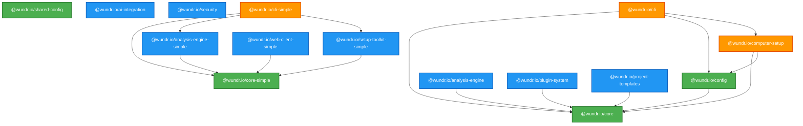

# @wundr.io Ecosystem

[](https://www.npmjs.com/org/wundr.io)
[](https://opensource.org/licenses/MIT)
[](https://www.typescriptlang.org/)
[](https://turbo.build/)

> **From chaos to excellence, systematically.**

A comprehensive collection of 14 production-ready npm packages that work together to enable
systematic software excellence. Whether you need a single utility package or a complete development
platform, @wundr.io provides the tools to build, analyze, and maintain exceptional software.

---

## Overview

The @wundr.io ecosystem consists of carefully architected packages organized into three tiers:

- **🏗️ Foundational** - Core utilities, configuration, and shared infrastructure
- **⚙️ Specialized** - Advanced functionality for analysis, security, and AI integration
- **🚀 Application** - Complete tools and interfaces for end-to-end workflows

All packages are:

- ✅ **TypeScript-first** with full type safety
- ✅ **Production-ready** with comprehensive testing
- ✅ **Interoperable** designed to work together seamlessly
- ✅ **Independent** can be used standalone or composed
- ✅ **Well-documented** with extensive examples and API references

---

## Table of Contents

- [All Packages](#all-packages)
  - [Foundational Tier](#foundational-tier)
  - [Specialized Tier](#specialized-tier)
  - [Application Tier](#application-tier)
- [Quick Start](#quick-start)
- [Architecture](#architecture)
- [Common Workflows](#common-workflows)
- [Package Selection Guide](#package-selection-guide)
- [Integration Patterns](#integration-patterns)
- [Installation](#installation)
- [Contributing](#contributing)
- [License](#license)

---

## All Packages

### Foundational Tier

Core infrastructure packages that provide essential utilities used across the ecosystem.

#### [@wundr.io/core](./packages/@wundr/core/README.md)

**Essential utilities, logging, event system, and error handling**

```bash
npm install @wundr.io/core
```

**Key Features**:

- 🪵 Production logging with multiple transports
- 📢 Type-safe event bus for inter-component communication
- 🛡️ Comprehensive error handling with custom error types
- ⏱️ Performance timers and profiling utilities
- 🔍 Deep object manipulation and validation
- 💾 Memory monitoring and optimization

**Use When**: You need foundational utilities for any Node.js/TypeScript application.

[→ Full Documentation](./packages/@wundr/core/README.md)

---

#### [@wundr.io/config](./packages/@wundr/config/README.md)

**Multi-source configuration management with validation and auto-reload**

```bash
npm install @wundr.io/config
```

**Key Features**:

- 📁 Multiple source support (JSON, YAML, ENV, files, memory)
- 🔄 Auto-reload on configuration file changes
- ✅ Built-in validation with custom rules and Zod schemas
- 🎯 Priority-based configuration merging
- 👁️ Watch API for reactive configuration updates
- 💾 Auto-save for writable sources

**Use When**: You need flexible, validated, multi-environment configuration.

[→ Full Documentation](./packages/@wundr/config/README.md)

---

#### [@wundr.io/shared-config](./packages/shared-config)

**Shared ESLint and Prettier configurations**

```bash
npm install --save-dev @wundr.io/shared-config
```

**Key Features**:

- 🎨 Consistent code formatting across all projects
- 📏 Opinionated linting rules for TypeScript
- 🔧 Ready-to-use ESLint and Prettier configs
- 📦 Zero configuration required

**Use When**: You want consistent code style across your organization.

---

### Specialized Tier

Advanced functionality built on foundational packages for specific capabilities.

#### [@wundr.io/security](./packages/@wundr/security/README.md)

**Enterprise-grade security with encryption, RBAC, and compliance**

```bash
npm install @wundr.io/security
```

**Key Features**:

- 🔐 AES-256-GCM encryption with key rotation
- 👥 Role-Based Access Control (RBAC) with hierarchies
- 📝 Comprehensive audit logging for compliance
- 🛡️ Secrets management with multiple backends
- 🔍 Security scanning and vulnerability detection
- 📊 SOC 2, HIPAA, and GDPR compliance frameworks

**Use When**: You need enterprise security, compliance, or sensitive data handling.

[→ Full Documentation](./packages/@wundr/security/README.md)

---

#### [@wundr.io/analysis-engine](./packages/@wundr/analysis-engine/README.md)

**AST-powered code analysis with 6 specialized engines**

```bash
npm install @wundr.io/analysis-engine
```

**Key Features**:

- 🔍 AST-based code analysis (ts-morph)
- 📊 Complexity metrics (cyclomatic, cognitive, Halstead)
- 🔄 Duplicate code detection with clustering
- 🏗️ Dependency graph visualization
- 🐛 Code smell detection
- ⚡ High performance (15,000+ files/sec)

**Use When**: You need code quality analysis, refactoring support, or technical debt tracking.

[→ Full Documentation](./packages/@wundr/analysis-engine/README.md)

---

#### [@wundr.io/ai-integration](./packages/@wundr/ai-integration/README.md)

**AI orchestration with 54 specialized agents and swarm intelligence**

```bash
npm install @wundr.io/ai-integration
```

**Key Features**:

- 🤖 54 specialized AI agents across 9 categories
- 🧠 4 neural models with 2.8-4.4x performance improvements
- 🔄 5 swarm topologies (hierarchical, mesh, adaptive, etc.)
- 📊 Real-time performance tracking and optimization
- 🎯 Task orchestration with priority-based scheduling
- 💾 Cross-session memory with TTL and namespacing

**Use When**: You need AI-powered development assistance or intelligent automation.

[→ Full Documentation](./packages/@wundr/ai-integration/README.md)

---

#### [@wundr.io/plugin-system](./packages/@wundr/plugin-system/README.md)

**Extensible plugin architecture with lifecycle management**

```bash
npm install @wundr.io/plugin-system
```

**Key Features**:

- 🔌 Dynamic plugin loading and unloading
- 🔄 Complete lifecycle management (load → activate → deactivate → unload)
- 🪝 Extensible hook system for custom behavior
- 📦 Auto-discovery of plugins in directories
- ⚡ Concurrent loading with semaphore control
- 🛡️ Semver validation and dependency management

**Use When**: You need a plugin-based architecture or runtime extensibility.

[→ Full Documentation](./packages/@wundr/plugin-system/README.md)

---

#### [@wundr.io/project-templates](./packages/@wundr/project-templates/README.md)

**Project scaffolding with opinionated best practices**

```bash
npm install @wundr.io/project-templates
```

**Key Features**:

- 🏗️ Ready-to-use project templates (Frontend, Backend, Monorepo)
- ⚙️ Pre-configured TypeScript, ESLint, Prettier
- 🧪 Testing setup (Jest/Vitest)
- 🔄 CI/CD pipelines (GitHub Actions)
- 📦 Turbo repo support for monorepos
- 🎨 Modern frameworks (Next.js 15, Fastify, etc.)

**Use When**: You're starting a new project and want best practices built-in.

[→ Full Documentation](./packages/@wundr/project-templates/README.md)

---

### Application Tier

Complete, user-facing tools that provide end-to-end functionality.

#### [@wundr.io/cli](./packages/@wundr/cli/README.md)

**Unified CLI framework with 60+ commands**

```bash
npm install -g @wundr.io/cli
```

**Key Features**:

- 🖥️ 60+ commands across 10 categories
- 🛠️ Three core workflows: Setup → Create → Govern
- 📦 Computer setup and provisioning
- 🏗️ Project creation with templates
- 📊 Code analysis and governance
- 🎯 Interactive wizards and TUI
- 🔌 OCLIF-based with plugin support

**Use When**: You want a complete developer platform with CLI interface.

[→ Full Documentation](./packages/@wundr/cli/README.md)

---

#### [@wundr.io/computer-setup](./packages/@wundr/computer-setup/README.md)

**Developer machine provisioning with 80+ agents**

```bash
npm install @wundr.io/computer-setup
```

**Key Features**:

- 🖥️ 6 developer profiles (Frontend, Backend, Full Stack, DevOps, ML, Mobile)
- ⚙️ 80+ installation agents for tools and runtimes
- 🧠 Hardware-adaptive Claude Code optimization (7x context improvement)
- 🎯 Team configuration templates
- 📊 Installation verification and health checks
- 🔄 Profile export/import for team consistency

**Use When**: You need automated developer onboarding or machine setup.

[→ Full Documentation](./packages/@wundr/computer-setup/README.md)

---

### Simple Packages

Lightweight alternatives for specific use cases with minimal dependencies.

#### [@wundr.io/core-simple](./packages/core)

Minimal core utilities without external dependencies beyond zod and uuid.

```bash
npm install @wundr.io/core-simple
```

---

#### [@wundr.io/analysis-engine-simple](./packages/analysis-engine)

Lightweight code analysis with reduced feature set.

```bash
npm install @wundr.io/analysis-engine-simple
```

---

#### [@wundr.io/setup-toolkit-simple](./packages/setup-toolkit)

Simplified environment setup tools.

```bash
npm install @wundr.io/setup-toolkit-simple
```

---

#### [@wundr.io/cli-simple](./packages/cli)

Basic CLI interface without full OCLIF framework.

```bash
npm install @wundr.io/cli-simple
```

---

#### [@wundr.io/web-client-simple](./packages/web-client)

Shared React components and utilities.

```bash
npm install @wundr.io/web-client-simple
```

---

## Quick Start

### Using Individual Packages

Each package can be used independently:

```typescript
// Use @wundr.io/core for logging and events
import { getLogger, getEventBus } from '@wundr.io/core';

const logger = getLogger();
const eventBus = getEventBus();

logger.info('Application starting...');
eventBus.emit('app:started', { timestamp: Date.now() });
```

```typescript
// Use @wundr.io/config for configuration
import { WundrConfigManager, JsonConfigSource } from '@wundr.io/config';

const config = new WundrConfigManager({
  sources: [new JsonConfigSource({ filePath: './config.json', priority: 50 })],
});

await config.initialize();
const dbHost = config.get<string>('database.host');
```

```typescript
// Use @wundr.io/analysis-engine for code analysis
import { CodeAnalyzer } from '@wundr.io/analysis-engine';

const analyzer = new CodeAnalyzer();
const results = await analyzer.analyze('./src', {
  includeComplexity: true,
  detectDuplicates: true,
});

console.log('Complexity score:', results.averageComplexity);
```

### Using the Complete Platform

Install the CLI for the full @wundr.io experience:

```bash
# Install globally
npm install -g @wundr.io/cli

# Setup developer machine
wundr computer-setup --profile fullstack

# Create new project
wundr create frontend my-app

# Analyze codebase
wundr analyze
```

---

## Architecture

### Three-Tier Package Architecture

```
┌─────────────────────────────────────────────────────────────┐
│                   APPLICATION TIER                          │
│  @wundr.io/cli        @wundr.io/computer-setup             │
│  @wundr.io/cli-simple @wundr.io/web-client-simple          │
└─────────────────────────────────────────────────────────────┘
                            │
                            ▼
┌─────────────────────────────────────────────────────────────┐
│                   SPECIALIZED TIER                          │
│  @wundr.io/analysis-engine  @wundr.io/ai-integration       │
│  @wundr.io/security         @wundr.io/plugin-system        │
│  @wundr.io/project-templates                                │
│  @wundr.io/analysis-engine-simple                          │
│  @wundr.io/setup-toolkit-simple                            │
└─────────────────────────────────────────────────────────────┘
                            │
                            ▼
┌─────────────────────────────────────────────────────────────┐
│                   FOUNDATIONAL TIER                         │
│  @wundr.io/core        @wundr.io/config                    │
│  @wundr.io/shared-config                                    │
│  @wundr.io/core-simple                                      │
└─────────────────────────────────────────────────────────────┘
```

### Dependency Graph



---

## Common Workflows

### 1. New Developer Onboarding

```bash
# Step 1: Setup developer machine
npm install -g @wundr.io/cli
wundr computer-setup --profile fullstack

# Step 2: Create first project
wundr create frontend my-app
cd my-app

# Step 3: Verify setup
wundr computer-setup validate
npm run dev
```

### 2. Building a Custom CLI Tool

```typescript
import { getLogger, getEventBus } from '@wundr.io/core';
import { WundrConfigManager } from '@wundr.io/config';
import { WundrPluginManager } from '@wundr.io/plugin-system';

// Setup logging
const logger = getLogger();

// Setup configuration
const config = new WundrConfigManager({
  sources: [
    /* ... */
  ],
});
await config.initialize();

// Setup plugin system
const plugins = new WundrPluginManager({
  pluginDir: './plugins',
  dataDir: './data',
});
await plugins.initialize();

// Your CLI logic here
logger.info('Custom CLI ready!');
```

### 3. Code Quality Analysis Pipeline

```typescript
import { CodeAnalyzer } from '@wundr.io/analysis-engine';
import { getLogger } from '@wundr.io/core';

const logger = getLogger();
const analyzer = new CodeAnalyzer();

// Analyze codebase
const results = await analyzer.analyze('./src', {
  includeComplexity: true,
  detectDuplicates: true,
  findCircularDeps: true,
});

// Check thresholds
if (results.averageComplexity > 10) {
  logger.warn('High complexity detected', {
    average: results.averageComplexity,
    max: results.maxComplexity,
  });
}

// Generate report
await analyzer.generateReport(results, './reports/quality.html');
```

### 4. Secure Application Configuration

```typescript
import { WundrConfigManager } from '@wundr.io/config';
import { SecureConfigSource } from '@wundr.io/security';
import { getLogger } from '@wundr.io/core';

const logger = getLogger();

// Load encrypted configuration
const config = new WundrConfigManager({
  sources: [
    new SecureConfigSource({
      filePath: './config.encrypted',
      priority: 100,
      encryptionKey: process.env.CONFIG_KEY,
    }),
  ],
});

await config.initialize();

// Use configuration securely
const dbPassword = config.get<string>('database.password');
logger.info('Configuration loaded securely');
```

---

## Package Selection Guide

### "Which package should I use?"

| Your Need                    | Recommended Package                                                          |
| ---------------------------- | ---------------------------------------------------------------------------- |
| **Logging and utilities**    | [@wundr.io/core](./packages/@wundr/core/README.md)                           |
| **Configuration management** | [@wundr.io/config](./packages/@wundr/config/README.md)                       |
| **Code analysis**            | [@wundr.io/analysis-engine](./packages/@wundr/analysis-engine/README.md)     |
| **Security and encryption**  | [@wundr.io/security](./packages/@wundr/security/README.md)                   |
| **AI assistance**            | [@wundr.io/ai-integration](./packages/@wundr/ai-integration/README.md)       |
| **Plugin architecture**      | [@wundr.io/plugin-system](./packages/@wundr/plugin-system/README.md)         |
| **Project scaffolding**      | [@wundr.io/project-templates](./packages/@wundr/project-templates/README.md) |
| **Complete CLI platform**    | [@wundr.io/cli](./packages/@wundr/cli/README.md)                             |
| **Developer onboarding**     | [@wundr.io/computer-setup](./packages/@wundr/computer-setup/README.md)       |
| **Minimal utilities**        | [@wundr.io/core-simple](./packages/core)                                     |

### Full vs Simple Packages

| When to Use                 | Full Packages    | Simple Packages     |
| --------------------------- | ---------------- | ------------------- |
| **Production applications** | ✅ Recommended   | ⚠️ Basic needs only |
| **Enterprise features**     | ✅ Full featured | ❌ Limited          |
| **Minimal dependencies**    | ❌ More deps     | ✅ Fewer deps       |
| **Bundle size critical**    | ⚠️ Larger        | ✅ Smaller          |
| **TypeScript types**        | ✅ Complete      | ✅ Complete         |
| **Documentation**           | ✅ Comprehensive | ⚠️ Basic            |

---

## Integration Patterns

### Pattern 1: Core + Specialized

```typescript
// Combine core utilities with specialized functionality
import { getLogger, getEventBus } from '@wundr.io/core';
import { CodeAnalyzer } from '@wundr.io/analysis-engine';

const logger = getLogger();
const eventBus = getEventBus();
const analyzer = new CodeAnalyzer();

// Analysis with logging
eventBus.on('analysis:complete', results => {
  logger.info('Analysis complete', {
    files: results.fileCount,
    complexity: results.averageComplexity,
  });
});

const results = await analyzer.analyze('./src');
```

### Pattern 2: Configuration + Security

```typescript
// Secure configuration with encryption
import { WundrConfigManager } from '@wundr.io/config';
import { SecureConfigSource, EncryptionManager } from '@wundr.io/security';

const encryption = new EncryptionManager({
  algorithm: 'aes-256-gcm',
});

await encryption.initialize();

const config = new WundrConfigManager({
  sources: [
    new SecureConfigSource({
      filePath: './config.encrypted',
      encryption,
    }),
  ],
});

await config.initialize();
```

### Pattern 3: Full Stack Application

```typescript
// Complete application setup
import { getLogger, getEventBus } from '@wundr.io/core';
import { WundrConfigManager } from '@wundr.io/config';
import { SecurityManager } from '@wundr.io/security';
import { WundrPluginManager } from '@wundr.io/plugin-system';
import { CodeAnalyzer } from '@wundr.io/analysis-engine';

// Bootstrap application
const logger = getLogger();
const eventBus = getEventBus();

// Configuration
const config = new WundrConfigManager({
  /* ... */
});
await config.initialize();

// Security
const security = new SecurityManager({
  /* ... */
});
await security.initialize();

// Plugins
const plugins = new WundrPluginManager({
  /* ... */
});
await plugins.initialize();

logger.info('Application bootstrapped successfully');
```

---

## Installation

### Install Individual Packages

```bash
# Foundational
npm install @wundr.io/core
npm install @wundr.io/config
npm install --save-dev @wundr.io/shared-config

# Specialized
npm install @wundr.io/security
npm install @wundr.io/analysis-engine
npm install @wundr.io/ai-integration
npm install @wundr.io/plugin-system
npm install @wundr.io/project-templates

# Application
npm install -g @wundr.io/cli
npm install @wundr.io/computer-setup

# Simple
npm install @wundr.io/core-simple
npm install @wundr.io/analysis-engine-simple
npm install @wundr.io/setup-toolkit-simple
npm install @wundr.io/cli-simple
npm install @wundr.io/web-client-simple
```

### Install Complete Platform

```bash
# Install CLI globally for complete experience
npm install -g @wundr.io/cli

# Verify installation
wundr --version
wundr --help
```

---

## Development

### Monorepo Setup

```bash
# Clone repository
git clone https://github.com/adapticai/wundr.git
cd wundr

# Install dependencies
pnpm install

# Build all packages
pnpm build

# Run tests
pnpm test

# Develop with watch mode
pnpm dev
```

### Package Scripts

```bash
# Build individual package
cd packages/@wundr/core
pnpm build

# Test individual package
pnpm test

# Type check
pnpm typecheck

# Lint
pnpm lint
```

---

## Contributing

We welcome contributions to any package in the ecosystem!

### Development Guidelines

1. **Fork the repository** and create a feature branch
2. **Write tests** for new functionality
3. **Update documentation** in package READMEs
4. **Follow TypeScript** best practices
5. **Run linting** and type checking before committing
6. **Submit a pull request** with clear description

See [CONTRIBUTING.md](./CONTRIBUTING.md) for detailed guidelines.

---

## Performance

All packages are optimized for production use:

- ⚡ **Fast builds** with Turborepo (2.8-4.4x speedup)
- 🗄️ **Smart caching** for incremental builds
- 📦 **Tree-shakeable** ESM exports
- 🎯 **Zero runtime overhead** where possible
- 🔄 **Lazy loading** for large dependencies

---

## Support

- 📚 **Documentation**: Package-specific READMEs
- 🐛 **Issues**: [GitHub Issues](https://github.com/adapticai/wundr/issues)
- 💬 **Discussions**: [GitHub Discussions](https://github.com/adapticai/wundr/discussions)
- 📧 **Email**: support@wundr.io

---

## License

MIT © [Wundr, by Adaptic.ai](https://wundr.io)

All packages in the @wundr.io ecosystem are released under the MIT License.

---

## Related Resources

- **[Main CLI README](./README.md)** - Complete platform documentation
- **[Package Cross-Reference](./docs/PACKAGE_CROSS_REFERENCE.md)** - Detailed package relationships
- **[Architecture Overview](./docs/PACKAGE_ARCHITECTURE_OVERVIEW.md)** - System design and patterns
- **[Integration Guide](./docs/PACKAGE_INTEGRATION_GUIDE.md)** - Common integration scenarios

---

<div align="center">

**[@wundr.io](https://wundr.io) - Building excellence, systematically.**

_From individual utilities to complete platforms - choose the tools that fit your needs._

</div>
