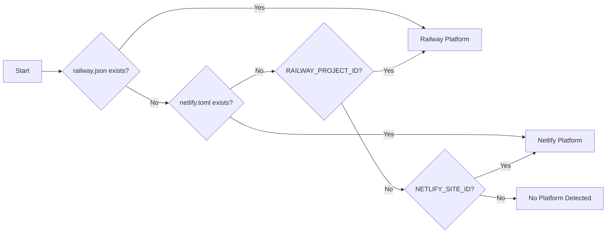

# Railway & Netlify MCP Server Implementation and Integration Plan

## Executive Summary

This document provides a comprehensive implementation plan for integrating Railway MCP Server (`@railway/mcp-server`) and Netlify MCP Server (`@netlify/mcp`) into the Wundr ecosystem. The integration will enable Claude Code to:

1. **Monitor deployment status** after pushing to git main/master
2. **Fetch and analyze logs** from production environments
3. **Debug deployment issues** using log analysis
4. **Implement continuous deploy → monitor → refactor → deploy cycles**
5. **Provide seamless deployment workflow integration** across all Claude agent templates

---

## Table of Contents

1. [MCP Server Overview](#1-mcp-server-overview)
2. [Architecture Design](#2-architecture-design)
3. [Implementation Phases](#3-implementation-phases)
4. [Computer Setup Integration](#4-computer-setup-integration)
5. [Project Init Integration](#5-project-init-integration)
6. [Agent Template Updates](#6-agent-template-updates)
7. [CLAUDE.md Integration](#7-claudemd-integration)
8. [Workflow Integration](#8-workflow-integration)
9. [Continuous Deployment Cycle Implementation](#9-continuous-deployment-cycle-implementation)
10. [Configuration Files](#10-configuration-files)
11. [Testing Strategy](#11-testing-strategy)
12. [Rollout Plan](#12-rollout-plan)

---

## 1. MCP Server Overview

### 1.1 Railway MCP Server

**Package**: `@railway/mcp-server`
**Repository**: https://github.com/railwayapp/railway-mcp-server
**NPM**: https://www.npmjs.com/package/@railway/mcp-server

#### Available Tools (Expected)

| Tool | Description | Primary Use Case |
|------|-------------|------------------|
| `mcp__railway__deploy_status` | Get current deployment status | Monitor after git push |
| `mcp__railway__get_logs` | Fetch application logs | Debug production issues |
| `mcp__railway__list_services` | List all services in project | Service discovery |
| `mcp__railway__get_deployments` | Get deployment history | Track deployment timeline |
| `mcp__railway__get_variables` | Get environment variables | Configuration management |
| `mcp__railway__restart_service` | Restart a service | Recovery actions |
| `mcp__railway__get_metrics` | Get service metrics | Performance monitoring |

### 1.2 Netlify MCP Server

**Package**: `@netlify/mcp`
**Documentation**: https://docs.netlify.com/build/build-with-ai/netlify-mcp-server/
**NPM**: https://www.npmjs.com/package/@netlify/mcp

#### Available Tools (Expected)

| Tool | Description | Primary Use Case |
|------|-------------|------------------|
| `mcp__netlify__deploy_status` | Get deployment status | Monitor deployments |
| `mcp__netlify__get_build_logs` | Fetch build logs | Debug build failures |
| `mcp__netlify__list_sites` | List all sites | Site discovery |
| `mcp__netlify__get_deploys` | Get deployment history | Track deploy timeline |
| `mcp__netlify__get_functions` | List serverless functions | Function management |
| `mcp__netlify__trigger_deploy` | Trigger a new deploy | Force redeploy |
| `mcp__netlify__get_analytics` | Get site analytics | Performance insights |

---

## 2. Architecture Design

### 2.1 Integration Architecture

```
┌─────────────────────────────────────────────────────────────────────────────┐
│                           Claude Code Session                                │
│                                                                              │
│  ┌─────────────────┐  ┌─────────────────┐  ┌─────────────────────────────┐  │
│  │   Git Push to   │→ │  Deployment     │→ │  Continuous Monitoring      │  │
│  │   main/master   │  │  Detection      │  │  & Debug Cycle              │  │
│  └─────────────────┘  └─────────────────┘  └─────────────────────────────┘  │
│           │                    │                        │                    │
│           ▼                    ▼                        ▼                    │
│  ┌─────────────────────────────────────────────────────────────────────────┐│
│  │                    MCP Server Layer                                      ││
│  │  ┌──────────────────┐            ┌──────────────────┐                   ││
│  │  │ Railway MCP      │            │ Netlify MCP      │                   ││
│  │  │ @railway/mcp     │            │ @netlify/mcp     │                   ││
│  │  │                  │            │                  │                   ││
│  │  │ • deploy_status  │            │ • deploy_status  │                   ││
│  │  │ • get_logs       │            │ • get_build_logs │                   ││
│  │  │ • get_metrics    │            │ • get_deploys    │                   ││
│  │  │ • restart        │            │ • trigger_deploy │                   ││
│  │  └──────────────────┘            └──────────────────┘                   ││
│  └─────────────────────────────────────────────────────────────────────────┘│
│           │                                              │                   │
│           ▼                                              ▼                   │
│  ┌─────────────────────────────────────────────────────────────────────────┐│
│  │                    Agent Coordination Layer                              ││
│  │  ┌──────────────────┐  ┌──────────────────┐  ┌──────────────────┐       ││
│  │  │ deployment-      │  │ log-analyzer     │  │ debug-refactor   │       ││
│  │  │ monitor          │  │ agent            │  │ agent            │       ││
│  │  └──────────────────┘  └──────────────────┘  └──────────────────┘       ││
│  └─────────────────────────────────────────────────────────────────────────┘│
└─────────────────────────────────────────────────────────────────────────────┘
```

### 2.2 Deployment Detection Flow

```
┌──────────────┐    ┌──────────────────┐    ┌─────────────────────────────────┐
│   Git Push   │ →  │  Post-Push Hook  │ →  │  Platform Detection             │
│   (main/     │    │  (detect remote  │    │  • Railway API check            │
│    master)   │    │   platform)      │    │  • Netlify API check            │
└──────────────┘    └──────────────────┘    │  • GitHub Actions check         │
                                             └─────────────────────────────────┘
                                                          │
                    ┌─────────────────────────────────────┘
                    ▼
        ┌───────────────────────────────────────────────────────────────────┐
        │                    Platform-Specific Monitoring                    │
        │                                                                    │
        │  ┌─────────────────────┐          ┌─────────────────────┐         │
        │  │     Railway         │          │     Netlify          │         │
        │  │                     │          │                      │         │
        │  │  1. Poll deploy     │          │  1. Poll build       │         │
        │  │     status          │          │     status           │         │
        │  │  2. Stream logs     │          │  2. Get build logs   │         │
        │  │  3. Monitor health  │          │  3. Check functions  │         │
        │  │  4. Get metrics     │          │  4. Verify deploy    │         │
        │  └─────────────────────┘          └─────────────────────┘         │
        └───────────────────────────────────────────────────────────────────┘
```

### 2.3 Continuous Debug Cycle

```
┌─────────────────────────────────────────────────────────────────────────────┐
│                    CONTINUOUS DEPLOY → MONITOR → REFACTOR CYCLE             │
│                                                                              │
│   ┌─────────┐      ┌─────────┐      ┌─────────┐      ┌─────────┐           │
│   │  CODE   │ ──→  │ DEPLOY  │ ──→  │ MONITOR │ ──→  │ ANALYZE │           │
│   │ CHANGES │      │ (push)  │      │ (logs)  │      │ (errors)│           │
│   └─────────┘      └─────────┘      └─────────┘      └─────────┘           │
│        ▲                                                   │                │
│        │                                                   ▼                │
│   ┌─────────┐      ┌─────────┐      ┌─────────┐      ┌─────────┐           │
│   │  TEST   │ ←──  │ REFACTOR│ ←──  │ IDENTIFY│ ←──  │ CLASSIFY│           │
│   │ LOCALLY │      │  CODE   │      │  ROOT   │      │ ISSUES  │           │
│   └─────────┘      └─────────┘      │  CAUSE  │      └─────────┘           │
│        │                            └─────────┘                             │
│        │           ┌─────────────────────────────────────────────┐         │
│        └──────────→│  IF errors still appearing in logs:        │         │
│                    │  REPEAT CYCLE until resolved                │         │
│                    └─────────────────────────────────────────────┘         │
└─────────────────────────────────────────────────────────────────────────────┘
```

---

## 3. Implementation Phases

### Phase 1: MCP Server Installation (Week 1)

#### 3.1.1 Update Claude Installer

**File**: `packages/@wundr/computer-setup/src/installers/claude-installer.ts`

Add Railway and Netlify MCP servers to the `mcpServers` array:

```typescript
private readonly mcpServers = [
  'claude-flow',
  'ruv-swarm',
  'firecrawl',
  'context7',
  'playwright',
  'browser',
  'sequentialthinking',
  // NEW: Deployment platform MCP servers
  'railway',
  'netlify',
];
```

Add installation methods:

```typescript
private async installRailwayMCP(): Promise<void> {
  console.log('🚂 Installing Railway MCP Server...');
  try {
    execSync('claude mcp add railway npx @railway/mcp-server', {
      stdio: 'pipe',
      timeout: 30000,
    });
    console.log('✅ Railway MCP Server installed');
  } catch (error) {
    // Handle already exists or not found
    this.handleMCPInstallError('railway', error);
  }
}

private async installNetlifyMCP(): Promise<void> {
  console.log('🌐 Installing Netlify MCP Server...');
  try {
    execSync('claude mcp add netlify npx @netlify/mcp', {
      stdio: 'pipe',
      timeout: 30000,
    });
    console.log('✅ Netlify MCP Server installed');
  } catch (error) {
    this.handleMCPInstallError('netlify', error);
  }
}
```

#### 3.1.2 Update MCP Server Configuration

Update the `configureClaudeSettings()` method to include Railway and Netlify:

```typescript
mcpServers: {
  // ... existing servers ...

  railway: {
    command: 'npx',
    args: ['@railway/mcp-server'],
    env: {
      RAILWAY_API_TOKEN: '${RAILWAY_API_TOKEN}',
      RAILWAY_PROJECT_ID: '${RAILWAY_PROJECT_ID}',
    },
  },
  netlify: {
    command: 'npx',
    args: ['@netlify/mcp'],
    env: {
      NETLIFY_ACCESS_TOKEN: '${NETLIFY_ACCESS_TOKEN}',
      NETLIFY_SITE_ID: '${NETLIFY_SITE_ID}',
    },
  },
},
```

### Phase 2: Agent Templates (Week 2)

#### 3.2.1 Create Deployment Monitor Agent

**File**: `packages/@wundr/computer-setup/resources/agents/devops/deployment-monitor.md`

```markdown
---
name: deployment-monitor
color: "blue"
type: devops
description: Monitors deployment status and health across Railway and Netlify platforms
capabilities:
  - deployment-monitoring
  - log-streaming
  - health-checks
  - error-detection
  - platform-abstraction
priority: high
hooks:
  pre: |
    echo "🚀 Deployment Monitor initializing..."
    echo "📡 Detecting deployment platform..."
    # Check for Railway
    if [ -f "railway.json" ] || [ -n "$RAILWAY_PROJECT_ID" ]; then
      echo "🚂 Railway platform detected"
    fi
    # Check for Netlify
    if [ -f "netlify.toml" ] || [ -n "$NETLIFY_SITE_ID" ]; then
      echo "🌐 Netlify platform detected"
    fi
  post: |
    echo "✅ Deployment monitoring session complete"
    npx claude-flow@alpha hooks post-task --task-id "deployment-monitor"
---

# Deployment Monitor Agent

## Purpose
This agent monitors deployments across Railway and Netlify platforms, providing real-time status updates, log analysis, and automated issue detection after git pushes to main/master branches.

## Core Responsibilities

### 1. Platform Detection
Automatically detect which deployment platform(s) are configured:
- Railway: Check for `railway.json`, `RAILWAY_PROJECT_ID`, or Railway API connectivity
- Netlify: Check for `netlify.toml`, `NETLIFY_SITE_ID`, or Netlify CLI configuration

### 2. Deployment Status Monitoring
After detecting a git push to main/master:

**For Railway:**
```bash
# Using Railway MCP tools
mcp__railway__deploy_status { projectId: "${RAILWAY_PROJECT_ID}" }
mcp__railway__get_deployments { limit: 5 }
```

**For Netlify:**
```bash
# Using Netlify MCP tools
mcp__netlify__deploy_status { siteId: "${NETLIFY_SITE_ID}" }
mcp__netlify__get_deploys { limit: 5 }
```

### 3. Log Streaming and Analysis
Continuously fetch and analyze logs until deployment succeeds or fails:

**Railway Log Monitoring:**
```bash
mcp__railway__get_logs {
  serviceId: "${SERVICE_ID}",
  lines: 500,
  since: "5m"
}
```

**Netlify Build Log Monitoring:**
```bash
mcp__netlify__get_build_logs {
  deployId: "${DEPLOY_ID}",
  includeOutput: true
}
```

### 4. Error Pattern Detection
Analyze logs for common error patterns:
- Runtime exceptions
- Build failures
- Memory issues
- Timeout errors
- Database connection failures
- Missing environment variables

### 5. Health Check Verification
After deployment completes:
- Verify service is responding
- Check health endpoints
- Validate critical functionality

## Usage Patterns

### Automatic Post-Push Monitoring
```
"I just pushed to main, monitor the deployment and let me know if there are any issues"
```

### Manual Status Check
```
"Check the current deployment status on Railway/Netlify"
```

### Log Investigation
```
"Get the last 100 lines of logs from production and analyze for errors"
```

## Integration with Other Agents

- **debug-refactor-agent**: Hands off issues for code fixes
- **log-analyzer-agent**: For deep log analysis
- **pr-manager**: For rollback PR creation if needed
- **release-manager**: For version coordination

## MCP Tool Reference

### Railway Tools
| Tool | Usage |
|------|-------|
| `mcp__railway__deploy_status` | Get current deployment state |
| `mcp__railway__get_logs` | Fetch service logs |
| `mcp__railway__get_deployments` | List recent deployments |
| `mcp__railway__restart_service` | Restart a service |
| `mcp__railway__get_variables` | Get environment variables |

### Netlify Tools
| Tool | Usage |
|------|-------|
| `mcp__netlify__deploy_status` | Get deployment state |
| `mcp__netlify__get_build_logs` | Fetch build logs |
| `mcp__netlify__get_deploys` | List recent deploys |
| `mcp__netlify__trigger_deploy` | Force a new deploy |
| `mcp__netlify__get_functions` | List serverless functions |

## Error Handling

### Platform Unavailable
If MCP tools fail to connect:
1. Verify API tokens are configured
2. Check network connectivity
3. Fall back to CLI commands if available

### Deployment Timeout
If deployment takes longer than expected:
1. Continue monitoring for configured timeout
2. Alert user of extended deployment
3. Provide option to cancel and investigate

### Continuous Errors
If errors persist after multiple deploy cycles:
1. Compile comprehensive error report
2. Suggest reverting to last known good deployment
3. Create incident tracking issue
```

#### 3.2.2 Create Log Analyzer Agent

**File**: `packages/@wundr/computer-setup/resources/agents/devops/log-analyzer.md`

```markdown
---
name: log-analyzer
color: "orange"
type: devops
description: Deep analysis of deployment logs to identify root causes and suggest fixes
capabilities:
  - log-parsing
  - pattern-recognition
  - error-classification
  - root-cause-analysis
  - fix-suggestion
priority: high
hooks:
  pre: |
    echo "🔍 Log Analyzer initializing..."
    echo "📊 Preparing log analysis patterns..."
  post: |
    echo "✅ Log analysis complete"
    npx claude-flow@alpha hooks post-edit --memory-key "logs/analysis/$(date +%s)"
---

# Log Analyzer Agent

## Purpose
Performs deep analysis of deployment and runtime logs from Railway and Netlify to identify issues, classify errors, determine root causes, and suggest specific code fixes.

## Core Capabilities

### 1. Log Fetching
Retrieve logs from deployment platforms:

**Railway:**
```javascript
mcp__railway__get_logs {
  serviceId: "${SERVICE_ID}",
  lines: 1000,
  filter: "error|warning|critical|exception",
  since: "1h"
}
```

**Netlify:**
```javascript
mcp__netlify__get_build_logs {
  deployId: "${DEPLOY_ID}",
  includeOutput: true
}
// For serverless function logs
mcp__netlify__get_function_logs {
  functionName: "${FUNCTION_NAME}",
  limit: 500
}
```

### 2. Error Pattern Database

#### Runtime Errors
| Pattern | Classification | Common Cause |
|---------|---------------|--------------|
| `ECONNREFUSED` | Connection Error | Database/service unreachable |
| `ENOMEM` | Memory Error | Memory limit exceeded |
| `ETIMEDOUT` | Timeout Error | Slow external service |
| `ERR_MODULE_NOT_FOUND` | Module Error | Missing dependency |
| `SyntaxError` | Parse Error | Invalid code syntax |
| `TypeError` | Type Error | Null/undefined access |

#### Build Errors
| Pattern | Classification | Common Cause |
|---------|---------------|--------------|
| `npm ERR!` | Dependency Error | Package resolution failure |
| `tsc error` | TypeScript Error | Type checking failure |
| `ENOENT` | File Not Found | Missing file reference |
| `Cannot find module` | Import Error | Bad import path |
| `Build exceeded memory` | Resource Error | Build too large |

### 3. Root Cause Analysis Process

```
┌─────────────────────────────────────────────────────────────┐
│                 LOG ANALYSIS PIPELINE                        │
│                                                              │
│  1. PARSE → Extract timestamps, levels, messages            │
│         ▼                                                    │
│  2. CLASSIFY → Match against error pattern database         │
│         ▼                                                    │
│  3. CORRELATE → Find related log entries                    │
│         ▼                                                    │
│  4. TRACE → Build error chain from cause to effect          │
│         ▼                                                    │
│  5. IDENTIFY → Determine root cause                         │
│         ▼                                                    │
│  6. SUGGEST → Propose specific code fixes                   │
└─────────────────────────────────────────────────────────────┘
```

### 4. Fix Suggestion Generation

Based on identified root cause, generate:
1. **Specific file and line references** where fix should be applied
2. **Code diff suggestions** showing exact changes
3. **Related files** that may need updates
4. **Test suggestions** to verify fix

## Output Format

### Error Report Structure
```markdown
## Log Analysis Report

### Summary
- **Platform**: Railway/Netlify
- **Time Range**: [start] - [end]
- **Errors Found**: [count]
- **Critical Issues**: [count]

### Issues Identified

#### Issue #1: [Classification]
- **Severity**: Critical/High/Medium/Low
- **First Occurrence**: [timestamp]
- **Frequency**: [count] occurrences
- **Error Message**:
  ```
  [full error message]
  ```
- **Root Cause**: [explanation]
- **Affected Files**:
  - `src/services/api.ts:145`
  - `src/utils/database.ts:78`
- **Suggested Fix**:
  ```diff
  - const result = await db.query(sql);
  + const result = await db.query(sql).catch(handleDbError);
  ```
- **Related Issues**: #2, #5

### Recommended Actions
1. [Immediate action required]
2. [Secondary fix]
3. [Preventive measure]
```

## Usage Examples

### Analyze Recent Errors
```
"Analyze the last hour of production logs and identify any errors"
```

### Investigate Specific Error
```
"I'm seeing 'Cannot connect to database' errors - analyze logs and find the cause"
```

### Build Failure Analysis
```
"The Netlify build failed, analyze the build logs and tell me what went wrong"
```

## Integration Points

- **deployment-monitor**: Receives raw logs for analysis
- **debug-refactor-agent**: Receives fix suggestions for implementation
- **coder agent**: May be spawned to implement complex fixes
- **tester agent**: Validates fixes don't introduce regressions
```

#### 3.2.3 Create Debug Refactor Agent

**File**: `packages/@wundr/computer-setup/resources/agents/devops/debug-refactor.md`

```markdown
---
name: debug-refactor
color: "red"
type: devops
description: Implements fixes for deployment issues identified through log analysis
capabilities:
  - code-modification
  - error-fixing
  - refactoring
  - test-creation
  - deployment-validation
priority: high
hooks:
  pre: |
    echo "🔧 Debug Refactor Agent initializing..."
    echo "📝 Loading fix suggestions from log analysis..."
  post: |
    echo "✅ Refactoring complete"
    echo "🧪 Triggering local tests before redeploy..."
    npm run test 2>/dev/null || echo "⚠️ Tests not available"
---

# Debug Refactor Agent

## Purpose
Implements code fixes for issues identified through deployment log analysis, executes the continuous deploy → monitor → refactor cycle until production issues are resolved.

## Core Workflow

### The Debug Cycle

```
┌─────────────────────────────────────────────────────────────────────────────┐
│                    DEBUG REFACTOR CYCLE                                      │
│                                                                              │
│   ┌───────────────┐                                                         │
│   │ RECEIVE FIX   │ ← From log-analyzer agent                               │
│   │ SUGGESTIONS   │                                                         │
│   └───────┬───────┘                                                         │
│           │                                                                  │
│           ▼                                                                  │
│   ┌───────────────┐                                                         │
│   │ IMPLEMENT     │ → Edit files, add error handling, fix types             │
│   │ CHANGES       │                                                         │
│   └───────┬───────┘                                                         │
│           │                                                                  │
│           ▼                                                                  │
│   ┌───────────────┐                                                         │
│   │ LOCAL TEST    │ → npm test, npm run build, npm run typecheck            │
│   │ VALIDATION    │                                                         │
│   └───────┬───────┘                                                         │
│           │                                                                  │
│           ▼                                                                  │
│   ┌───────────────┐                                                         │
│   │ COMMIT &      │ → git add, git commit, git push origin main             │
│   │ DEPLOY        │                                                         │
│   └───────┬───────┘                                                         │
│           │                                                                  │
│           ▼                                                                  │
│   ┌───────────────┐                                                         │
│   │ MONITOR       │ ← Hand off to deployment-monitor agent                  │
│   │ DEPLOYMENT    │                                                         │
│   └───────┬───────┘                                                         │
│           │                                                                  │
│           ▼                                                                  │
│   ┌───────────────┐                                                         │
│   │ CHECK LOGS    │ ← Verify errors no longer appearing                     │
│   │ FOR ERRORS    │                                                         │
│   └───────┬───────┘                                                         │
│           │                                                                  │
│      ┌────┴────┐                                                            │
│      │         │                                                            │
│   [Errors]  [No Errors]                                                     │
│      │         │                                                            │
│      ▼         ▼                                                            │
│   REPEAT    SUCCESS!                                                        │
│   CYCLE     ✅ DONE                                                         │
└─────────────────────────────────────────────────────────────────────────────┘
```

## Implementation Patterns

### 1. Receive Fix Instructions

From log-analyzer agent:
```json
{
  "issues": [
    {
      "id": "db-connection-timeout",
      "severity": "critical",
      "file": "src/services/database.ts",
      "line": 45,
      "suggestion": "Add connection retry logic with exponential backoff",
      "codeChanges": [
        {
          "file": "src/services/database.ts",
          "oldCode": "await pool.connect()",
          "newCode": "await retryWithBackoff(() => pool.connect(), 3)"
        }
      ]
    }
  ]
}
```

### 2. Apply Changes

Using Claude Code tools:
```typescript
// Read the file first
Read { file_path: "src/services/database.ts" }

// Apply the fix
Edit {
  file_path: "src/services/database.ts",
  old_string: "await pool.connect()",
  new_string: "await retryWithBackoff(() => pool.connect(), 3)"
}

// If retry utility doesn't exist, create it
Write {
  file_path: "src/utils/retry.ts",
  content: `export async function retryWithBackoff<T>(
    fn: () => Promise<T>,
    maxRetries: number,
    baseDelay = 1000
  ): Promise<T> {
    let lastError: Error;
    for (let i = 0; i < maxRetries; i++) {
      try {
        return await fn();
      } catch (error) {
        lastError = error as Error;
        await new Promise(r => setTimeout(r, baseDelay * Math.pow(2, i)));
      }
    }
    throw lastError!;
  }`
}
```

### 3. Local Validation

Before deploying:
```bash
# Type checking
npm run typecheck

# Unit tests
npm run test

# Build verification
npm run build

# Lint check
npm run lint
```

### 4. Deploy Changes

```bash
# Stage changes
git add -A

# Commit with descriptive message
git commit -m "fix: resolve database connection timeout with retry logic

- Added retryWithBackoff utility for connection resilience
- Applied retry pattern to database pool connection
- Fixes production timeout errors identified in Railway logs

🔧 Auto-fix from debug-refactor-agent"

# Push to trigger deployment
git push origin main
```

### 5. Monitor Deployment

Hand off to deployment-monitor agent:
```javascript
// Railway monitoring
mcp__railway__deploy_status {
  projectId: "${RAILWAY_PROJECT_ID}",
  waitForComplete: true
}

// After deployment complete, check logs
mcp__railway__get_logs {
  serviceId: "${SERVICE_ID}",
  lines: 100,
  since: "5m",
  filter: "error|timeout|connection"
}
```

### 6. Verify Fix

Check if the specific error pattern has been eliminated:
```javascript
// If original error was "ECONNREFUSED" at database connection
// Search new logs for same pattern
const logsAfterDeploy = await mcp__railway__get_logs({...});
const errorStillPresent = logsAfterDeploy.includes('ECONNREFUSED');

if (errorStillPresent) {
  // REPEAT CYCLE - hand back to log-analyzer for deeper analysis
  return { status: 'retry', reason: 'Error still present in logs' };
} else {
  // SUCCESS
  return { status: 'success', message: 'Error resolved' };
}
```

## Fix Templates

### Database Connection Errors
```typescript
// Before
const connection = await db.connect();

// After
import { retryWithBackoff } from '../utils/retry';

const connection = await retryWithBackoff(
  () => db.connect(),
  3,
  { onRetry: (err, attempt) => logger.warn(`DB connect retry ${attempt}`, err) }
);
```

### Memory Limit Errors
```typescript
// Before
const allRecords = await Model.find({});
process.records = allRecords;

// After
// Use streaming/pagination instead of loading all into memory
const batchSize = 1000;
let skip = 0;
while (true) {
  const batch = await Model.find({}).skip(skip).limit(batchSize);
  if (batch.length === 0) break;
  await processBatch(batch);
  skip += batchSize;
}
```

### Missing Environment Variables
```typescript
// Before
const apiKey = process.env.API_KEY;
await callExternalService(apiKey);

// After
const apiKey = process.env.API_KEY;
if (!apiKey) {
  throw new ConfigurationError('API_KEY environment variable is required');
}
await callExternalService(apiKey);
```

## Cycle Termination Conditions

The debug cycle terminates when:

1. **Success**: Target error pattern no longer appears in logs
2. **Max Iterations**: Reached maximum retry count (default: 5)
3. **Different Error**: A new/different error appears (escalate to user)
4. **User Intervention**: User requests to stop the cycle
5. **Deployment Failure**: Deployment itself fails (not runtime error)

## Integration with Deployment Platforms

### Railway Integration
```javascript
// After fix is pushed
const deploymentComplete = await pollRailwayDeployment({
  projectId: RAILWAY_PROJECT_ID,
  timeout: 300000, // 5 minutes
  pollInterval: 5000
});

if (deploymentComplete.status === 'success') {
  // Wait for service to stabilize
  await sleep(30000);

  // Check logs for original error
  const postDeployLogs = await mcp__railway__get_logs({
    serviceId: SERVICE_ID,
    since: '2m'
  });

  return analyzeLogsForOriginalError(postDeployLogs, originalError);
}
```

### Netlify Integration
```javascript
// After fix is pushed
const buildComplete = await pollNetlifyBuild({
  siteId: NETLIFY_SITE_ID,
  timeout: 600000, // 10 minutes for build
  pollInterval: 10000
});

if (buildComplete.status === 'ready') {
  // For SSR/functions, check function logs
  const functionLogs = await mcp__netlify__get_function_logs({
    siteId: NETLIFY_SITE_ID,
    since: '2m'
  });

  return analyzeLogsForOriginalError(functionLogs, originalError);
}
```

## Safety Measures

1. **Backup Before Changes**: Always read and store original file content
2. **Atomic Commits**: One logical fix per commit
3. **Test Before Deploy**: Never skip local tests
4. **Rollback Ready**: Keep rollback command ready
5. **Max Iterations**: Hard limit on cycle repetitions
6. **Human Escalation**: Auto-escalate after repeated failures
```

### Phase 3: Workflow Templates (Week 3)

#### 3.3.1 Create Deployment Workflow

**File**: `packages/@wundr/computer-setup/resources/workflows/deployment-monitor-workflow.md`

```markdown
---
name: deployment-monitor-workflow
description: Continuous deployment monitoring and automatic issue resolution
triggers:
  - git push to main
  - git push to master
  - manual invocation
phases:
  - detect-platform
  - monitor-deployment
  - analyze-logs
  - fix-issues
  - verify-resolution
---

# Deployment Monitor Workflow

## Overview
This workflow provides end-to-end monitoring of deployments to Railway and Netlify, with automatic issue detection and resolution.

## Trigger Conditions

### Automatic Triggers
1. Git push to `main` branch detected
2. Git push to `master` branch detected
3. Deployment webhook received (if configured)

### Manual Triggers
```bash
# Via slash command
/deploy-monitor

# Via Claude prompt
"Monitor my deployment to Railway/Netlify"
"Check deployment status and fix any issues"
```

## Workflow Phases

### Phase 1: Platform Detection



**Actions:**
1. Check for platform configuration files
2. Verify environment variables
3. Test API connectivity
4. Select appropriate MCP tools

### Phase 2: Monitor Deployment

**For Railway:**
```javascript
// Poll deployment status
let status = 'building';
while (['building', 'deploying'].includes(status)) {
  const deployment = await mcp__railway__deploy_status({
    projectId: process.env.RAILWAY_PROJECT_ID
  });
  status = deployment.status;

  console.log(`Deployment status: ${status}`);

  if (status === 'failed') {
    // Fetch build logs for analysis
    const logs = await mcp__railway__get_logs({
      deploymentId: deployment.id,
      type: 'build'
    });
    return { status: 'failed', logs };
  }

  await sleep(5000);
}
```

**For Netlify:**
```javascript
// Poll build status
let deploy = await mcp__netlify__get_deploys({ limit: 1 })[0];
while (['building', 'processing'].includes(deploy.state)) {
  deploy = await mcp__netlify__deploy_status({
    deployId: deploy.id
  });

  console.log(`Build status: ${deploy.state}`);

  if (deploy.state === 'error') {
    const logs = await mcp__netlify__get_build_logs({
      deployId: deploy.id
    });
    return { status: 'failed', logs };
  }

  await sleep(10000);
}
```

### Phase 3: Log Analysis

After deployment completes (success or failure):

1. **Fetch Recent Logs**
   - Railway: Runtime logs from deployed service
   - Netlify: Build logs + Function logs (if applicable)

2. **Pattern Matching**
   - Scan for error patterns
   - Identify stack traces
   - Detect warning accumulation

3. **Classification**
   - Categorize by severity
   - Identify root cause category
   - Determine if auto-fixable

### Phase 4: Issue Resolution

If issues detected:

```
┌─────────────────────────────────────────────────────────────┐
│                    ISSUE RESOLUTION FLOW                     │
│                                                              │
│   Issue Category          Resolution Action                  │
│   ─────────────────       ──────────────────                │
│   Build Failure     →     Analyze build logs, fix deps      │
│   Type Error        →     Fix TypeScript issues             │
│   Runtime Error     →     Add error handling/retry          │
│   Memory Issue      →     Optimize code/add pagination      │
│   Env Var Missing   →     Alert user (manual action)        │
│   External Service  →     Add circuit breaker/retry         │
│   Database Error    →     Add connection pooling/retry      │
└─────────────────────────────────────────────────────────────┘
```

### Phase 5: Verification

After applying fixes:

1. **Local Verification**
   - Run tests
   - Run build
   - Run type check

2. **Deploy Changes**
   - Commit with descriptive message
   - Push to main/master

3. **Monitor New Deployment**
   - Repeat Phase 2-3

4. **Confirm Resolution**
   - Check logs for original error
   - Verify service health
   - Report success/failure

## Cycle Continuation

The workflow continues in a loop until:
- All identified errors are resolved
- Maximum iteration count reached (default: 5)
- User intervention requested
- Non-auto-fixable issue encountered

## Configuration Options

```yaml
# .claude/workflows/deployment-monitor.config.yaml
deployment_monitor:
  platforms:
    railway:
      enabled: true
      project_id: ${RAILWAY_PROJECT_ID}
      poll_interval: 5000
      timeout: 300000
    netlify:
      enabled: true
      site_id: ${NETLIFY_SITE_ID}
      poll_interval: 10000
      timeout: 600000

  auto_fix:
    enabled: true
    max_iterations: 5
    categories:
      - type_errors
      - missing_imports
      - null_checks
      - retry_logic

  notifications:
    on_deploy_start: true
    on_deploy_complete: true
    on_error_detected: true
    on_fix_applied: true

  escalation:
    after_iterations: 3
    on_repeated_failure: true
```

## Slash Command

**File**: `.claude/commands/devops/deploy-monitor.md`

```markdown
Monitor deployment to Railway/Netlify after pushing to main/master.

## Usage
/deploy-monitor [--platform railway|netlify] [--timeout <seconds>]

## Actions
1. Detect deployment platform
2. Monitor deployment progress
3. Analyze logs for errors
4. Attempt auto-fix if issues found
5. Re-deploy and verify resolution
6. Report final status

## Examples
- `/deploy-monitor` - Auto-detect platform and monitor
- `/deploy-monitor --platform railway` - Monitor Railway only
- `/deploy-monitor --timeout 600` - Set 10-minute timeout
```
```

### Phase 4: CLAUDE.md Updates (Week 4)

#### 3.4.1 Update Root CLAUDE.md

Add the following sections to the main CLAUDE.md:

```markdown
## 🚂🌐 Deployment Platform Integration (Railway & Netlify)

### Platform MCP Servers

Wundr integrates with Railway and Netlify through their official MCP servers for seamless deployment monitoring and debugging.

#### Railway MCP Server
**Package**: `@railway/mcp-server`

```bash
# Setup (handled automatically by computer-setup)
claude mcp add railway npx @railway/mcp-server

# Required environment variables
export RAILWAY_API_TOKEN="your-token"
export RAILWAY_PROJECT_ID="your-project-id"
```

**Available Tools:**
| Tool | Description | Example |
|------|-------------|---------|
| `mcp__railway__deploy_status` | Get deployment status | `{ projectId: "..." }` |
| `mcp__railway__get_logs` | Fetch service logs | `{ serviceId: "...", lines: 100 }` |
| `mcp__railway__get_deployments` | List deployments | `{ limit: 5 }` |
| `mcp__railway__restart_service` | Restart service | `{ serviceId: "..." }` |

#### Netlify MCP Server
**Package**: `@netlify/mcp`

```bash
# Setup (handled automatically by computer-setup)
claude mcp add netlify npx @netlify/mcp

# Required environment variables
export NETLIFY_ACCESS_TOKEN="your-token"
export NETLIFY_SITE_ID="your-site-id"
```

**Available Tools:**
| Tool | Description | Example |
|------|-------------|---------|
| `mcp__netlify__deploy_status` | Get deployment status | `{ siteId: "..." }` |
| `mcp__netlify__get_build_logs` | Fetch build logs | `{ deployId: "..." }` |
| `mcp__netlify__get_deploys` | List deployments | `{ limit: 5 }` |
| `mcp__netlify__trigger_deploy` | Trigger new deploy | `{ siteId: "..." }` |

### Continuous Deployment Workflow

After pushing to `main` or `master`, Claude Code can automatically:

1. **Detect Platform**: Identify Railway/Netlify from config files
2. **Monitor Deployment**: Poll status until complete
3. **Analyze Logs**: Check for errors and warnings
4. **Auto-Fix Issues**: Apply code fixes for common errors
5. **Re-deploy**: Push fixes and verify resolution
6. **Report Status**: Provide comprehensive deployment report

#### Trigger the Workflow

```bash
# After git push
"Monitor my deployment and fix any issues"

# Or via slash command
/deploy-monitor

# Platform-specific
/deploy-monitor --platform railway
/deploy-monitor --platform netlify
```

### Deployment Debugging Agents

| Agent | Purpose |
|-------|---------|
| `deployment-monitor` | Monitors deployment status and health |
| `log-analyzer` | Deep analysis of logs to identify root causes |
| `debug-refactor` | Implements fixes and manages the debug cycle |

### Example Workflows

#### Post-Push Monitoring
```
User: "I just pushed to main, check if the deployment succeeds"

Claude: [Invokes deployment-monitor agent]
1. Detects Railway platform from railway.json
2. Monitors deployment progress via mcp__railway__deploy_status
3. Deployment completes successfully
4. Fetches last 5 minutes of logs
5. No errors detected
6. Reports: "✅ Deployment successful, service healthy"
```

#### Automatic Error Resolution
```
User: "Deploy failed, analyze and fix"

Claude: [Invokes log-analyzer → debug-refactor agents]
1. Fetches build/runtime logs
2. Identifies: "TypeError: Cannot read property 'id' of null"
3. Traces to: src/handlers/user.ts:45
4. Applies fix: Add null check before accessing property
5. Runs local tests
6. Commits and pushes fix
7. Monitors new deployment
8. Verifies error no longer in logs
9. Reports: "✅ Issue resolved after 1 fix cycle"
```

### Configuration

Add to your project's `.claude/config.yaml`:

```yaml
deployment:
  platforms:
    railway:
      enabled: true
      auto_monitor: true
      log_retention: "1h"
    netlify:
      enabled: true
      auto_monitor: true
      log_retention: "1h"

  auto_fix:
    enabled: true
    max_cycles: 5
    categories:
      - type_errors
      - null_checks
      - import_errors
      - connection_retries
```
```

#### 3.4.2 Update Template CLAUDE.md

**File**: `templates/.claude/CLAUDE.md`

Add deployment platform section to the template.

---

## 4. Computer Setup Integration

### 4.1 Update ClaudeInstaller

**File**: `packages/@wundr/computer-setup/src/installers/claude-installer.ts`

#### 4.1.1 Add to mcpServers Array

```typescript
private readonly mcpServers = [
  'claude-flow',
  'ruv-swarm',
  'firecrawl',
  'context7',
  'playwright',
  'browser',
  'sequentialthinking',
  // Deployment platform MCP servers
  'railway',
  'netlify',
];
```

#### 4.1.2 Add Installation Methods

```typescript
private async installDeploymentPlatformMCPs(): Promise<void> {
  console.log('🚀 Installing deployment platform MCP servers...');

  // Install Railway MCP
  await this.installMCP('railway', 'claude mcp add railway npx @railway/mcp-server');

  // Install Netlify MCP
  await this.installMCP('netlify', 'claude mcp add netlify npx @netlify/mcp');

  console.log('✅ Deployment platform MCP servers installed');
}

private async installMCP(name: string, command: string): Promise<void> {
  try {
    execSync(command, { stdio: 'pipe', timeout: 30000 });
    console.log(`✓ Installed ${name}`);
  } catch (error: unknown) {
    const errorObj = error as { stderr?: Buffer; stdout?: Buffer; message?: string };
    const stderr = errorObj.stderr?.toString() || '';

    if (stderr.includes('already exists')) {
      console.log(`⚠️ ${name} already installed, skipping`);
    } else if (stderr.includes('could not determine executable')) {
      console.warn(`⚠️ ${name} package not found in npm registry, skipping`);
    } else {
      console.warn(`⚠️ Failed to install ${name}: ${errorObj.message}`);
    }
  }
}
```

#### 4.1.3 Add Deployment Agent Setup

```typescript
private async setupDeploymentAgents(): Promise<void> {
  console.log('🚀 Setting up deployment monitoring agents...');

  const deploymentAgents = [
    'deployment-monitor',
    'log-analyzer',
    'debug-refactor',
  ];

  const devopsDir = path.join(this.agentsDir, 'devops');
  await fs.mkdir(devopsDir, { recursive: true });

  // Copy bundled deployment agent .md files
  const bundledDeploymentAgentsDir = path.join(this.bundledAgentsDir, 'devops');
  const bundledExists = await fs.access(bundledDeploymentAgentsDir)
    .then(() => true)
    .catch(() => false);

  if (bundledExists) {
    try {
      execSync(`cp -R "${bundledDeploymentAgentsDir}"/* "${devopsDir}"/`, { stdio: 'pipe' });
      console.log(`✅ Installed deployment agents: ${deploymentAgents.join(', ')}`);
    } catch (error) {
      console.warn('⚠️ Could not copy deployment agent files');
    }
  }
}
```

#### 4.1.4 Update configureClaudeSettings()

Add Railway and Netlify to MCP server configurations:

```typescript
mcpServers: {
  // ... existing servers ...

  railway: {
    command: 'npx',
    args: ['@railway/mcp-server'],
    env: {
      RAILWAY_API_TOKEN: '${RAILWAY_API_TOKEN}',
      RAILWAY_PROJECT_ID: '${RAILWAY_PROJECT_ID}',
    },
    description: 'Railway deployment platform monitoring and management',
  },
  netlify: {
    command: 'npx',
    args: ['@netlify/mcp'],
    env: {
      NETLIFY_ACCESS_TOKEN: '${NETLIFY_ACCESS_TOKEN}',
      NETLIFY_SITE_ID: '${NETLIFY_SITE_ID}',
    },
    description: 'Netlify deployment and build monitoring',
  },
},
```

#### 4.1.5 Add Deployment Hooks

```typescript
hooks: {
  // ... existing hooks ...

  postGitPush: [
    {
      pattern: 'main|master',
      command: 'npx claude-flow@alpha hooks post-push --detect-platform',
      description: 'Detect deployment platform and initiate monitoring',
    },
  ],

  deploymentComplete: [
    {
      command: 'npx claude-flow@alpha hooks deployment-complete --analyze-logs',
      description: 'Analyze logs after deployment completes',
    },
  ],
},
```

### 4.2 Add Setup Steps

Add new setup steps to `getSteps()`:

```typescript
steps.push({
  id: 'deployment-mcps',
  name: 'Install Deployment Platform MCPs',
  description: 'Install Railway and Netlify MCP servers',
  category: 'ai',
  required: false,
  dependencies: ['claude-config'],
  estimatedTime: 30,
  installer: async () => {
    await this.installDeploymentPlatformMCPs();
  },
});

steps.push({
  id: 'deployment-agents',
  name: 'Setup Deployment Agents',
  description: 'Configure deployment monitoring and debugging agents',
  category: 'ai',
  required: false,
  dependencies: ['claude-agents'],
  estimatedTime: 15,
  installer: async () => {
    await this.setupDeploymentAgents();
  },
});
```

### 4.3 Interactive Setup Questions

Add to `createInteractiveProfile()`:

```typescript
{
  type: 'checkbox',
  name: 'deploymentPlatforms',
  message: 'Which deployment platforms do you use?',
  choices: [
    { name: 'Railway', value: 'railway' },
    { name: 'Netlify', value: 'netlify' },
    { name: 'Vercel', value: 'vercel' },
    { name: 'AWS (Amplify/ECS)', value: 'aws' },
    { name: 'None / Manual', value: 'none' },
  ],
},
```

---

## 5. Project Init Integration

### 5.1 Update ProjectInitializer

**File**: `packages/@wundr/computer-setup/src/project-init/project-initializer.ts`

#### 5.1.1 Add Deployment Platform Detection

```typescript
private async detectDeploymentPlatform(projectPath: string): Promise<string[]> {
  const platforms: string[] = [];

  // Check for Railway
  if (await fs.pathExists(path.join(projectPath, 'railway.json'))) {
    platforms.push('railway');
  }
  if (process.env.RAILWAY_PROJECT_ID) {
    platforms.push('railway');
  }

  // Check for Netlify
  if (await fs.pathExists(path.join(projectPath, 'netlify.toml'))) {
    platforms.push('netlify');
  }
  if (process.env.NETLIFY_SITE_ID) {
    platforms.push('netlify');
  }

  return [...new Set(platforms)];
}
```

#### 5.1.2 Add Deployment Configuration to Init

```typescript
private async setupDeploymentConfig(options: ProjectInitOptions): Promise<void> {
  const platforms = await this.detectDeploymentPlatform(options.projectPath);

  if (platforms.length === 0) {
    return; // No deployment platform detected
  }

  const claudeDir = path.join(options.projectPath, '.claude');
  const deploymentConfig = {
    version: '1.0.0',
    platforms: {},
    auto_monitor: true,
    auto_fix: {
      enabled: true,
      max_cycles: 5,
    },
  };

  if (platforms.includes('railway')) {
    deploymentConfig.platforms.railway = {
      enabled: true,
      project_id: '${RAILWAY_PROJECT_ID}',
      poll_interval: 5000,
      timeout: 300000,
    };
  }

  if (platforms.includes('netlify')) {
    deploymentConfig.platforms.netlify = {
      enabled: true,
      site_id: '${NETLIFY_SITE_ID}',
      poll_interval: 10000,
      timeout: 600000,
    };
  }

  await fs.writeJson(
    path.join(claudeDir, 'deployment.config.json'),
    deploymentConfig,
    { spaces: 2 }
  );

  console.log(`✅ Deployment config created for: ${platforms.join(', ')}`);
}
```

#### 5.1.3 Copy Deployment Agents

```typescript
private async copyDeploymentAgents(claudeDir: string): Promise<void> {
  const devopsDir = path.join(claudeDir, 'agents', 'devops');
  await fs.ensureDir(devopsDir);

  const deploymentAgents = [
    'deployment-monitor.md',
    'log-analyzer.md',
    'debug-refactor.md',
  ];

  const sourceDir = path.join(this.resourcesDir, 'agents', 'devops');

  for (const agent of deploymentAgents) {
    const sourcePath = path.join(sourceDir, agent);
    const targetPath = path.join(devopsDir, agent);

    if (await fs.pathExists(sourcePath)) {
      await fs.copy(sourcePath, targetPath);
    }
  }
}
```

#### 5.1.4 Add Deployment Workflow

```typescript
private async copyDeploymentWorkflow(claudeDir: string): Promise<void> {
  const workflowsDir = path.join(claudeDir, 'workflows');
  await fs.ensureDir(workflowsDir);

  const workflowPath = path.join(workflowsDir, 'deployment-monitor-workflow.md');
  const sourcePath = path.join(this.resourcesDir, 'workflows', 'deployment-monitor-workflow.md');

  if (await fs.pathExists(sourcePath)) {
    await fs.copy(sourcePath, workflowPath);
  }
}
```

### 5.2 Add Deployment Slash Command

**File**: `packages/@wundr/computer-setup/resources/commands/devops/deploy-monitor.md`

```markdown
Monitor deployment to Railway/Netlify after pushing to main/master.

## Workflow

1. **Detect Platform**: Check for railway.json or netlify.toml
2. **Monitor Status**: Poll deployment API until complete
3. **Analyze Logs**: Check for errors and warnings
4. **Auto-Fix**: Attempt to fix common issues
5. **Re-deploy**: Push fixes and verify resolution
6. **Report**: Provide comprehensive status report

## MCP Tools Used

### Railway
- `mcp__railway__deploy_status`
- `mcp__railway__get_logs`
- `mcp__railway__get_deployments`

### Netlify
- `mcp__netlify__deploy_status`
- `mcp__netlify__get_build_logs`
- `mcp__netlify__get_deploys`

## Options

- `--platform <railway|netlify>`: Force specific platform
- `--timeout <seconds>`: Set monitoring timeout (default: 300)
- `--no-auto-fix`: Disable automatic fix attempts
- `--max-cycles <n>`: Maximum fix cycles (default: 5)

## Examples

```bash
/deploy-monitor
/deploy-monitor --platform railway
/deploy-monitor --timeout 600 --max-cycles 3
```
```

---

## 6. Agent Template Updates

### 6.1 Global Agent Templates

The following agent templates need to be added to:
- `packages/@wundr/computer-setup/resources/agents/devops/`
- `.claude/agents/devops/` (global installation)

#### Files to Create

1. **deployment-monitor.md** - See Phase 2 section 3.2.1
2. **log-analyzer.md** - See Phase 2 section 3.2.2
3. **debug-refactor.md** - See Phase 2 section 3.2.3

### 6.2 Update Existing Agents

#### 6.2.1 Update PR Manager Agent

**File**: `.claude/agents/templates/github-pr-manager.md`

Add deployment awareness:

```markdown
### Deployment Integration

After PR merge to main/master:
1. Detect deployment platform (Railway/Netlify)
2. Monitor deployment status
3. Report deployment result in PR comment
4. Create issue if deployment fails

#### Post-Merge Actions

```bash
# After successful merge
gh pr comment $PR_NUMBER --body "🚀 Merged! Monitoring deployment..."

# If Railway
mcp__railway__deploy_status { projectId: "${RAILWAY_PROJECT_ID}" }

# If Netlify
mcp__netlify__deploy_status { siteId: "${NETLIFY_SITE_ID}" }

# Update PR with deployment result
gh pr comment $PR_NUMBER --body "✅ Deployment successful!"
```
```

#### 6.2.2 Update Release Manager Agent

Add deployment coordination:

```markdown
### Deployment Coordination

When releasing:
1. Create release tag
2. Push to main/master
3. Monitor deployment via MCP
4. Verify production health
5. Update release notes with deployment status
```

### 6.3 Agent Directory Structure

After implementation, the agent directory should include:

```
.claude/agents/
├── core/
│   └── ... (existing)
├── devops/
│   ├── deployment-monitor.md    # NEW
│   ├── log-analyzer.md          # NEW
│   ├── debug-refactor.md        # NEW
│   ├── cicd-engineer.md         # UPDATED
│   └── workflow-automation.md   # UPDATED
├── github/
│   ├── pr-manager.md            # UPDATED
│   ├── release-manager.md       # UPDATED
│   └── ... (existing)
└── ... (other categories)
```

---

## 7. CLAUDE.md Integration

### 7.1 Root CLAUDE.md Updates

**File**: `/Users/iroselli/wundr/CLAUDE.md`

Add the deployment platform section (see section 3.4.1).

### 7.2 Template CLAUDE.md Updates

**File**: `templates/.claude/CLAUDE.md`

Add deployment integration section that gets customized per project.

### 7.3 Project CLAUDE.md Generation

Update the CLAUDE.md generator to include deployment platform detection:

```javascript
// In generate-claude-md.js
const hasRailway = fs.existsSync('railway.json') || process.env.RAILWAY_PROJECT_ID;
const hasNetlify = fs.existsSync('netlify.toml') || process.env.NETLIFY_SITE_ID;

const deploymentSection = `
## Deployment Platforms
${hasRailway ? '- Railway: Enabled' : ''}
${hasNetlify ? '- Netlify: Enabled' : ''}

### Deployment Monitoring
After pushing to main/master:
${hasRailway ? '- Railway deployment is monitored via mcp__railway__* tools' : ''}
${hasNetlify ? '- Netlify build is monitored via mcp__netlify__* tools' : ''}

Use \`/deploy-monitor\` to manually trigger deployment monitoring.
`;
```

---

## 8. Workflow Integration

### 8.1 Post-Push Hook

**File**: `packages/@wundr/computer-setup/resources/hooks/post-push.sh`

```bash
#!/bin/bash
# Post-push hook for deployment monitoring

BRANCH=$(git rev-parse --abbrev-ref HEAD)

# Only trigger for main/master
if [[ "$BRANCH" == "main" || "$BRANCH" == "master" ]]; then
  echo "🚀 Push to $BRANCH detected, initiating deployment monitoring..."

  # Detect platform
  PLATFORM=""
  if [ -f "railway.json" ] || [ -n "$RAILWAY_PROJECT_ID" ]; then
    PLATFORM="railway"
    echo "🚂 Railway platform detected"
  elif [ -f "netlify.toml" ] || [ -n "$NETLIFY_SITE_ID" ]; then
    PLATFORM="netlify"
    echo "🌐 Netlify platform detected"
  fi

  if [ -n "$PLATFORM" ]; then
    # Notify Claude Flow to start monitoring
    npx claude-flow@alpha hooks post-push \
      --platform "$PLATFORM" \
      --branch "$BRANCH" \
      --auto-monitor true
  fi
fi
```

### 8.2 Git Hook Installation

Add to claude-installer.ts:

```typescript
private async installGitHooksForDeployment(): Promise<void> {
  const gitDir = path.join(process.cwd(), '.git');
  if (!await fs.pathExists(gitDir)) {
    return; // Not a git repo
  }

  const hooksDir = path.join(gitDir, 'hooks');
  await fs.ensureDir(hooksDir);

  const postPushHook = `#!/bin/bash
# Wundr deployment monitoring hook

# Source the main hook if it exists
if [ -f "$HOME/.claude/hooks/post-push.sh" ]; then
  source "$HOME/.claude/hooks/post-push.sh"
fi
`;

  const hookPath = path.join(hooksDir, 'post-push');
  await fs.writeFile(hookPath, postPushHook);
  await fs.chmod(hookPath, '755');
}
```

### 8.3 Claude Settings Hooks

Add to claude settings.json:

```json
{
  "hooks": {
    "postGitPush": [
      {
        "pattern": "main|master",
        "command": "~/.claude/hooks/post-push.sh",
        "description": "Trigger deployment monitoring after push to main/master"
      }
    ]
  }
}
```

---

## 9. Continuous Deployment Cycle Implementation

### 9.1 Cycle Controller

**File**: `packages/@wundr/computer-setup/resources/scripts/deployment-cycle.js`

```javascript
#!/usr/bin/env node
/**
 * Deployment Cycle Controller
 * Manages the continuous deploy → monitor → refactor → deploy cycle
 */

const MAX_CYCLES = 5;
const POLL_INTERVAL = 5000;
const DEPLOY_TIMEOUT = 300000;

class DeploymentCycle {
  constructor(options) {
    this.platform = options.platform;
    this.projectId = options.projectId;
    this.siteId = options.siteId;
    this.maxCycles = options.maxCycles || MAX_CYCLES;
    this.currentCycle = 0;
    this.originalErrors = [];
  }

  async run() {
    console.log(`🔄 Starting deployment cycle (max ${this.maxCycles} iterations)`);

    while (this.currentCycle < this.maxCycles) {
      this.currentCycle++;
      console.log(`\n📍 Cycle ${this.currentCycle}/${this.maxCycles}`);

      // Step 1: Monitor deployment
      const deployStatus = await this.monitorDeployment();
      if (!deployStatus.success) {
        console.log('❌ Deployment failed, analyzing build logs...');
        await this.analyzeBuildFailure(deployStatus.logs);
        continue;
      }

      // Step 2: Check for runtime errors
      const runtimeErrors = await this.checkRuntimeLogs();
      if (runtimeErrors.length === 0) {
        console.log('✅ No errors detected! Deployment successful.');
        return { success: true, cycles: this.currentCycle };
      }

      // Step 3: Analyze and fix errors
      console.log(`🔍 Found ${runtimeErrors.length} error(s), analyzing...`);
      const fixes = await this.analyzeErrors(runtimeErrors);

      if (fixes.length === 0) {
        console.log('⚠️ Could not generate auto-fixes, escalating to user');
        return { success: false, reason: 'no_auto_fix', errors: runtimeErrors };
      }

      // Step 4: Apply fixes
      console.log(`🔧 Applying ${fixes.length} fix(es)...`);
      await this.applyFixes(fixes);

      // Step 5: Local validation
      const localValid = await this.validateLocally();
      if (!localValid) {
        console.log('❌ Local validation failed, reverting...');
        await this.revertChanges();
        return { success: false, reason: 'local_validation_failed' };
      }

      // Step 6: Commit and push
      await this.commitAndPush(fixes);

      // Step 7: Wait for new deployment (continues to next iteration)
      console.log('⏳ Waiting for new deployment...');
      await this.waitForNewDeployment();
    }

    return {
      success: false,
      reason: 'max_cycles_reached',
      cycles: this.currentCycle
    };
  }

  async monitorDeployment() {
    // Implementation depends on platform
    if (this.platform === 'railway') {
      return await this.monitorRailwayDeployment();
    } else if (this.platform === 'netlify') {
      return await this.monitorNetlifyDeployment();
    }
  }

  async monitorRailwayDeployment() {
    // Call Railway MCP tools
    // mcp__railway__deploy_status, mcp__railway__get_logs
  }

  async monitorNetlifyDeployment() {
    // Call Netlify MCP tools
    // mcp__netlify__deploy_status, mcp__netlify__get_build_logs
  }

  async checkRuntimeLogs() {
    // Fetch and analyze runtime logs for errors
  }

  async analyzeErrors(errors) {
    // Call log-analyzer agent to generate fixes
  }

  async applyFixes(fixes) {
    // Use Claude Code Edit tool to apply fixes
  }

  async validateLocally() {
    // Run npm test, npm run build, npm run typecheck
  }

  async commitAndPush(fixes) {
    // Git commit with descriptive message and push
  }

  async waitForNewDeployment() {
    // Poll until new deployment starts
  }

  async revertChanges() {
    // Git checkout to revert applied fixes
  }
}

module.exports = { DeploymentCycle };
```

### 9.2 MCP Tool Wrapper Functions

```javascript
// Railway MCP wrappers
async function railwayDeployStatus(projectId) {
  return await mcp__railway__deploy_status({ projectId });
}

async function railwayGetLogs(serviceId, options = {}) {
  return await mcp__railway__get_logs({
    serviceId,
    lines: options.lines || 500,
    since: options.since || '10m',
    filter: options.filter,
  });
}

async function railwayGetDeployments(projectId, limit = 5) {
  return await mcp__railway__get_deployments({ projectId, limit });
}

// Netlify MCP wrappers
async function netlifyDeployStatus(siteId) {
  return await mcp__netlify__deploy_status({ siteId });
}

async function netlifyGetBuildLogs(deployId) {
  return await mcp__netlify__get_build_logs({ deployId, includeOutput: true });
}

async function netlifyGetDeploys(siteId, limit = 5) {
  return await mcp__netlify__get_deploys({ siteId, limit });
}

async function netlifyTriggerDeploy(siteId) {
  return await mcp__netlify__trigger_deploy({ siteId });
}
```

---

## 10. Configuration Files

### 10.1 Deployment Config Schema

**File**: `packages/@wundr/computer-setup/resources/schemas/deployment.config.schema.json`

```json
{
  "$schema": "http://json-schema.org/draft-07/schema#",
  "title": "Wundr Deployment Configuration",
  "type": "object",
  "properties": {
    "version": {
      "type": "string",
      "description": "Configuration schema version"
    },
    "platforms": {
      "type": "object",
      "properties": {
        "railway": {
          "type": "object",
          "properties": {
            "enabled": { "type": "boolean" },
            "project_id": { "type": "string" },
            "poll_interval": { "type": "number", "default": 5000 },
            "timeout": { "type": "number", "default": 300000 },
            "services": {
              "type": "array",
              "items": { "type": "string" }
            }
          }
        },
        "netlify": {
          "type": "object",
          "properties": {
            "enabled": { "type": "boolean" },
            "site_id": { "type": "string" },
            "poll_interval": { "type": "number", "default": 10000 },
            "timeout": { "type": "number", "default": 600000 }
          }
        }
      }
    },
    "auto_monitor": {
      "type": "boolean",
      "default": true,
      "description": "Automatically monitor after push to main/master"
    },
    "auto_fix": {
      "type": "object",
      "properties": {
        "enabled": { "type": "boolean", "default": true },
        "max_cycles": { "type": "number", "default": 5 },
        "categories": {
          "type": "array",
          "items": {
            "type": "string",
            "enum": [
              "type_errors",
              "null_checks",
              "import_errors",
              "connection_retries",
              "memory_optimization",
              "build_errors"
            ]
          }
        }
      }
    },
    "notifications": {
      "type": "object",
      "properties": {
        "on_deploy_start": { "type": "boolean" },
        "on_deploy_complete": { "type": "boolean" },
        "on_error_detected": { "type": "boolean" },
        "on_fix_applied": { "type": "boolean" },
        "on_cycle_complete": { "type": "boolean" }
      }
    }
  }
}
```

### 10.2 Environment Variables

Required environment variables for deployment platform integration:

```bash
# Railway
RAILWAY_API_TOKEN=        # API token for Railway
RAILWAY_PROJECT_ID=       # Project ID to monitor

# Netlify
NETLIFY_ACCESS_TOKEN=     # Personal access token
NETLIFY_SITE_ID=          # Site ID to monitor

# Optional
DEPLOY_MONITOR_TIMEOUT=   # Override default timeout
DEPLOY_AUTO_FIX=          # Enable/disable auto-fix (true/false)
DEPLOY_MAX_CYCLES=        # Max fix cycles before giving up
```

### 10.3 Example .env.deployment

```env
# Deployment Platform Configuration
# Add these to your .env or set as environment variables

# Railway (choose one method)
RAILWAY_API_TOKEN=your-railway-api-token
RAILWAY_PROJECT_ID=your-project-id

# Netlify (choose one method)
NETLIFY_ACCESS_TOKEN=your-netlify-token
NETLIFY_SITE_ID=your-site-id

# Deployment Monitoring Settings
DEPLOY_MONITOR_TIMEOUT=300000
DEPLOY_AUTO_FIX=true
DEPLOY_MAX_CYCLES=5
```

---

## 11. Testing Strategy

### 11.1 Unit Tests

**File**: `packages/@wundr/computer-setup/tests/deployment-monitor.test.ts`

```typescript
describe('Deployment Monitor', () => {
  describe('Platform Detection', () => {
    it('should detect Railway from railway.json', async () => {
      // Test railway.json detection
    });

    it('should detect Netlify from netlify.toml', async () => {
      // Test netlify.toml detection
    });

    it('should detect from environment variables', async () => {
      // Test env var detection
    });
  });

  describe('MCP Tool Integration', () => {
    it('should call railway deploy_status correctly', async () => {
      // Mock and test Railway MCP calls
    });

    it('should call netlify deploy_status correctly', async () => {
      // Mock and test Netlify MCP calls
    });
  });

  describe('Error Analysis', () => {
    it('should classify runtime errors correctly', async () => {
      // Test error classification
    });

    it('should generate fix suggestions', async () => {
      // Test fix generation
    });
  });

  describe('Deployment Cycle', () => {
    it('should complete cycle on success', async () => {
      // Test successful cycle
    });

    it('should retry on fixable errors', async () => {
      // Test retry logic
    });

    it('should stop after max cycles', async () => {
      // Test max cycle limit
    });
  });
});
```

### 11.2 Integration Tests

Test the full workflow with mock MCP servers:

```typescript
describe('Deployment Workflow Integration', () => {
  it('should complete full deploy-monitor-fix cycle', async () => {
    // 1. Simulate git push
    // 2. Verify platform detection
    // 3. Mock deployment status polling
    // 4. Mock log fetching with errors
    // 5. Verify fix generation
    // 6. Mock fix application
    // 7. Verify cycle completion
  });
});
```

### 11.3 E2E Tests

Test with actual Railway/Netlify projects (manual or CI):

```typescript
describe('E2E Deployment Monitoring', () => {
  // These tests require actual API tokens and projects

  it('should monitor Railway deployment', async () => {
    // Real Railway API calls
  });

  it('should monitor Netlify build', async () => {
    // Real Netlify API calls
  });
});
```

---

## 12. Rollout Plan

### Phase 1: Infrastructure (Days 1-3)
- [ ] Add MCP server installation to claude-installer.ts
- [ ] Add MCP server configurations to settings
- [ ] Create deployment config schema
- [ ] Update environment variable handling

### Phase 2: Agent Templates (Days 4-7)
- [ ] Create deployment-monitor.md agent
- [ ] Create log-analyzer.md agent
- [ ] Create debug-refactor.md agent
- [ ] Update existing agents (pr-manager, release-manager)

### Phase 3: Workflow Integration (Days 8-10)
- [ ] Create deployment-monitor-workflow.md
- [ ] Create deploy-monitor slash command
- [ ] Add post-push git hooks
- [ ] Implement cycle controller script

### Phase 4: CLAUDE.md Updates (Days 11-12)
- [ ] Update root CLAUDE.md
- [ ] Update template CLAUDE.md
- [ ] Update CLAUDE.md generator

### Phase 5: Project Init Integration (Days 13-14)
- [ ] Add platform detection to project-init
- [ ] Add deployment config generation
- [ ] Copy deployment agents during init
- [ ] Copy deployment workflows during init

### Phase 6: Testing (Days 15-17)
- [ ] Write unit tests
- [ ] Write integration tests
- [ ] Manual E2E testing with real projects

### Phase 7: Documentation & Release (Days 18-20)
- [ ] Update README
- [ ] Update documentation
- [ ] Create migration guide for existing users
- [ ] Release new version

---

## Appendix A: MCP Tool Reference

### Railway MCP Tools (Expected)

| Tool Name | Parameters | Return Value |
|-----------|------------|--------------|
| `mcp__railway__deploy_status` | `projectId: string` | `{ status, deploymentId, createdAt }` |
| `mcp__railway__get_logs` | `serviceId: string, lines?: number, since?: string` | `{ logs: string[] }` |
| `mcp__railway__get_deployments` | `projectId: string, limit?: number` | `{ deployments: Deployment[] }` |
| `mcp__railway__list_services` | `projectId: string` | `{ services: Service[] }` |
| `mcp__railway__restart_service` | `serviceId: string` | `{ success: boolean }` |
| `mcp__railway__get_variables` | `projectId: string` | `{ variables: Variable[] }` |

### Netlify MCP Tools (Expected)

| Tool Name | Parameters | Return Value |
|-----------|------------|--------------|
| `mcp__netlify__deploy_status` | `siteId?: string, deployId?: string` | `{ state, deployId, url }` |
| `mcp__netlify__get_build_logs` | `deployId: string` | `{ logs: string }` |
| `mcp__netlify__get_deploys` | `siteId: string, limit?: number` | `{ deploys: Deploy[] }` |
| `mcp__netlify__list_sites` | none | `{ sites: Site[] }` |
| `mcp__netlify__trigger_deploy` | `siteId: string` | `{ deployId, state }` |
| `mcp__netlify__get_functions` | `siteId: string` | `{ functions: Function[] }` |

---

## Appendix B: Error Pattern Database

### Build Errors

| Pattern | Category | Auto-Fixable | Fix Strategy |
|---------|----------|--------------|--------------|
| `npm ERR! peer dep` | Dependency | Yes | Update package.json, npm install |
| `Cannot find module` | Import | Yes | Fix import path |
| `TS2322: Type` | TypeScript | Sometimes | Add type assertion or fix types |
| `ESLint error` | Lint | Yes | Run eslint --fix |
| `Out of memory` | Resource | No | Increase build memory |

### Runtime Errors

| Pattern | Category | Auto-Fixable | Fix Strategy |
|---------|----------|--------------|--------------|
| `TypeError: Cannot read property` | Null Reference | Yes | Add null check |
| `ECONNREFUSED` | Connection | Yes | Add retry logic |
| `ETIMEDOUT` | Timeout | Yes | Add timeout handling |
| `ReferenceError` | Undefined | Sometimes | Check variable scope |
| `SyntaxError` | Parse | No | Manual fix required |

---

## Appendix C: File Locations Summary

### New Files to Create

```
packages/@wundr/computer-setup/
├── resources/
│   ├── agents/
│   │   └── devops/
│   │       ├── deployment-monitor.md
│   │       ├── log-analyzer.md
│   │       └── debug-refactor.md
│   ├── commands/
│   │   └── devops/
│   │       └── deploy-monitor.md
│   ├── workflows/
│   │   └── deployment-monitor-workflow.md
│   ├── hooks/
│   │   └── post-push.sh
│   ├── scripts/
│   │   └── deployment-cycle.js
│   └── schemas/
│       └── deployment.config.schema.json
└── tests/
    └── deployment-monitor.test.ts
```

### Files to Update

```
packages/@wundr/computer-setup/src/
├── installers/
│   └── claude-installer.ts        # Add MCP servers
├── project-init/
│   └── project-initializer.ts     # Add deployment detection

/Users/iroselli/wundr/
├── CLAUDE.md                       # Add deployment section
└── templates/.claude/
    └── CLAUDE.md                   # Add deployment template

.claude/agents/
├── templates/
│   ├── github-pr-manager.md       # Add deployment awareness
│   └── ... (others)
└── devops/
    └── ... (new agents)
```

---

## Conclusion

This implementation plan provides a comprehensive roadmap for integrating Railway and Netlify MCP servers into the Wundr ecosystem. The key innovations include:

1. **Automatic platform detection** from config files and environment variables
2. **Continuous deployment monitoring** after git push to main/master
3. **Intelligent log analysis** with error classification and root cause identification
4. **Automated fix cycles** that iterate until issues are resolved
5. **Deep integration** with existing Claude agents and workflows
6. **Comprehensive configuration** for customization per project

Upon completion, developers using Wundr will have seamless deployment monitoring and automatic issue resolution capabilities built directly into their Claude Code workflow.
