# @wundr.io Package Cross-Reference Guide

> **Version:** 1.0.0 **Last Updated:** 2025-11-21 **Purpose:** Comprehensive mapping of package
> dependencies, workflows, and integration patterns

---

## Table of Contents

1. [Package Overview](#package-overview)
2. [Package Architecture Tiers](#package-architecture-tiers)
3. [Dependency Graph](#dependency-graph)
4. [Package Relationship Matrix](#package-relationship-matrix)
5. [Integration Patterns](#integration-patterns)
6. [Common Workflows](#common-workflows)
7. [Package Selection Guide](#package-selection-guide)
8. [Architecture Diagrams](#architecture-diagrams)
9. [Quick Reference](#quick-reference)

---

## Package Overview

### Core Packages (Foundational)

These packages provide fundamental functionality that other packages depend on.

| Package                     | Description                                 | Key Exports                      |
| --------------------------- | ------------------------------------------- | -------------------------------- |
| **@wundr.io/core**          | Core utilities, logging, events, validation | Logger, EventEmitter, validators |
| **@wundr.io/config**        | Configuration management and validation     | ConfigManager, schema validation |
| **@wundr.io/shared-config** | Shared ESLint/Prettier configurations       | ESLint configs, Prettier configs |

### Engine Packages (Specialized)

Advanced functionality built on core packages.

| Package                       | Description                                          | Key Exports                    |
| ----------------------------- | ---------------------------------------------------- | ------------------------------ |
| **@wundr.io/analysis-engine** | AST parsing, complexity metrics, duplicate detection | CodeAnalyzer, MetricsCollector |
| **@wundr.io/ai-integration**  | Claude Code, Claude Flow, MCP orchestration          | AIOrchestrator, MCPClient      |
| **@wundr.io/security**        | Enterprise security, encryption, RBAC                | SecurityManager, Encryption    |

### Tool Packages (Application)

User-facing tools and interfaces.

| Package                         | Description                         | Key Exports                       |
| ------------------------------- | ----------------------------------- | --------------------------------- |
| **@wundr.io/cli**               | Unified CLI framework (OCLIF-based) | Command handlers, CLI runner      |
| **@wundr.io/computer-setup**    | Developer machine provisioning      | SetupOrchestrator, InstallManager |
| **@wundr.io/plugin-system**     | Plugin architecture and interfaces  | PluginManager, Plugin interfaces  |
| **@wundr.io/project-templates** | Project scaffolding templates       | TemplateGenerator, scaffolding    |

### Simple Packages (Lightweight)

Simplified versions for specific use cases.

| Package                              | Description               | Dependencies                        |
| ------------------------------------ | ------------------------- | ----------------------------------- |
| **@wundr.io/core-simple**            | Minimal core utilities    | zod, uuid, eventemitter3            |
| **@wundr.io/analysis-engine-simple** | Lightweight code analysis | ts-morph, @wundr.io/core-simple     |
| **@wundr.io/setup-toolkit-simple**   | Simplified setup tools    | @wundr.io/core-simple, chalk, execa |
| **@wundr.io/web-client-simple**      | Shared React components   | React, @wundr.io/core-simple        |
| **@wundr.io/cli-simple**             | Basic CLI interface       | All simple packages                 |

---

## Package Architecture Tiers

```
┌─────────────────────────────────────────────────────────────┐
│                   APPLICATION TIER                          │
│  @wundr.io/cli        @wundr.io/computer-setup             │
│  @wundr.io/cli-simple @wundr.io/web-client-simple          │
└─────────────────────────────────────────────────────────────┘
                            │
                            ▼
┌─────────────────────────────────────────────────────────────┐
│                   SPECIALIZED TIER                          │
│  @wundr.io/analysis-engine  @wundr.io/ai-integration       │
│  @wundr.io/security         @wundr.io/plugin-system        │
│  @wundr.io/project-templates                                │
│  @wundr.io/analysis-engine-simple                          │
│  @wundr.io/setup-toolkit-simple                            │
└─────────────────────────────────────────────────────────────┘
                            │
                            ▼
┌─────────────────────────────────────────────────────────────┐
│                   FOUNDATIONAL TIER                         │
│  @wundr.io/core        @wundr.io/config                    │
│  @wundr.io/shared-config                                    │
│  @wundr.io/core-simple                                      │
└─────────────────────────────────────────────────────────────┘
```

---

## Dependency Graph

### Full Package Dependency Graph

```mermaid
graph TB
    %% Foundational Tier
    core["@wundr.io/core"]
    config["@wundr.io/config"]
    shared["@wundr.io/shared-config"]
    coreSimple["@wundr.io/core-simple"]

    %% Specialized Tier
    analysis["@wundr.io/analysis-engine"]
    ai["@wundr.io/ai-integration"]
    security["@wundr.io/security"]
    plugin["@wundr.io/plugin-system"]
    templates["@wundr.io/project-templates"]
    analysisSimple["@wundr.io/analysis-engine-simple"]
    setupSimple["@wundr.io/setup-toolkit-simple"]
    webSimple["@wundr.io/web-client-simple"]

    %% Application Tier
    cli["@wundr.io/cli"]
    computerSetup["@wundr.io/computer-setup"]
    cliSimple["@wundr.io/cli-simple"]

    %% Dependencies - Foundational
    config --> core

    %% Dependencies - Specialized
    analysis --> core
    plugin --> core
    templates --> core
    analysisSimple --> coreSimple
    setupSimple --> coreSimple
    webSimple --> coreSimple

    %% Dependencies - Application
    cli --> core
    cli --> config
    cli --> computerSetup
    computerSetup --> core
    computerSetup --> config
    cliSimple --> coreSimple
    cliSimple --> analysisSimple
    cliSimple --> setupSimple

    %% Styling
    classDef foundational fill:#4CAF50,stroke:#2E7D32,stroke-width:2px,color:#fff
    classDef specialized fill:#2196F3,stroke:#1565C0,stroke-width:2px,color:#fff
    classDef application fill:#FF9800,stroke:#E65100,stroke-width:2px,color:#fff

    class core,config,shared,coreSimple foundational
    class analysis,ai,security,plugin,templates,analysisSimple,setupSimple,webSimple specialized
    class cli,computerSetup,cliSimple application
```



### Dependency Depth Analysis

**Level 0 (No Dependencies):**

- @wundr.io/core
- @wundr.io/shared-config
- @wundr.io/core-simple

**Level 1 (Depends on Level 0):**

- @wundr.io/config → core
- @wundr.io/plugin-system → core
- @wundr.io/project-templates → core
- @wundr.io/analysis-engine → (external: ts-morph)
- @wundr.io/analysis-engine-simple → core-simple
- @wundr.io/setup-toolkit-simple → core-simple
- @wundr.io/web-client-simple → core-simple

**Level 2 (Depends on Level 1):**

- @wundr.io/computer-setup → core, config
- @wundr.io/cli-simple → core-simple, analysis-engine-simple, setup-toolkit-simple

**Level 3 (Depends on Level 2):**

- @wundr.io/cli → core, config, computer-setup

---

## Package Relationship Matrix

| Package                              | Depends On                                                | Used By                                                                     | Integration Points           |
| ------------------------------------ | --------------------------------------------------------- | --------------------------------------------------------------------------- | ---------------------------- |
| **@wundr.io/core**                   | -                                                         | config, analysis-engine, plugin-system, templates, cli, computer-setup      | Logger, EventBus, Validators |
| **@wundr.io/config**                 | core                                                      | cli, computer-setup                                                         | ConfigManager, Environment   |
| **@wundr.io/shared-config**          | -                                                         | All packages (dev)                                                          | ESLint, Prettier configs     |
| **@wundr.io/analysis-engine**        | -                                                         | cli (indirect)                                                              | AST parsing, metrics         |
| **@wundr.io/ai-integration**         | -                                                         | cli (optional)                                                              | AI orchestration             |
| **@wundr.io/security**               | -                                                         | cli (optional)                                                              | Encryption, RBAC             |
| **@wundr.io/plugin-system**          | core                                                      | cli                                                                         | Plugin loading, lifecycle    |
| **@wundr.io/project-templates**      | core                                                      | cli                                                                         | Template generation          |
| **@wundr.io/computer-setup**         | core, config                                              | cli                                                                         | Setup orchestration          |
| **@wundr.io/cli**                    | core, config, computer-setup                              | End users                                                                   | CLI commands                 |
| **@wundr.io/core-simple**            | -                                                         | analysis-engine-simple, setup-toolkit-simple, web-client-simple, cli-simple | Basic utilities              |
| **@wundr.io/analysis-engine-simple** | core-simple                                               | cli-simple                                                                  | Code analysis                |
| **@wundr.io/setup-toolkit-simple**   | core-simple                                               | cli-simple                                                                  | Setup tools                  |
| **@wundr.io/web-client-simple**      | core-simple                                               | Dashboard apps                                                              | React components             |
| **@wundr.io/cli-simple**             | core-simple, analysis-engine-simple, setup-toolkit-simple | End users                                                                   | Lightweight CLI              |

---

## Integration Patterns

### Pattern 1: Core Service Integration

**When to use:** Building new features that need logging, events, or validation

**Example:**

```typescript
// In any package
import { Logger, EventBus, Validator } from '@wundr.io/core';

class MyService {
  private logger = new Logger('MyService');
  private eventBus = EventBus.getInstance();

  async execute() {
    this.logger.info('Executing service');
    this.eventBus.emit('service:started', { timestamp: Date.now() });

    // Business logic

    this.eventBus.emit('service:completed');
  }
}
```

**Packages using this pattern:**

- @wundr.io/config
- @wundr.io/analysis-engine
- @wundr.io/computer-setup
- @wundr.io/cli

---

### Pattern 2: Configuration Management

**When to use:** Loading and validating configuration from multiple sources

**Example:**

```typescript
import { ConfigManager } from '@wundr.io/config';
import { Logger } from '@wundr.io/core';

const logger = new Logger('App');
const config = new ConfigManager({
  sources: ['file', 'env', 'cli'],
  schema: {
    apiKey: { type: 'string', required: true },
    debug: { type: 'boolean', default: false },
  },
});

const settings = await config.load();
logger.debug('Configuration loaded', settings);
```

**Packages using this pattern:**

- @wundr.io/cli
- @wundr.io/computer-setup
- @wundr.io/ai-integration

---

### Pattern 3: CLI Command Registration

**When to use:** Adding new CLI commands to the Wundr platform

**Example:**

```typescript
// In @wundr.io/cli/src/commands/
import { Command } from '@oclif/core';
import { Logger } from '@wundr.io/core';
import { ConfigManager } from '@wundr.io/config';

export default class MyCommand extends Command {
  static description = 'My custom command';

  async run() {
    const logger = new Logger('MyCommand');
    const config = new ConfigManager();

    logger.info('Running command');
    // Command logic
  }
}
```

**Packages using this pattern:**

- @wundr.io/cli (all commands)

---

### Pattern 4: Analysis Engine Integration

**When to use:** Performing code analysis, AST parsing, or metrics collection

**Example:**

```typescript
import { CodeAnalyzer, ComplexityMetrics } from '@wundr.io/analysis-engine';
import { Logger } from '@wundr.io/core';

const logger = new Logger('Analyzer');
const analyzer = new CodeAnalyzer({
  projectPath: './src',
  include: ['**/*.ts'],
  exclude: ['**/*.test.ts'],
});

const results = await analyzer.analyze();
logger.info('Analysis complete', {
  filesAnalyzed: results.fileCount,
  complexity: results.metrics.complexity,
});
```

**Packages using this pattern:**

- @wundr.io/cli (analyze commands)
- Custom analysis tools

---

### Pattern 5: Plugin System Integration

**When to use:** Extending Wundr with custom functionality

**Example:**

```typescript
import { Plugin, PluginManager } from '@wundr.io/plugin-system';
import { Logger } from '@wundr.io/core';

class MyPlugin implements Plugin {
  name = 'my-plugin';
  version = '1.0.0';

  async initialize() {
    const logger = new Logger('MyPlugin');
    logger.info('Plugin initialized');
  }

  async execute(context: any) {
    // Plugin logic
  }
}

const manager = new PluginManager();
manager.register(new MyPlugin());
await manager.initializeAll();
```

**Packages using this pattern:**

- @wundr.io/cli (plugin commands)
- Custom plugins

---

### Pattern 6: Computer Setup Integration

**When to use:** Automating developer machine setup

**Example:**

```typescript
import { SetupOrchestrator } from '@wundr.io/computer-setup';
import { Logger } from '@wundr.io/core';
import { ConfigManager } from '@wundr.io/config';

const logger = new Logger('Setup');
const config = await new ConfigManager().load();

const orchestrator = new SetupOrchestrator({
  platform: process.platform,
  config: config.setup,
});

await orchestrator.run(['install-brew', 'install-node', 'install-git', 'configure-claude']);

logger.info('Setup complete');
```

**Packages using this pattern:**

- @wundr.io/cli (setup commands)

---

### Pattern 7: Simple Package Integration

**When to use:** Building lightweight tools without heavy dependencies

**Example:**

```typescript
import { Logger } from '@wundr.io/core-simple';
import { CodeAnalyzer } from '@wundr.io/analysis-engine-simple';

const logger = new Logger('SimpleApp');
const analyzer = new CodeAnalyzer('./src');

const metrics = await analyzer.getMetrics();
logger.info('Metrics collected', metrics);
```

**Packages using this pattern:**

- @wundr.io/cli-simple
- Lightweight tools

---

## Common Workflows

### Workflow 1: Full Code Analysis Workflow

**Goal:** Analyze a codebase for quality, complexity, and issues

**Packages involved:**

1. @wundr.io/cli (entry point)
2. @wundr.io/config (load analysis config)
3. @wundr.io/core (logging, events)
4. @wundr.io/analysis-engine (perform analysis)

**Flow:**

```
User Command
    ↓
CLI (wundr analyze)
    ↓
Config Manager (load .wundrrc)
    ↓
Analysis Engine (AST parsing, metrics)
    ↓
Results (console output, file export)
```

**Code example:**

```bash
# CLI command
wundr analyze --path ./src --output ./reports/analysis.json

# Internally executes:
# 1. CLI command handler
# 2. Config loading from .wundrrc
# 3. Analysis engine initialization
# 4. AST parsing and metric collection
# 5. Report generation
```

---

### Workflow 2: Developer Machine Setup

**Goal:** Provision a new developer machine with all required tools

**Packages involved:**

1. @wundr.io/cli (entry point)
2. @wundr.io/config (load setup config)
3. @wundr.io/core (logging, orchestration)
4. @wundr.io/computer-setup (setup tasks)

**Flow:**

```
User Command
    ↓
CLI (wundr setup)
    ↓
Config Manager (load setup.yaml)
    ↓
Setup Orchestrator (detect platform)
    ↓
Install Tasks (brew, node, git, etc.)
    ↓
Configuration (Claude Code, env vars)
    ↓
Verification (check installations)
```

**Code example:**

```bash
# CLI command
wundr setup --profile backend-dev

# Internally executes:
# 1. CLI command handler
# 2. Load setup profile from config
# 3. Detect OS and hardware
# 4. Install tools (Homebrew, Node.js, etc.)
# 5. Configure Claude Code
# 6. Verify installations
```

---

### Workflow 3: Project Creation from Template

**Goal:** Create a new project from a Wundr-compliant template

**Packages involved:**

1. @wundr.io/cli (entry point)
2. @wundr.io/config (template config)
3. @wundr.io/core (logging, validation)
4. @wundr.io/project-templates (template generation)

**Flow:**

```
User Command
    ↓
CLI (wundr create)
    ↓
Template Selection (interactive or flag)
    ↓
Template Generator (copy and transform)
    ↓
Package Installation (npm/pnpm)
    ↓
Git Initialization (optional)
    ↓
Success Message
```

**Code example:**

```bash
# CLI command
wundr create my-project --template typescript-library

# Internally executes:
# 1. CLI command handler
# 2. Template selection/validation
# 3. Directory creation
# 4. File generation with Handlebars
# 5. npm install
# 6. git init
```

---

### Workflow 4: AI-Assisted Refactoring

**Goal:** Use AI to analyze and refactor code

**Packages involved:**

1. @wundr.io/cli (entry point)
2. @wundr.io/config (AI config)
3. @wundr.io/core (logging)
4. @wundr.io/analysis-engine (code analysis)
5. @wundr.io/ai-integration (AI orchestration)

**Flow:**

```
User Command
    ↓
CLI (wundr ai refactor)
    ↓
Analysis Engine (analyze code)
    ↓
AI Integration (Claude Code/Flow)
    ↓
Refactoring Plan (generated by AI)
    ↓
User Approval (interactive)
    ↓
Code Transformation (apply changes)
    ↓
Verification (run tests)
```

**Code example:**

```bash
# CLI command
wundr ai refactor --file ./src/legacy.ts --strategy modular

# Internally executes:
# 1. CLI command handler
# 2. Load AI configuration
# 3. Analyze code with analysis-engine
# 4. Generate refactoring plan with AI
# 5. Show plan to user
# 6. Apply approved changes
# 7. Run tests
```

---

### Workflow 5: Security Audit

**Goal:** Perform comprehensive security audit

**Packages involved:**

1. @wundr.io/cli (entry point)
2. @wundr.io/config (security config)
3. @wundr.io/core (logging)
4. @wundr.io/security (security scanning)
5. @wundr.io/analysis-engine (code analysis)

**Flow:**

```
User Command
    ↓
CLI (wundr security audit)
    ↓
Security Scanner (vulnerability detection)
    ↓
Code Analysis (security code smells)
    ↓
Dependency Audit (npm audit)
    ↓
Report Generation (findings + recommendations)
    ↓
Output (console + file)
```

**Code example:**

```bash
# CLI command
wundr security audit --severity high --output ./reports/security.json

# Internally executes:
# 1. CLI command handler
# 2. Load security configuration
# 3. Scan for vulnerabilities
# 4. Analyze code for security issues
# 5. Audit dependencies
# 6. Generate report
```

---

### Workflow 6: Plugin Development

**Goal:** Develop and test a custom Wundr plugin

**Packages involved:**

1. @wundr.io/cli (entry point)
2. @wundr.io/core (base utilities)
3. @wundr.io/plugin-system (plugin interfaces)
4. @wundr.io/project-templates (plugin template)

**Flow:**

```
User Command
    ↓
CLI (wundr create plugin)
    ↓
Template Generator (plugin scaffold)
    ↓
Development (implement interfaces)
    ↓
Testing (unit tests)
    ↓
CLI (wundr plugin install)
    ↓
Plugin Registration (PluginManager)
    ↓
Execution (plugin runs)
```

**Code example:**

```bash
# Create plugin
wundr create plugin my-custom-plugin

# Develop plugin (implement interfaces)
# See Pattern 5: Plugin System Integration

# Install plugin
wundr plugin install ./my-custom-plugin

# Use plugin
wundr run my-custom-plugin --arg value
```

---

## Package Selection Guide

### When to use @wundr.io/core vs @wundr.io/core-simple

**Use @wundr.io/core when:**

- Building full-featured applications
- Need comprehensive logging (Winston)
- Require advanced event handling
- Building CLI tools with rich output

**Use @wundr.io/core-simple when:**

- Building lightweight libraries
- Minimal dependencies required
- Browser compatibility needed
- Simple validation use cases

---

### When to use @wundr.io/analysis-engine vs @wundr.io/analysis-engine-simple

**Use @wundr.io/analysis-engine when:**

- Need full AST parsing capabilities
- Require circular dependency detection
- Advanced complexity metrics needed
- Code smell detection required

**Use @wundr.io/analysis-engine-simple when:**

- Basic code analysis sufficient
- Fast parsing required
- Lightweight integration needed
- Minimal dependencies preferred

---

### When to use @wundr.io/cli vs @wundr.io/cli-simple

**Use @wundr.io/cli when:**

- Building full Wundr applications
- Need all platform features
- Require plugin system
- Advanced setup capabilities needed

**Use @wundr.io/cli-simple when:**

- Building standalone tools
- Minimal feature set sufficient
- Quick prototyping
- Lightweight deployment needed

---

### Choosing Between Full and Simple Package Suites

| Use Case                  | Recommended Suite                             |
| ------------------------- | --------------------------------------------- |
| Enterprise monorepo       | Full packages (@wundr.io/core, etc.)          |
| Lightweight tool          | Simple packages (@wundr.io/core-simple, etc.) |
| Browser application       | Simple packages                               |
| Full platform integration | Full packages                                 |
| Standalone utility        | Simple packages                               |
| CI/CD pipeline            | Full packages                                 |
| Web component library     | @wundr.io/web-client-simple                   |

---

## Architecture Diagrams

### High-Level System Architecture

```
┌────────────────────────────────────────────────────────────────┐
│                        USER INTERFACES                         │
├────────────────────────────────────────────────────────────────┤
│  CLI (@wundr.io/cli)          Web UI (@wundr.io/dashboard)    │
│  CLI Simple (@wundr.io/cli-simple)                            │
└────────────────────────────────────────────────────────────────┘
                            │
                            ▼
┌────────────────────────────────────────────────────────────────┐
│                    APPLICATION SERVICES                        │
├────────────────────────────────────────────────────────────────┤
│  Computer Setup  │  Project Templates  │  Plugin System       │
│  AI Integration  │  Security          │                       │
└────────────────────────────────────────────────────────────────┘
                            │
                            ▼
┌────────────────────────────────────────────────────────────────┐
│                      ANALYSIS & TOOLS                          │
├────────────────────────────────────────────────────────────────┤
│  Analysis Engine (Full)    │  Analysis Engine (Simple)        │
│  Setup Toolkit (Simple)    │  Web Components (Simple)         │
└────────────────────────────────────────────────────────────────┘
                            │
                            ▼
┌────────────────────────────────────────────────────────────────┐
│                      CORE INFRASTRUCTURE                       │
├────────────────────────────────────────────────────────────────┤
│  Core (Full)     │  Core (Simple)    │  Config              │
│  Shared Config   │                                             │
└────────────────────────────────────────────────────────────────┘
```

---

### Data Flow Architecture

```
┌─────────────┐
│  User Input │
└──────┬──────┘
       │
       ▼
┌─────────────────────────────────────────────┐
│  CLI Command Parser                         │
│  (@wundr.io/cli)                           │
└──────┬──────────────────────────────────────┘
       │
       ▼
┌─────────────────────────────────────────────┐
│  Configuration Management                   │
│  (@wundr.io/config)                        │
│  - Load .wundrrc                           │
│  - Merge env vars                          │
│  - Validate schema                         │
└──────┬──────────────────────────────────────┘
       │
       ▼
┌─────────────────────────────────────────────┐
│  Core Services                              │
│  (@wundr.io/core)                          │
│  - Logger                                   │
│  - Event Bus                                │
│  - Validators                               │
└──────┬──────────────────────────────────────┘
       │
       ├─────────────────────┬─────────────────┐
       ▼                     ▼                 ▼
┌──────────────┐  ┌──────────────────┐  ┌──────────────┐
│  Analysis    │  │  Setup           │  │  Templates   │
│  Engine      │  │  Orchestrator    │  │  Generator   │
└──────┬───────┘  └────────┬─────────┘  └──────┬───────┘
       │                   │                    │
       └───────────────────┴────────────────────┘
                          │
                          ▼
                  ┌──────────────┐
                  │  Results     │
                  │  Output      │
                  └──────────────┘
```

---

### Module Interaction Architecture

```
   ┌─────────────────────────────────────────────────────┐
   │              @wundr.io/cli                          │
   │  ┌────────────┐  ┌────────────┐  ┌──────────────┐ │
   │  │  Commands  │  │  UI/TUI    │  │  Orchestrator│ │
   │  └────────────┘  └────────────┘  └──────────────┘ │
   └───────┬────────────────┬────────────────┬──────────┘
           │                │                │
           ▼                ▼                ▼
   ┌──────────────┐  ┌──────────────┐  ┌──────────────┐
   │  @wundr.io/  │  │  @wundr.io/  │  │  @wundr.io/  │
   │  config      │  │  core        │  │  plugin-     │
   │              │  │              │  │  system      │
   │ ConfigMgr ───┼──┼─▶ Logger    │  │              │
   │ Schema    ───┼──┼─▶ EventBus  │  │ PluginMgr ───┤
   │ Validator ───┼──┼─▶ Validator │  │ Lifecycle ───┤
   └──────────────┘  └──────────────┘  └──────────────┘
           │                │                │
           └────────────────┴────────────────┘
                          │
           ┌──────────────┴───────────────┐
           ▼                              ▼
   ┌──────────────┐              ┌──────────────┐
   │  @wundr.io/  │              │  @wundr.io/  │
   │  analysis-   │              │  computer-   │
   │  engine      │              │  setup       │
   │              │              │              │
   │ CodeAnalyzer │              │ SetupOrch ───┤
   │ Metrics   ───┤              │ Installers───┤
   │ AST Parser───┤              │ Validators───┤
   └──────────────┘              └──────────────┘
```

---

## Quick Reference

### Command to Package Mapping

| CLI Command      | Primary Package             | Supporting Packages |
| ---------------- | --------------------------- | ------------------- |
| `wundr analyze`  | @wundr.io/analysis-engine   | core, config, cli   |
| `wundr setup`    | @wundr.io/computer-setup    | core, config, cli   |
| `wundr create`   | @wundr.io/project-templates | core, cli           |
| `wundr ai`       | @wundr.io/ai-integration    | core, config, cli   |
| `wundr security` | @wundr.io/security          | core, cli           |
| `wundr plugin`   | @wundr.io/plugin-system     | core, cli           |

---

### Import Quick Reference

```typescript
// Logging
import { Logger } from '@wundr.io/core';
const logger = new Logger('MyModule');

// Configuration
import { ConfigManager } from '@wundr.io/config';
const config = await new ConfigManager().load();

// Events
import { EventBus } from '@wundr.io/core';
const events = EventBus.getInstance();
events.on('event:name', handler);

// Validation
import { Validator } from '@wundr.io/core';
const isValid = Validator.validate(data, schema);

// Analysis
import { CodeAnalyzer } from '@wundr.io/analysis-engine';
const analyzer = new CodeAnalyzer(options);

// Setup
import { SetupOrchestrator } from '@wundr.io/computer-setup';
const setup = new SetupOrchestrator(config);

// Templates
import { TemplateGenerator } from '@wundr.io/project-templates';
const generator = new TemplateGenerator(template);

// Plugins
import { Plugin, PluginManager } from '@wundr.io/plugin-system';
const manager = new PluginManager();
```

---

### Package Installation Quick Reference

```bash
# Core packages
npm install @wundr.io/core @wundr.io/config

# Full CLI
npm install -g @wundr.io/cli

# Analysis
npm install @wundr.io/analysis-engine

# Setup tools
npm install @wundr.io/computer-setup

# Simple suite
npm install @wundr.io/core-simple @wundr.io/cli-simple

# Development
npm install -D @wundr.io/shared-config
```

---

### Testing Integration Patterns

```typescript
// Testing with core utilities
import { Logger } from '@wundr.io/core';
import { ConfigManager } from '@wundr.io/config';

describe('MyFeature', () => {
  let logger: Logger;
  let config: ConfigManager;

  beforeEach(() => {
    logger = new Logger('Test');
    config = new ConfigManager({ mode: 'test' });
  });

  test('should work correctly', async () => {
    // Test implementation
  });
});
```

---

## Version Compatibility Matrix

| Package                     | Minimum Node | TypeScript | Peer Dependencies                |
| --------------------------- | ------------ | ---------- | -------------------------------- |
| @wundr.io/core              | 18.0.0       | 5.2.2      | -                                |
| @wundr.io/config            | 18.0.0       | 5.2.2      | @wundr.io/core                   |
| @wundr.io/cli               | 18.0.0       | 5.3.3      | @wundr.io/core, @wundr.io/config |
| @wundr.io/analysis-engine   | 18.0.0       | 5.5.0      | typescript >=4.0.0               |
| @wundr.io/web-client-simple | 18.0.0       | 5.2.2      | react ^19.1.0                    |

---

## Migration Guides

### Migrating from Simple to Full Packages

```typescript
// Before (Simple)
import { Logger } from '@wundr.io/core-simple';
const logger = new Logger('App');

// After (Full)
import { Logger } from '@wundr.io/core';
const logger = new Logger('App'); // Same API!
```

### Adding Analysis to Existing Project

```bash
# 1. Install package
npm install @wundr.io/analysis-engine

# 2. Add to code
import { CodeAnalyzer } from '@wundr.io/analysis-engine';

# 3. Configure
const analyzer = new CodeAnalyzer({
  projectPath: './src'
});
```

---

## Additional Resources

- **Main Documentation:** [/docs/README.md](./README.md)
- **API Reference:** [/docs/API.md](./API.md)
- **Contributing Guide:** [/CONTRIBUTING.md](../CONTRIBUTING.md)
- **Examples:** [/examples](../examples)

---

**Last Updated:** 2025-11-21 **Maintained By:** Wundr Team **Questions?** Open an issue at
https://github.com/adapticai/wundr/issues
