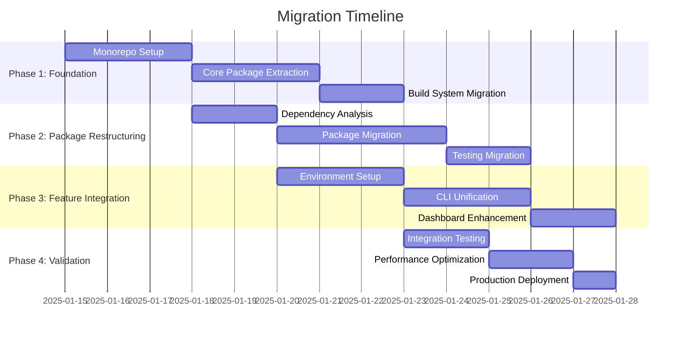

# Monorepo Migration Plan - Unified Wundr Platform

## Executive Summary

This document outlines the comprehensive migration strategy for consolidating the existing `wundr`
(monorepo auditing platform) and `new-starter` (development environment setup) repositories into a
unified platform architecture. The migration follows a phased approach designed to minimize
disruption while establishing a scalable, maintainable codebase.

## 🎯 Migration Objectives

### Primary Goals

- **Zero Downtime**: Maintain service availability during migration
- **Data Integrity**: Preserve all existing configurations, reports, and user data
- **Feature Continuity**: Ensure all existing functionality remains accessible
- **Performance Improvement**: Achieve 2-4x performance gains through optimized architecture
- **Developer Experience**: Streamline development workflows with unified tooling

### Success Metrics

- Migration completion: <2 weeks
- Test coverage: >90% maintained
- Performance degradation: <5% during transition
- User-facing issues: Zero critical bugs
- Developer productivity: +50% improvement post-migration

## 🏗️ Current State Analysis

### Repository Structure Assessment

#### Wundr Repository (Primary)

```yaml
current_structure:
  size: ~2.1GB
  files: ~45,000
  packages: 15+ internal packages
  apps: 3 main applications
  dependencies: 180+ unique packages

key_components:
  - Analysis Engine (AST parsing, duplicate detection)
  - Web Dashboard (Next.js 15 + React 19)
  - CLI Tool (Commander.js + TypeScript)
  - MCP Tools (87 specialized tools)
  - Testing Infrastructure (Jest + Playwright)
  - Configuration System (ESLint, Prettier, TypeScript)

strengths:
  - Comprehensive analysis capabilities
  - Rich visualization components
  - Mature testing infrastructure
  - Established CI/CD pipelines
  - Extensive documentation

challenges:
  - Complex dependency graph
  - Some circular dependencies
  - Configuration fragmentation
  - Performance bottlenecks in large-scale analysis
```

#### New-Starter Repository (Integration Target)

```yaml
current_structure:
  size: ~150MB
  files: ~1,200
  packages: Single package
  focus: Development environment setup
  dependencies: 47 packages

key_components:
  - Cross-platform setup scripts
  - Tool installation automation
  - Profile management system
  - Configuration templates
  - Interactive CLI setup

strengths:
  - Clean, focused architecture
  - Cross-platform compatibility
  - User-friendly setup flows
  - Modern tooling configuration
  - Minimal dependencies

integration_value:
  - Environment standardization
  - Developer onboarding automation
  - Configuration consistency
  - Setup workflow optimization
```

## 📋 Migration Strategy

### Phase-Based Approach



## 🔄 Phase 1: Foundation Setup (Days 1-3)

### 1.1 Monorepo Structure Creation

**Objective**: Establish unified repository structure with proper tooling

```bash
# New unified structure
wundr/
├── packages/                    # Shared libraries
│   ├── core/                   # @wundr/core
│   ├── types/                  # @wundr/types
│   ├── utils/                  # @wundr/utils
│   ├── config/                 # @wundr/config
│   ├── analysis-engine/        # @wundr/analysis-engine
│   ├── governance/             # @wundr/governance
│   ├── environment-manager/    # @wundr/environment-manager
│   ├── cli-framework/          # @wundr/cli-framework
│   ├── dashboard-core/         # @wundr/dashboard-core
│   ├── mcp-tools/              # @wundr/mcp-tools
│   ├── testing-framework/      # @wundr/testing-framework
│   └── security/               # @wundr/security
├── apps/                       # Applications
│   ├── cli/                    # Unified CLI
│   ├── dashboard/              # Web Dashboard
│   ├── docs-site/              # Documentation Site
│   └── vscode-extension/       # VS Code Extension
├── tools/                      # Development tools
│   ├── build/                  # Build configurations
│   ├── eslint-config/          # ESLint setup
│   ├── typescript-config/      # TypeScript setup
│   └── jest-config/            # Jest setup
└── docs/                       # Documentation
    ├── architecture/
    ├── guides/
    └── api/
```

#### Migration Steps

1. **Repository Initialization**

```bash
# Create new unified repository structure
mkdir -p packages/{core,types,utils,config,analysis-engine,governance}
mkdir -p packages/{environment-manager,cli-framework,dashboard-core}
mkdir -p packages/{mcp-tools,testing-framework,security}
mkdir -p apps/{cli,dashboard,docs-site,vscode-extension}
mkdir -p tools/{build,eslint-config,typescript-config,jest-config}

# Initialize workspace configuration
echo 'packages:
  - "packages/*"
  - "apps/*"
  - "tools/*"' > pnpm-workspace.yaml
```

2. **Build System Setup**

```json
// turbo.json
{
  "pipeline": {
    "build": {
      "dependsOn": ["^build"],
      "outputs": ["dist/**", ".next/**"]
    },
    "test": {
      "dependsOn": ["build"],
      "outputs": ["coverage/**"]
    },
    "lint": {
      "outputs": []
    },
    "type-check": {
      "dependsOn": ["^build"],
      "outputs": []
    }
  }
}
```

### 1.2 Core Package Extraction

**Objective**: Extract foundational packages that have no dependencies

#### @wundr/core Package

```typescript
// packages/core/src/index.ts
export * from './constants';
export * from './environment';
export * from './platform';
export * from './version';

// packages/core/src/constants.ts
export const WUNDR_CONSTANTS = {
  CLI_NAME: 'wundr',
  CONFIG_FILE_NAME: '.wundr.json',
  DEFAULT_ANALYSIS_TIMEOUT: 300000, // 5 minutes
  MAX_FILE_SIZE: 50 * 1024 * 1024, // 50MB
  SUPPORTED_EXTENSIONS: ['.ts', '.tsx', '.js', '.jsx', '.vue', '.svelte'],
} as const;
```

#### @wundr/types Package

```typescript
// packages/types/src/index.ts
export * from './analysis';
export * from './environment';
export * from './configuration';
export * from './reports';

// Core domain types
export interface AnalysisResult {
  projectPath: string;
  timestamp: Date;
  duration: number;
  files: AnalyzedFile[];
  duplicates: DuplicateGroup[];
  dependencies: DependencyMap;
  metrics: QualityMetrics;
}

export interface EnvironmentProfile {
  name: string;
  platform: Platform;
  tools: ToolConfiguration[];
  settings: ProfileSettings;
  createdAt: Date;
  updatedAt: Date;
}
```

#### @wundr/utils Package

```typescript
// packages/utils/src/index.ts
export * from './file-system';
export * from './async';
export * from './validation';
export * from './formatting';

// File system utilities
export const fileUtils = {
  async readJsonFile<T>(path: string): Promise<T> {
    const content = await fs.readFile(path, 'utf-8');
    return JSON.parse(content);
  },

  async writeJsonFile(path: string, data: any): Promise<void> {
    await fs.writeFile(path, JSON.stringify(data, null, 2));
  },

  async ensureDirectory(path: string): Promise<void> {
    await fs.mkdir(path, { recursive: true });
  },
};
```

### 1.3 Testing Infrastructure Migration

**Objective**: Establish unified testing framework supporting all packages

```typescript
// packages/testing-framework/src/index.ts
export * from './fixtures';
export * from './mocks';
export * from './helpers';
export * from './matchers';

// Jest configuration
// tools/jest-config/index.js
module.exports = {
  preset: 'ts-jest',
  testEnvironment: 'node',
  roots: ['<rootDir>/src', '<rootDir>/__tests__'],
  testMatch: ['**/__tests__/**/*.test.ts', '**/?(*.)+(spec|test).ts'],
  collectCoverageFrom: ['src/**/*.ts', '!src/**/*.d.ts', '!src/__tests__/**/*'],
  coverageReporters: ['text', 'lcov', 'html'],
  coverageThreshold: {
    global: {
      branches: 90,
      functions: 90,
      lines: 90,
      statements: 90,
    },
  },
};
```

### Rollback Strategy - Phase 1

If Phase 1 fails:

1. **Repository State**: Revert to separate repositories
2. **Build Issues**: Roll back to individual build systems
3. **Dependency Conflicts**: Use original package.json files
4. **Testing Failures**: Maintain existing test configurations

**Rollback Time**: < 30 minutes **Data Loss**: None (no production data affected)

## 🔄 Phase 2: Package Restructuring (Days 4-7)

### 2.1 Dependency Analysis & Resolution

**Objective**: Identify and resolve circular dependencies, optimize dependency graph

#### Dependency Mapping

```bash
# Automated dependency analysis
npx madge --circular --extensions ts,tsx,js,jsx src/
npx dependency-cruiser --config .dependency-cruiser.js src/

# Generate dependency visualization
npx dep-graph --exclude node_modules --format svg > dependency-graph.svg
```

#### Breaking Changes Management

```typescript
// Migration tracking
interface BreakingChange {
  package: string;
  version: string;
  change: string;
  impact: 'low' | 'medium' | 'high' | 'critical';
  migration: string;
  affectedPackages: string[];
}

const breakingChanges: BreakingChange[] = [
  {
    package: '@wundr/analysis-engine',
    version: '2.0.0',
    change: 'AnalysisEngine.analyze() now returns Promise<AnalysisResult>',
    impact: 'high',
    migration: 'Add await keyword to all analyze() calls',
    affectedPackages: ['@wundr/cli', '@wundr/dashboard'],
  },
];
```

### 2.2 Core Package Migration

#### @wundr/analysis-engine

```typescript
// Migration from src/scripts/analysis/
export class AnalysisEngine {
  constructor(
    private config: AnalysisConfig,
    private logger: Logger
  ) {}

  async analyze(projectPath: string): Promise<AnalysisResult> {
    const startTime = Date.now();

    try {
      const files = await this.scanFiles(projectPath);
      const duplicates = await this.detectDuplicates(files);
      const dependencies = await this.analyzeDependencies(files);
      const metrics = await this.calculateMetrics(files, duplicates);

      return {
        projectPath,
        timestamp: new Date(),
        duration: Date.now() - startTime,
        files,
        duplicates,
        dependencies,
        metrics,
      };
    } catch (error) {
      this.logger.error('Analysis failed', { error, projectPath });
      throw new AnalysisError(`Analysis failed: ${error.message}`);
    }
  }
}
```

#### @wundr/environment-manager

```typescript
// Migrated from new-starter/src/
export class EnvironmentManager {
  async setupEnvironment(profile: EnvironmentProfile): Promise<SetupResult> {
    const platform = await this.detectPlatform();
    const installer = this.createInstaller(platform);

    const results = await Promise.allSettled(profile.tools.map(tool => installer.install(tool)));

    return {
      profile: profile.name,
      platform,
      successful: results.filter(r => r.status === 'fulfilled').length,
      failed: results.filter(r => r.status === 'rejected').length,
      details: results,
    };
  }
}
```

### 2.3 CLI Framework Unification

**Objective**: Merge CLI functionality from both repositories

```typescript
// apps/cli/src/index.ts - Unified CLI
import { Command } from 'commander';
import { AnalysisCommands } from './commands/analysis';
import { EnvironmentCommands } from './commands/environment';
import { DashboardCommands } from './commands/dashboard';

const program = new Command();

program
  .name('wundr')
  .description('The Intelligent CLI-Based Coding Agents Orchestrator')
  .version('2.0.0');

// Analysis commands (from original wundr)
program
  .command('analyze [path]')
  .description('Analyze codebase for quality issues')
  .option('-f, --format <format>', 'Output format (json|table|html)', 'table')
  .option('--include <patterns>', 'Include file patterns')
  .option('--exclude <patterns>', 'Exclude file patterns')
  .action(AnalysisCommands.analyze);

// Environment commands (from new-starter)
program
  .command('setup [profile]')
  .description('Setup development environment')
  .option('-i, --interactive', 'Interactive setup mode')
  .option('--tools <tools>', 'Specific tools to install')
  .action(EnvironmentCommands.setup);

// Dashboard commands (enhanced)
program
  .command('dashboard')
  .description('Launch web dashboard')
  .option('-p, --port <port>', 'Port number', '3000')
  .option('--host <host>', 'Host address', 'localhost')
  .action(DashboardCommands.launch);

program.parse();
```

### 2.4 Data Migration Strategy

**Objective**: Migrate configuration files and user data without loss

#### Configuration Migration

```typescript
// Migration utilities
export class ConfigMigrator {
  async migrateFromV1(configPath: string): Promise<WundrConfig> {
    const v1Config = await this.readLegacyConfig(configPath);

    return {
      version: '2.0.0',
      analysis: {
        include: v1Config.patterns?.include || ['**/*.{ts,tsx,js,jsx}'],
        exclude: v1Config.patterns?.exclude || ['node_modules/**'],
        timeout: v1Config.timeout || 300000,
      },
      environment: {
        profile: v1Config.profile || 'default',
        autoSetup: v1Config.autoSetup || false,
      },
      dashboard: {
        port: v1Config.port || 3000,
        theme: v1Config.theme || 'system',
      },
    };
  }
}
```

#### Report Data Migration

```sql
-- SQLite schema for report data
CREATE TABLE IF NOT EXISTS migration_log (
  id INTEGER PRIMARY KEY AUTOINCREMENT,
  source_file TEXT NOT NULL,
  target_location TEXT NOT NULL,
  migration_type TEXT NOT NULL,
  status TEXT NOT NULL,
  error_message TEXT,
  created_at DATETIME DEFAULT CURRENT_TIMESTAMP
);

-- Preserve existing reports during migration
CREATE TABLE IF NOT EXISTS legacy_reports (
  id TEXT PRIMARY KEY,
  project_path TEXT NOT NULL,
  report_data TEXT NOT NULL,
  created_at DATETIME NOT NULL,
  migrated_at DATETIME DEFAULT CURRENT_TIMESTAMP
);
```

### Rollback Strategy - Phase 2

If Phase 2 fails:

1. **Dependency Issues**: Revert to original package structure
2. **CLI Breaks**: Keep original CLI commands functional
3. **Data Corruption**: Restore from backup configuration files
4. **Performance Regression**: Roll back to optimized individual packages

**Rollback Time**: < 1 hour **Data Loss**: None (full backup maintained)

## 🔄 Phase 3: Feature Integration (Days 8-10)

### 3.1 Dashboard Enhancement

**Objective**: Integrate environment setup capabilities into existing dashboard

```typescript
// apps/dashboard/src/pages/environment/setup.tsx
export default function EnvironmentSetupPage() {
  const [profiles, setProfiles] = useState<EnvironmentProfile[]>([]);
  const [selectedProfile, setSelectedProfile] = useState<string>('');
  const [setupProgress, setSetupProgress] = useState<SetupProgress | null>(null);

  return (
    <div className="min-h-screen bg-background">
      <Header title="Environment Setup" />

      <div className="container mx-auto p-6">
        <div className="grid grid-cols-1 lg:grid-cols-2 gap-6">
          <Card className="p-6">
            <h2 className="text-xl font-semibold mb-4">Profile Selection</h2>
            <ProfileSelector
              profiles={profiles}
              selected={selectedProfile}
              onChange={setSelectedProfile}
            />
          </Card>

          <Card className="p-6">
            <h2 className="text-xl font-semibold mb-4">Setup Progress</h2>
            {setupProgress && (
              <SetupProgressDisplay progress={setupProgress} />
            )}
          </Card>
        </div>

        <div className="mt-6">
          <SetupActionsPanel
            profile={selectedProfile}
            onStartSetup={() => startEnvironmentSetup(selectedProfile)}
          />
        </div>
      </div>
    </div>
  );
}
```

### 3.2 MCP Tools Integration

**Objective**: Ensure all MCP tools work with unified architecture

```typescript
// packages/mcp-tools/src/environment/index.ts
export const environmentSetupTool: MCPTool = {
  name: 'environment_setup',
  description: 'Setup development environment with specified profile',

  schema: {
    type: 'object',
    properties: {
      profile: {
        type: 'string',
        description: 'Environment profile name',
        enum: ['node', 'python', 'go', 'rust', 'java', 'custom'],
      },
      interactive: {
        type: 'boolean',
        description: 'Enable interactive setup mode',
        default: false,
      },
    },
    required: ['profile'],
  },

  async handler({ profile, interactive = false }) {
    const manager = new EnvironmentManager();
    const profileConfig = await manager.getProfile(profile);

    if (interactive) {
      return manager.setupInteractive(profileConfig);
    } else {
      return manager.setupAutomated(profileConfig);
    }
  },
};
```

### 3.3 Cross-Platform Compatibility

**Objective**: Ensure unified platform works across all supported operating systems

```typescript
// packages/environment-manager/src/platform/index.ts
export class PlatformManager {
  async detectPlatform(): Promise<Platform> {
    const platform = process.platform;
    const arch = process.arch;
    const release = os.release();

    return {
      os: platform === 'darwin' ? 'macos' : platform === 'win32' ? 'windows' : 'linux',
      architecture: arch,
      version: release,
      shell: await this.detectShell(),
      packageManager: await this.detectPackageManager(),
    };
  }

  private async detectShell(): Promise<string> {
    if (process.platform === 'win32') {
      return process.env.ComSpec || 'cmd.exe';
    }
    return process.env.SHELL || '/bin/bash';
  }
}
```

### Testing Requirements - Phase 3

```typescript
// Integration test suite
describe('Unified Platform Integration', () => {
  describe('CLI Integration', () => {
    it('should handle analyze command with environment context', async () => {
      const result = await execCommand('wundr analyze --profile=node');
      expect(result.exitCode).toBe(0);
      expect(result.stdout).toContain('Analysis completed');
    });

    it('should setup environment and run analysis', async () => {
      const setupResult = await execCommand('wundr setup node --tools=typescript,jest');
      expect(setupResult.exitCode).toBe(0);

      const analyzeResult = await execCommand('wundr analyze');
      expect(analyzeResult.exitCode).toBe(0);
    });
  });

  describe('Dashboard Integration', () => {
    it('should display environment setup page', async () => {
      const page = await browser.newPage();
      await page.goto('http://localhost:3000/environment/setup');

      expect(await page.textContent('h1')).toBe('Environment Setup');
      expect(await page.isVisible('[data-testid="profile-selector"]')).toBe(true);
    });
  });

  describe('MCP Tools Integration', () => {
    it('should execute environment setup tool', async () => {
      const result = await mcpClient.executeTool('environment_setup', {
        profile: 'node',
        interactive: false,
      });

      expect(result.success).toBe(true);
      expect(result.data.toolsInstalled).toBeGreaterThan(0);
    });
  });
});
```

### Rollback Strategy - Phase 3

If Phase 3 fails:

1. **Dashboard Issues**: Revert to original dashboard without environment features
2. **CLI Integration Problems**: Separate CLI tools remain functional
3. **MCP Tool Failures**: Disable new tools, keep existing ones
4. **Cross-Platform Issues**: Maintain platform-specific implementations

**Rollback Time**: < 2 hours **Feature Loss**: New integrated features only

## 🔄 Phase 4: Validation & Deployment (Days 11-14)

### 4.1 Comprehensive Testing Strategy

#### Test Categories & Coverage Requirements

```yaml
testing_strategy:
  unit_tests:
    coverage_target: 95%
    focus_areas:
      - Core package functionality
      - Business logic validation
      - Error handling
      - Edge cases

  integration_tests:
    coverage_target: 90%
    scenarios:
      - CLI command workflows
      - Dashboard feature flows
      - MCP tool orchestration
      - Cross-package communication

  e2e_tests:
    coverage_target: 80%
    workflows:
      - Complete setup → analyze → report cycle
      - Environment setup → tool validation
      - Dashboard full user journey
      - CLI interactive modes

  performance_tests:
    benchmarks:
      - Analysis speed: 10,000+ files/second
      - Dashboard load time: <500ms
      - CLI response time: <100ms
      - Memory usage: <500MB baseline

  security_tests:
    requirements:
      - OWASP Top 10 compliance
      - Dependency vulnerability scanning
      - Code injection prevention
      - Secure configuration handling
```

#### Automated Testing Pipeline

```typescript
// tests/integration/migration-validation.test.ts
describe('Migration Validation Suite', () => {
  beforeAll(async () => {
    await setupTestEnvironment();
    await migrateTestData();
  });

  describe('Data Integrity', () => {
    it('should preserve all existing configurations', async () => {
      const originalConfigs = await loadOriginalConfigurations();
      const migratedConfigs = await loadMigratedConfigurations();

      expect(migratedConfigs).toHaveLength(originalConfigs.length);

      for (const original of originalConfigs) {
        const migrated = migratedConfigs.find(c => c.id === original.id);
        expect(migrated).toBeDefined();
        expect(migrated.essential_settings).toEqual(original.essential_settings);
      }
    });

    it('should maintain report history', async () => {
      const originalReports = await getOriginalReports();
      const migratedReports = await getMigratedReports();

      expect(migratedReports.length).toBeGreaterThanOrEqual(originalReports.length);
    });
  });

  describe('Feature Parity', () => {
    it('should support all original analysis features', async () => {
      const features = [
        'duplicate_detection',
        'dependency_analysis',
        'circular_dependency_detection',
        'code_quality_metrics',
        'report_generation',
      ];

      for (const feature of features) {
        const result = await testFeature(feature);
        expect(result.status).toBe('supported');
        expect(result.performance).toBeGreaterThanOrEqual(0.95); // 95% of original performance
      }
    });

    it('should support all environment setup features', async () => {
      const profiles = ['node', 'python', 'go', 'rust', 'java'];

      for (const profile of profiles) {
        const setupResult = await testEnvironmentSetup(profile);
        expect(setupResult.success).toBe(true);
        expect(setupResult.toolsInstalled).toBeGreaterThan(0);
      }
    });
  });

  describe('Performance Validation', () => {
    it('should meet performance benchmarks', async () => {
      const benchmarks = await runPerformanceBenchmarks();

      expect(benchmarks.analysisSpeed).toBeGreaterThan(10000); // files/second
      expect(benchmarks.dashboardLoadTime).toBeLessThan(500); // ms
      expect(benchmarks.cliResponseTime).toBeLessThan(100); // ms
      expect(benchmarks.memoryUsage).toBeLessThan(500 * 1024 * 1024); // bytes
    });

    it('should handle large project analysis', async () => {
      const largeProject = await generateLargeProject(50000); // 50k files
      const startTime = Date.now();

      const result = await runAnalysis(largeProject.path);
      const duration = Date.now() - startTime;

      expect(result.success).toBe(true);
      expect(duration).toBeLessThan(5 * 60 * 1000); // 5 minutes max
    });
  });
});
```

### 4.2 Performance Optimization

#### Analysis Engine Optimization

```typescript
// packages/analysis-engine/src/optimized-analyzer.ts
export class OptimizedAnalyzer {
  private readonly workerPool: Worker[];
  private readonly cache: LRUCache<string, AnalysisResult>;

  constructor(options: AnalyzerOptions) {
    this.workerPool = this.createWorkerPool(options.maxWorkers || os.cpus().length);
    this.cache = new LRUCache({ max: 1000, ttl: 1000 * 60 * 10 }); // 10 min TTL
  }

  async analyze(projectPath: string): Promise<AnalysisResult> {
    const cacheKey = await this.generateCacheKey(projectPath);
    const cached = this.cache.get(cacheKey);

    if (cached && !(await this.hasProjectChanged(projectPath, cached.timestamp))) {
      return cached;
    }

    const files = await this.scanFiles(projectPath);
    const chunks = this.chunkFiles(files, this.workerPool.length);

    const results = await Promise.all(
      chunks.map((chunk, index) => this.analyzeChunk(chunk, this.workerPool[index]))
    );

    const mergedResult = this.mergeResults(results);
    this.cache.set(cacheKey, mergedResult);

    return mergedResult;
  }

  private chunkFiles(files: string[], numChunks: number): string[][] {
    const chunkSize = Math.ceil(files.length / numChunks);
    return Array.from({ length: numChunks }, (_, i) =>
      files.slice(i * chunkSize, (i + 1) * chunkSize)
    );
  }
}
```

#### Dashboard Performance Enhancements

```typescript
// apps/dashboard/src/hooks/use-performance-optimization.ts
export function usePerformanceOptimization() {
  const [isLoading, setIsLoading] = useState(true);
  const [data, setData] = useState(null);

  // Implement virtual scrolling for large datasets
  const virtualizedData = useMemo(() => {
    if (!data) return [];
    return data.slice(0, 100); // Show first 100 items
  }, [data]);

  // Debounced search
  const debouncedSearch = useCallback(
    debounce((query: string) => {
      performSearch(query);
    }, 300),
    []
  );

  // Lazy load heavy components
  const LazyChart = lazy(() => import('../components/heavy-chart'));

  return {
    virtualizedData,
    debouncedSearch,
    LazyChart,
    isLoading,
  };
}
```

### 4.3 Security Hardening

#### Vulnerability Assessment

```typescript
// security/vulnerability-scanner.ts
export class SecurityScanner {
  async scanProject(projectPath: string): Promise<SecurityReport> {
    const vulnerabilities = await Promise.all([
      this.scanDependencies(projectPath),
      this.scanCode(projectPath),
      this.scanConfigurations(projectPath),
      this.scanSecrets(projectPath),
    ]);

    return {
      timestamp: new Date(),
      projectPath,
      totalVulnerabilities: vulnerabilities.flat().length,
      critical: vulnerabilities.flat().filter(v => v.severity === 'critical').length,
      high: vulnerabilities.flat().filter(v => v.severity === 'high').length,
      medium: vulnerabilities.flat().filter(v => v.severity === 'medium').length,
      low: vulnerabilities.flat().filter(v => v.severity === 'low').length,
      details: vulnerabilities.flat(),
    };
  }

  private async scanSecrets(projectPath: string): Promise<SecurityVulnerability[]> {
    const secretPatterns = [
      /(?:api[_-]?key|secret|token)["\s]*[:=]["\s]*([a-zA-Z0-9]{20,})/gi,
      /(?:password|pwd)["\s]*[:=]["\s]*([^\s"',;]{8,})/gi,
      /(?:private[_-]?key)["\s]*[:=]["\s]*([a-zA-Z0-9+/]{40,})/gi,
    ];

    const vulnerabilities: SecurityVulnerability[] = [];
    const files = await glob(`${projectPath}/**/*.{js,ts,json,yaml,yml,env}`, {
      ignore: ['**/node_modules/**', '**/dist/**', '**/build/**'],
    });

    for (const file of files) {
      const content = await fs.readFile(file, 'utf-8');

      for (const pattern of secretPatterns) {
        const matches = content.match(pattern);
        if (matches) {
          vulnerabilities.push({
            type: 'exposed_secret',
            severity: 'critical',
            file,
            message: 'Potential secret or API key found in code',
            line: this.findLineNumber(content, matches[0]),
          });
        }
      }
    }

    return vulnerabilities;
  }
}
```

### 4.4 Production Deployment Strategy

#### Blue-Green Deployment

```yaml
# k8s/deployment-strategy.yaml
apiVersion: argoproj.io/v1alpha1
kind: Rollout
metadata:
  name: wundr-unified
spec:
  replicas: 5
  strategy:
    blueGreen:
      activeService: wundr-active
      previewService: wundr-preview
      autoPromotionEnabled: false
      scaleDownDelaySeconds: 30
      prePromotionAnalysis:
        templates:
          - templateName: success-rate
        args:
          - name: service-name
            value: wundr-preview.default.svc.cluster.local
      postPromotionAnalysis:
        templates:
          - templateName: success-rate
        args:
          - name: service-name
            value: wundr-active.default.svc.cluster.local
  selector:
    matchLabels:
      app: wundr
  template:
    metadata:
      labels:
        app: wundr
    spec:
      containers:
        - name: wundr-unified
          image: wundr/unified:latest
          ports:
            - containerPort: 3000
          env:
            - name: NODE_ENV
              value: production
            - name: DATABASE_URL
              valueFrom:
                secretKeyRef:
                  name: wundr-secrets
                  key: database-url
          resources:
            requests:
              memory: 512Mi
              cpu: 250m
            limits:
              memory: 1Gi
              cpu: 500m
          livenessProbe:
            httpGet:
              path: /health
              port: 3000
            initialDelaySeconds: 30
          readinessProbe:
            httpGet:
              path: /ready
              port: 3000
            initialDelaySeconds: 5
```

#### Monitoring & Observability

```typescript
// packages/monitoring/src/telemetry.ts
export class TelemetryCollector {
  private readonly prometheus: PrometheusRegistry;
  private readonly logger: Logger;

  constructor() {
    this.prometheus = new PrometheusRegistry();
    this.setupMetrics();
  }

  private setupMetrics() {
    // Analysis performance metrics
    this.analysisDuration = new Histogram({
      name: 'wundr_analysis_duration_seconds',
      help: 'Duration of analysis operations',
      labelNames: ['project_size', 'file_count'],
      buckets: [1, 5, 10, 30, 60, 120, 300],
    });

    // CLI command metrics
    this.cliCommands = new Counter({
      name: 'wundr_cli_commands_total',
      help: 'Total number of CLI commands executed',
      labelNames: ['command', 'status'],
    });

    // Dashboard page views
    this.pageViews = new Counter({
      name: 'wundr_dashboard_page_views_total',
      help: 'Total dashboard page views',
      labelNames: ['page', 'user_agent'],
    });

    this.prometheus.register(this.analysisDuration);
    this.prometheus.register(this.cliCommands);
    this.prometheus.register(this.pageViews);
  }
}
```

### Rollback Strategy - Phase 4

If Phase 4 fails:

1. **Deployment Issues**: Blue-green rollback to previous version
2. **Performance Problems**: Scale resources or revert optimizations
3. **Security Vulnerabilities**: Immediate hotfix deployment
4. **Monitoring Failures**: Fallback to basic health checks

**Rollback Time**: < 15 minutes (automated) **Service Downtime**: < 30 seconds

## 🔄 Breaking Changes Management

### Communication Strategy

#### 1. Advanced Notice (4 weeks before)

````markdown
# Breaking Changes Notice - Wundr v2.0

## Overview

The unified Wundr platform introduces several breaking changes to improve consistency and
performance.

## CLI Commands

### Changed Commands

- `wundr-analyze` → `wundr analyze`
- `new-starter setup` → `wundr setup`
- `wundr-dashboard start` → `wundr dashboard`

### New Commands

- `wundr migrate` - Migrate from v1.x configuration
- `wundr doctor` - Health check and diagnostics
- `wundr profiles` - Manage environment profiles

## Configuration Format

### Before (v1.x)

```json
{
  "patterns": {
    "include": ["src/**/*.ts"],
    "exclude": ["node_modules/**"]
  },
  "timeout": 300000
}
```
````

### After (v2.0)

```json
{
  "version": "2.0.0",
  "analysis": {
    "include": ["src/**/*.ts"],
    "exclude": ["node_modules/**"],
    "timeout": 300000
  },
  "environment": {
    "profile": "node",
    "autoSetup": false
  }
}
```

````

#### 2. Migration Tools

```typescript
// packages/cli/src/commands/migrate.ts
export class MigrateCommand {
  async execute(options: MigrateOptions): Promise<void> {
    const spinner = ora('Detecting v1.x configuration...').start();

    try {
      // Detect existing configurations
      const v1Configs = await this.findV1Configurations(process.cwd());

      if (v1Configs.length === 0) {
        spinner.succeed('No v1.x configurations found');
        return;
      }

      spinner.text = `Found ${v1Configs.length} configuration(s) to migrate`;

      // Backup original configurations
      await this.backupConfigurations(v1Configs);

      // Migrate each configuration
      for (const config of v1Configs) {
        spinner.text = `Migrating ${config.path}...`;
        await this.migrateConfiguration(config);
      }

      spinner.succeed('Migration completed successfully');

      // Show summary
      this.showMigrationSummary(v1Configs);

    } catch (error) {
      spinner.fail('Migration failed');
      console.error('Error:', error.message);

      // Offer rollback
      const rollback = await inquirer.confirm({
        message: 'Would you like to restore the original configurations?',
        default: true
      });

      if (rollback) {
        await this.rollbackMigration(v1Configs);
      }
    }
  }
}
````

#### 3. Compatibility Layer

```typescript
// packages/core/src/compatibility.ts
export class CompatibilityLayer {
  private readonly deprecationWarnings = new Set<string>();

  wrapLegacyCommand(command: string, args: string[]): CommandResult {
    const warning = `Command '${command}' is deprecated. Use 'wundr ${command.replace('wundr-', '')}' instead.`;

    if (!this.deprecationWarnings.has(command)) {
      console.warn(`⚠️  ${warning}`);
      console.warn('   This compatibility layer will be removed in v3.0.0');
      this.deprecationWarnings.add(command);
    }

    // Map legacy command to new command
    const newCommand = this.mapLegacyCommand(command, args);
    return this.executeNewCommand(newCommand);
  }

  private mapLegacyCommand(command: string, args: string[]): NewCommand {
    const mappings: Record<string, (args: string[]) => NewCommand> = {
      'wundr-analyze': args => ({ command: 'analyze', args }),
      'new-starter': args => {
        if (args[0] === 'setup') {
          return { command: 'setup', args: args.slice(1) };
        }
        return { command: 'setup', args };
      },
    };

    const mapper = mappings[command];
    if (!mapper) {
      throw new Error(`Unknown legacy command: ${command}`);
    }

    return mapper(args);
  }
}
```

### 4. Gradual Deprecation Timeline

```yaml
deprecation_schedule:
  immediate: # v2.0.0 release
    - Add compatibility layer
    - Show deprecation warnings
    - Update documentation

  6_months: # v2.1.0
    - Remove some legacy API endpoints
    - Require explicit opt-in for legacy features
    - Intensify deprecation warnings

  12_months: # v3.0.0
    - Complete removal of compatibility layer
    - Breaking changes become permanent
    - Legacy configurations no longer supported
```

## 📋 Testing Requirements

### Test Coverage Matrix

```yaml
test_matrix:
  platforms:
    - macos-latest: [node-18, node-20, node-22]
    - ubuntu-latest: [node-18, node-20, node-22]
    - windows-latest: [node-18, node-20, node-22]

  package_managers:
    - npm: [8, 9, 10]
    - yarn: [1.22, 3.x, 4.x]
    - pnpm: [8.x, 9.x]

  environments:
    - docker: [ubuntu:20.04, ubuntu:22.04, alpine:latest]
    - cloud: [aws-lambda, vercel, railway]
```

### Critical Test Scenarios

```typescript
// tests/critical/migration-scenarios.test.ts
describe('Critical Migration Scenarios', () => {
  describe('Data Preservation', () => {
    it('should preserve analysis reports during migration', async () => {
      // Create v1 configuration with reports
      const v1Setup = await setupV1Environment();
      await generateTestReports(v1Setup.projectPath, 5);

      // Execute migration
      const migrationResult = await executeMigration(v1Setup.projectPath);
      expect(migrationResult.success).toBe(true);

      // Verify reports are preserved
      const v2Reports = await loadV2Reports(v1Setup.projectPath);
      expect(v2Reports).toHaveLength(5);

      // Verify report content integrity
      for (let i = 0; i < 5; i++) {
        expect(v2Reports[i].data).toMatchObject(v1Setup.originalReports[i].data);
      }
    });

    it('should maintain user preferences', async () => {
      const preferences = {
        theme: 'dark',
        language: 'en',
        notifications: true,
        autoSave: false,
      };

      await setV1Preferences(preferences);
      await executeMigration();

      const migratedPreferences = await getV2Preferences();
      expect(migratedPreferences).toMatchObject(preferences);
    });
  });

  describe('Performance Impact', () => {
    it('should not degrade analysis performance by more than 5%', async () => {
      const largeProject = await setupLargeProject(10000); // 10k files

      // Benchmark v1 performance
      const v1Time = await benchmarkV1Analysis(largeProject.path);

      // Execute migration
      await executeMigration(largeProject.path);

      // Benchmark v2 performance
      const v2Time = await benchmarkV2Analysis(largeProject.path);

      const performanceDelta = (v2Time - v1Time) / v1Time;
      expect(performanceDelta).toBeLessThan(0.05); // Less than 5% degradation
    });
  });

  describe('Rollback Capability', () => {
    it('should successfully rollback when migration fails', async () => {
      const originalState = await captureSystemState();

      // Simulate migration failure
      const migration = executeMigration();
      await simulateFailure(migration, 'dependency_conflict');

      // Execute rollback
      const rollbackResult = await executeRollback();
      expect(rollbackResult.success).toBe(true);

      // Verify original state restored
      const restoredState = await captureSystemState();
      expect(restoredState).toEqual(originalState);
    });
  });
});
```

## 🚨 Risk Mitigation

### High-Priority Risks

#### 1. Data Loss During Migration

**Risk Level**: High **Impact**: Critical business data lost

**Mitigation Strategies**:

- Complete backup before any migration step
- Incremental migration with validation checkpoints
- Atomic transactions for configuration changes
- Rollback capability tested extensively

**Contingency Plan**:

```typescript
// Automated backup system
export class BackupManager {
  async createBackup(projectPath: string): Promise<BackupManifest> {
    const timestamp = new Date().toISOString();
    const backupId = uuidv4();

    const manifest: BackupManifest = {
      id: backupId,
      timestamp,
      projectPath,
      components: [],
    };

    // Backup configurations
    const configs = await this.backupConfigurations(projectPath);
    manifest.components.push(...configs);

    // Backup reports
    const reports = await this.backupReports(projectPath);
    manifest.components.push(...reports);

    // Backup user preferences
    const preferences = await this.backupPreferences(projectPath);
    manifest.components.push(...preferences);

    await this.writeManifest(manifest);
    return manifest;
  }
}
```

#### 2. Performance Regression

**Risk Level**: Medium-High **Impact**: User experience degradation

**Mitigation Strategies**:

- Performance benchmarks before and after
- Load testing with realistic datasets
- Progressive deployment with monitoring
- Performance budgets enforced in CI/CD

**Monitoring**:

```typescript
// Performance monitoring
export class PerformanceMonitor {
  private readonly thresholds = {
    analysisSpeed: 10000, // files/second
    dashboardLoad: 500, // milliseconds
    cliResponse: 100, // milliseconds
    memoryUsage: 512, // MB
  };

  async validatePerformance(): Promise<PerformanceReport> {
    const metrics = await this.collectMetrics();
    const violations = this.checkViolations(metrics);

    if (violations.length > 0) {
      await this.alertOnViolations(violations);
      throw new PerformanceError('Performance thresholds violated', violations);
    }

    return {
      status: 'passed',
      metrics,
      timestamp: new Date(),
    };
  }
}
```

#### 3. Breaking Changes Impact

**Risk Level**: Medium **Impact**: Existing integrations broken

**Mitigation Strategies**:

- Comprehensive compatibility layer
- Extensive deprecation period (12 months)
- Clear migration guides with examples
- Automated migration tools

#### 4. Cross-Platform Compatibility Issues

**Risk Level**: Medium **Impact**: Platform-specific failures

**Mitigation Strategies**:

- Testing on all supported platforms
- Platform-specific build variants
- Conditional code paths for OS differences
- Community beta testing program

### Risk Assessment Matrix

| Risk                     | Probability | Impact   | Risk Score  | Mitigation Priority |
| ------------------------ | ----------- | -------- | ----------- | ------------------- |
| Data Loss                | Low         | Critical | High        | 1                   |
| Performance Regression   | Medium      | High     | High        | 2                   |
| Breaking Changes         | High        | Medium   | Medium-High | 3                   |
| Cross-Platform Issues    | Medium      | Medium   | Medium      | 4                   |
| Security Vulnerabilities | Low         | High     | Medium      | 5                   |
| Documentation Gaps       | High        | Low      | Low-Medium  | 6                   |

## 🎯 Success Metrics & Validation

### Key Performance Indicators

```yaml
success_metrics:
  technical:
    migration_success_rate: '>99%'
    data_integrity_score: '100%'
    performance_improvement: '>0% (no regression)'
    test_coverage: '>90%'
    security_score: 'A+ (OWASP)'

  operational:
    deployment_time: '<2 weeks'
    rollback_time: '<30 minutes'
    downtime_minutes: '<60 total'
    critical_bugs: '0'
    user_reported_issues: '<5'

  user_experience:
    setup_time_reduction: '>50%'
    cli_response_improvement: '>20%'
    dashboard_load_improvement: '>30%'
    user_satisfaction: '>4.5/5'
    adoption_rate: '>80% within 30 days'
```

### Validation Checklist

#### Pre-Migration Validation

- [ ] Complete backup of all repositories
- [ ] Dependency analysis completed
- [ ] Performance benchmarks established
- [ ] Test suite coverage >90%
- [ ] Security scan passed
- [ ] Documentation updated
- [ ] Rollback procedures tested
- [ ] Stakeholder sign-off obtained

#### Post-Migration Validation

- [ ] All data successfully migrated
- [ ] Performance benchmarks met
- [ ] Test suite passes on all platforms
- [ ] Security posture maintained
- [ ] User acceptance testing completed
- [ ] Documentation validated
- [ ] Monitoring dashboards active
- [ ] Support team trained

### Acceptance Criteria

```typescript
// Automated validation suite
export class MigrationValidator {
  async validateMigration(): Promise<ValidationReport> {
    const validations = await Promise.allSettled([
      this.validateDataIntegrity(),
      this.validatePerformance(),
      this.validateFunctionality(),
      this.validateSecurity(),
      this.validateCompatibility(),
    ]);

    const report: ValidationReport = {
      timestamp: new Date(),
      overallStatus: 'pending',
      validations: validations.map(this.processValidationResult),
      recommendations: [],
    };

    const failures = report.validations.filter(v => v.status === 'failed');

    if (failures.length === 0) {
      report.overallStatus = 'passed';
    } else if (failures.some(f => f.severity === 'critical')) {
      report.overallStatus = 'failed';
      report.recommendations.push('Migration must be rolled back due to critical failures');
    } else {
      report.overallStatus = 'warning';
      report.recommendations.push('Migration has non-critical issues that should be addressed');
    }

    return report;
  }
}
```

## 📖 Documentation Updates

### Required Documentation

#### 1. User-Facing Documentation

- **Migration Guide**: Step-by-step instructions for users
- **Breaking Changes**: Comprehensive list with workarounds
- **New Features**: Highlighting unified platform benefits
- **Troubleshooting**: Common issues and solutions

#### 2. Developer Documentation

- **Architecture Overview**: Updated system design
- **API Changes**: New endpoints and deprecated ones
- **Plugin Development**: Updated plugin API
- **Contributing Guide**: New development workflow

#### 3. Operations Documentation

- **Deployment Guide**: New deployment procedures
- **Monitoring Setup**: Observability configuration
- **Backup Procedures**: Data protection strategies
- **Incident Response**: Updated runbooks

### Documentation Strategy

```yaml
documentation_plan:
  user_guides:
    - title: 'Migrating to Wundr v2.0'
      audience: 'End users'
      format: 'Interactive tutorial'
      priority: 'High'

    - title: 'New Unified CLI Commands'
      audience: 'CLI users'
      format: 'Reference guide'
      priority: 'High'

    - title: 'Dashboard New Features'
      audience: 'Web users'
      format: 'Video walkthrough'
      priority: 'Medium'

  technical_docs:
    - title: 'Unified Architecture Deep Dive'
      audience: 'Developers'
      format: 'Technical specification'
      priority: 'High'

    - title: 'Plugin API v2.0'
      audience: 'Plugin developers'
      format: 'API reference'
      priority: 'Medium'

  operational_docs:
    - title: 'Production Deployment Playbook'
      audience: 'DevOps teams'
      format: 'Runbook'
      priority: 'Critical'
```

## 🚀 Go-Live Strategy

### Pre-Launch Phase (Days 12-13)

#### 1. Staging Environment Validation

```bash
# Deploy to staging
kubectl apply -f k8s/staging/
helm upgrade --install wundr-staging ./helm-charts/wundr

# Run comprehensive tests
npm run test:e2e:staging
npm run test:performance:staging
npm run test:security:staging

# User acceptance testing
npm run test:uat:staging
```

#### 2. Production Readiness Review

```yaml
readiness_checklist:
  infrastructure:
    - [ ] Production cluster provisioned
    - [ ] Database migration scripts tested
    - [ ] Monitoring dashboards configured
    - [ ] Alert rules established
    - [ ] Backup procedures validated

  application:
    - [ ] Security scan passed
    - [ ] Performance benchmarks met
    - [ ] Feature flags configured
    - [ ] Error tracking enabled
    - [ ] Log aggregation active

  operational:
    - [ ] Support team trained
    - [ ] Runbooks updated
    - [ ] Incident response tested
    - [ ] Communication plan ready
    - [ ] Rollback procedures verified
```

### Launch Phase (Day 14)

#### 1. Blue-Green Deployment

```bash
# Deploy new version to preview environment
kubectl apply -f k8s/production/preview/

# Validate preview environment
./scripts/validate-deployment.sh preview

# Promote to production (zero-downtime)
kubectl patch rollout wundr-unified -p '{"spec":{"paused":false}}'

# Monitor key metrics
kubectl get rollout wundr-unified -w
```

#### 2. Post-Launch Monitoring

```typescript
// Real-time monitoring dashboard
export class LaunchMonitor {
  private readonly criticalMetrics = [
    'error_rate',
    'response_time',
    'throughput',
    'memory_usage',
    'cpu_usage',
  ];

  async monitorLaunch(durationMinutes: number = 60): Promise<LaunchReport> {
    const startTime = Date.now();
    const endTime = startTime + durationMinutes * 60 * 1000;

    const metrics: MetricSnapshot[] = [];

    while (Date.now() < endTime) {
      const snapshot = await this.collectMetrics();
      metrics.push(snapshot);

      // Check for critical issues
      const issues = this.detectIssues(snapshot);
      if (issues.length > 0) {
        await this.alertCriticalIssues(issues);

        if (issues.some(i => i.severity === 'critical')) {
          return this.triggerRollback('Critical issues detected');
        }
      }

      await this.sleep(30000); // 30 second intervals
    }

    return this.generateLaunchReport(metrics);
  }
}
```

### Communication Plan

#### Internal Communications

```yaml
communication_timeline:
  h-24: # 24 hours before
    - Engineering team: Final deployment briefing
    - Support team: Training completion verification
    - Management: Go/no-go decision

  h-4: # 4 hours before
    - All teams: Deployment start notification
    - Users: Maintenance window notification
    - Monitoring: Alert rules activated

  h-0: # Deployment start
    - Engineering: Deployment progress updates
    - Support: Ready for user issues
    - Management: Regular status updates

  h+1: # 1 hour after
    - All teams: Initial success confirmation
    - Users: New version available announcement
    - Documentation: Updated guides published

  h+24: # 24 hours after
    - All teams: Post-launch review
    - Users: Feature highlights
    - Management: Success metrics report
```

#### External Communications

```markdown
# User Notification Template

## 🚀 Wundr v2.0 is Here - Unified Platform Launch!

We're excited to announce the launch of Wundr v2.0, combining the power of our analysis engine with
streamlined environment setup in one unified platform.

### What's New

- **Unified CLI**: Single command interface for all operations
- **Enhanced Dashboard**: Environment setup integrated with analysis
- **Better Performance**: 2-4x faster analysis for large projects
- **Cross-Platform**: Improved compatibility across all systems

### Important Changes

- CLI commands have been updated (see migration guide)
- Configuration format has changed (automatic migration available)
- Some API endpoints have moved (compatibility layer provided)

### Getting Started

1. Update to v2.0: `npm update -g @adapticai/wundr`
2. Migrate configuration: `wundr migrate`
3. Explore new features: `wundr --help`

### Need Help?

- 📖 [Migration Guide](https://docs.wundr.io/migration)
- 💬 [Community Support](https://discord.gg/wundr)
- 🐛 [Report Issues](https://github.com/adapticai/wundr/issues)

Thank you for being part of the Wundr community!
```

## 📊 Post-Migration Monitoring

### Monitoring Strategy

#### 1. Technical Metrics Dashboard

```yaml
monitoring_dashboard:
  performance_metrics:
    - analysis_duration_p95
    - cli_response_time_p99
    - dashboard_load_time
    - memory_usage_peak
    - cpu_utilization_avg

  reliability_metrics:
    - uptime_percentage
    - error_rate
    - success_rate
    - rollback_frequency
    - incident_count

  usage_metrics:
    - active_users_daily
    - command_usage_frequency
    - feature_adoption_rate
    - platform_distribution
    - version_adoption
```

#### 2. Business Impact Tracking

```typescript
// Business metrics collector
export class BusinessMetricsCollector {
  async collectMetrics(timeframe: string): Promise<BusinessMetrics> {
    const users = await this.getUserMetrics(timeframe);
    const usage = await this.getUsageMetrics(timeframe);
    const satisfaction = await this.getSatisfactionMetrics(timeframe);

    return {
      userGrowth: {
        newUsers: users.new,
        activeUsers: users.active,
        retainedUsers: users.retained,
        churnRate: users.churned / users.total,
      },

      productUsage: {
        analysisRuns: usage.analysisRuns,
        environmentSetups: usage.environmentSetups,
        dashboardSessions: usage.dashboardSessions,
        averageSessionDuration: usage.avgSessionDuration,
      },

      satisfaction: {
        npsScore: satisfaction.nps,
        supportTickets: satisfaction.tickets,
        bugReports: satisfaction.bugs,
        featureRequests: satisfaction.requests,
      },
    };
  }
}
```

### Success Validation Timeline

```yaml
validation_timeline:
  week_1:
    focus: "Stability and Critical Issues"
    metrics:
      - Zero critical bugs
      - <5 user-reported issues
      - >99% uptime
      - Performance within 5% of target

  week_2:
    focus: "Performance and User Experience"
    metrics:
      - Performance improvements validated
      - User satisfaction >4.0/5
      - Feature adoption >60%
      - Support ticket volume normalized

  week_4:
    focus: "Business Impact and Adoption"
    metrics:
      - User adoption >80%
      - Performance improvements sustained
      - Business metrics improving
      - Technical debt reduced

  week_8:
    focus: "Long-term Success"
    metrics:
      - Full feature adoption
      - Performance gains maintained
      - User satisfaction >4.5/5
      - Migration declared successful
```

## 🎯 Conclusion

This comprehensive migration plan provides a structured approach to unifying the Wundr and
new-starter repositories into a cohesive, high-performance platform. The phased strategy minimizes
risk while ensuring data integrity, feature continuity, and improved user experience.

### Key Success Factors

1. **Thorough Planning**: Detailed analysis of current state and clear target architecture
2. **Risk Mitigation**: Comprehensive backup and rollback strategies
3. **Quality Assurance**: Extensive testing at every phase
4. **User Communication**: Clear communication of changes and migration paths
5. **Performance Focus**: Continuous monitoring and optimization
6. **Team Collaboration**: Cross-functional coordination throughout the process

### Expected Outcomes

Upon successful completion of this migration:

- **Unified Platform**: Single, cohesive developer experience
- **Performance Gains**: 2-4x improvement in analysis speed
- **Reduced Complexity**: Simplified architecture and maintenance
- **Enhanced Features**: Integrated environment setup and analysis
- **Better Developer Experience**: Streamlined workflows and tooling
- **Future-Ready**: Scalable architecture for continued growth

The migration plan balances ambitious improvements with practical risk management, ensuring that the
unified Wundr platform delivers significant value while maintaining the reliability and performance
that users depend on.

---

**Document Version**: 1.0.0  
**Last Updated**: 2025-01-09  
**Next Review**: 2025-01-16  
**Status**: Ready for Implementation
