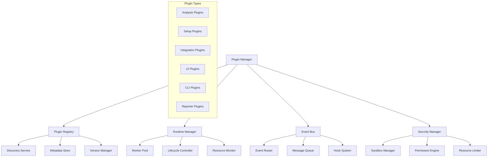
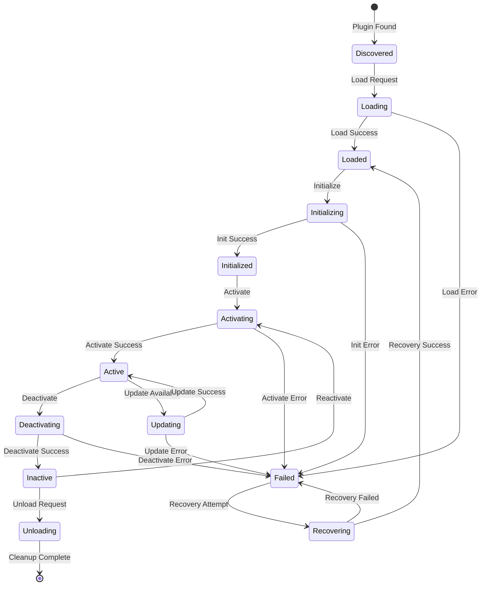
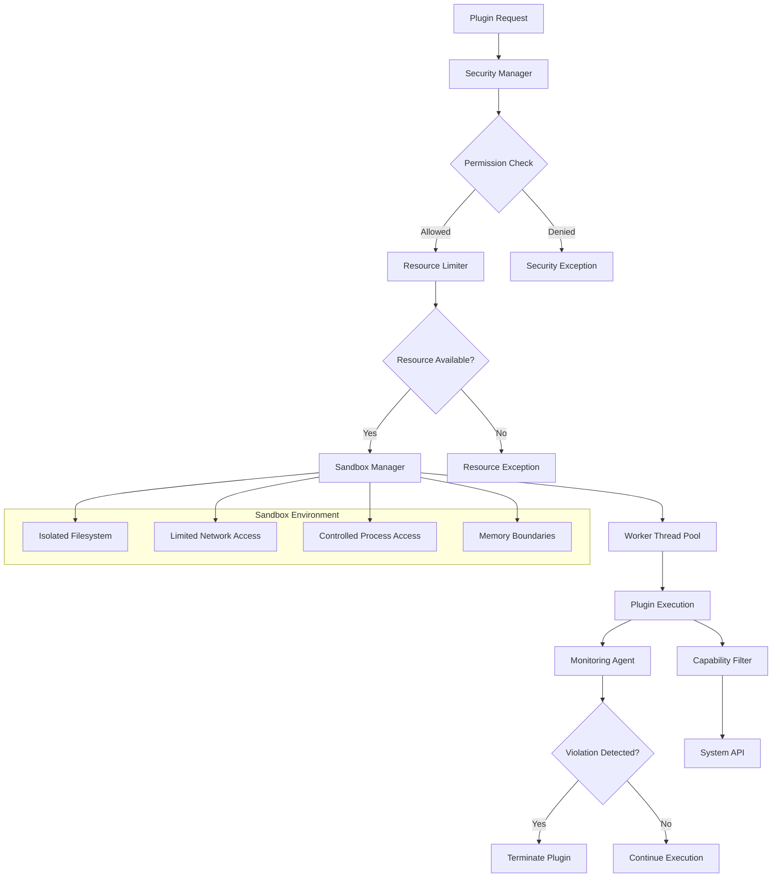

# Plugin System Architecture - Unified Wundr Platform

## Executive Summary

This document defines the comprehensive plugin system architecture for the unified Wundr platform,
enabling extensible code analysis, environment setup, and custom integrations through a secure,
high-performance, and developer-friendly plugin ecosystem.

## Table of Contents

1. [Architecture Overview](#architecture-overview)
2. [Plugin Interface Specifications](#plugin-interface-specifications)
3. [Lifecycle Management](#lifecycle-management)
4. [Dependency Resolution System](#dependency-resolution-system)
5. [Sandboxing and Security Model](#sandboxing-and-security-model)
6. [Plugin Registry and Marketplace](#plugin-registry-and-marketplace)
7. [Example Plugin Implementations](#example-plugin-implementations)
8. [Development Kit and Tooling](#development-kit-and-tooling)
9. [Performance and Scalability](#performance-and-scalability)
10. [Migration and Versioning](#migration-and-versioning)

## Architecture Overview

### Core Principles

- **Security First**: Isolated execution with granular permissions
- **Performance Optimized**: Worker thread pools and lazy loading
- **Developer Friendly**: Rich SDK and comprehensive tooling
- **Type Safety**: Full TypeScript support throughout
- **Event-Driven**: Loose coupling via event system
- **Extensible**: Multiple plugin types and extension points

### System Components



### Plugin Execution Architecture

```typescript
interface PluginArchitecture {
  layers: {
    presentation: {
      cli: 'Command-line interface plugins';
      dashboard: 'Web UI components and pages';
      vscode: 'VS Code extension plugins';
      ide: 'IDE integration plugins';
    };

    application: {
      analysis: 'Code analysis and quality plugins';
      setup: 'Environment and tool setup plugins';
      integration: 'Third-party service integrations';
      reporting: 'Custom report generators';
    };

    platform: {
      eventBus: 'Event-driven communication';
      lifecycle: 'Plugin lifecycle management';
      security: 'Sandboxing and permissions';
      registry: 'Plugin discovery and metadata';
    };

    infrastructure: {
      runtime: 'Worker thread execution';
      storage: 'Plugin data persistence';
      network: 'External service communication';
      filesystem: 'File system operations';
    };
  };
}
```

## Plugin Interface Specifications

### Base Plugin Interface

```typescript
/**
 * Base interface that all plugins must implement
 */
interface WundrPlugin {
  readonly manifest: PluginManifest;

  // Lifecycle methods
  initialize(context: PluginContext): Promise<void>;
  activate?(): Promise<void>;
  deactivate?(): Promise<void>;
  cleanup?(): Promise<void>;

  // Health check
  healthCheck?(): Promise<PluginHealth>;
}

/**
 * Plugin manifest containing metadata and configuration
 */
interface PluginManifest {
  // Basic information
  readonly name: string;
  readonly version: string;
  readonly description: string;
  readonly author: string | PluginAuthor;
  readonly license: string;
  readonly homepage?: string;
  readonly repository?: string;

  // Plugin classification
  readonly type: PluginType;
  readonly category: PluginCategory;
  readonly tags: string[];

  // Technical specifications
  readonly main: string;
  readonly engines: {
    node: string;
    wundr: string;
  };

  // Dependencies and compatibility
  readonly dependencies?: PluginDependency[];
  readonly peerDependencies?: PluginDependency[];
  readonly incompatibilities?: string[];

  // Capabilities and requirements
  readonly capabilities: PluginCapability[];
  readonly requirements: PluginRequirement[];
  readonly permissions: PluginPermission[];

  // Configuration
  readonly configSchema?: JSONSchema7;
  readonly defaultConfig?: Record<string, any>;

  // Resources and limits
  readonly resources: PluginResourceLimits;

  // Extension points
  readonly extensionPoints: PluginExtensionPoint[];

  // Metadata
  readonly keywords: string[];
  readonly createdAt: string;
  readonly updatedAt: string;
}

/**
 * Plugin types defining primary functionality
 */
type PluginType =
  | 'analysis' // Code analysis and quality checking
  | 'setup' // Environment and tool setup
  | 'integration' // Third-party service integration
  | 'ui' // User interface extensions
  | 'cli' // Command-line interface extensions
  | 'reporter' // Custom report generation
  | 'transformer' // Code transformation and formatting
  | 'generator' // Code and file generation
  | 'validator' // Custom validation rules
  | 'monitor' // System and performance monitoring
  | 'workflow' // Custom workflow automation
  | 'ai' // AI/ML model integration
  | 'security' // Security scanning and compliance
  | 'deployment' // Deployment and infrastructure
  | 'test' // Testing framework integration
  | 'documentation'; // Documentation generation

/**
 * Plugin categories for organization
 */
type PluginCategory =
  | 'code-quality'
  | 'security'
  | 'performance'
  | 'testing'
  | 'documentation'
  | 'deployment'
  | 'collaboration'
  | 'productivity'
  | 'monitoring'
  | 'integration'
  | 'ai-ml'
  | 'database'
  | 'frontend'
  | 'backend'
  | 'mobile'
  | 'devops'
  | 'analytics';
```

### Analysis Plugin Interface

```typescript
/**
 * Plugins that analyze code and projects
 */
interface AnalysisPlugin extends WundrPlugin {
  readonly type: 'analysis';

  // Analysis capabilities
  readonly supportedLanguages: string[];
  readonly supportedFrameworks?: string[];
  readonly analysisTypes: AnalysisType[];

  // Core analysis method
  analyze(context: AnalysisContext): Promise<AnalysisResult>;

  // Optional methods
  validateConfiguration?(config: any): Promise<ValidationResult>;
  getMetrics?(files: string[]): Promise<AnalysisMetrics>;
  fixIssues?(issues: AnalysisIssue[]): Promise<FixResult>;
}

interface AnalysisContext {
  readonly projectPath: string;
  readonly files: SourceFile[];
  readonly configuration: any;
  readonly previousResults?: AnalysisResult;

  // Utilities
  readonly logger: PluginLogger;
  readonly progress: ProgressReporter;
  readonly filesystem: FileSystemAPI;
  readonly cache: CacheAPI;
}

interface AnalysisResult {
  readonly summary: AnalysisSummary;
  readonly issues: AnalysisIssue[];
  readonly metrics: AnalysisMetrics;
  readonly suggestions: AnalysisSuggestion[];
  readonly metadata: Record<string, any>;
}

type AnalysisType =
  | 'syntax'
  | 'semantic'
  | 'quality'
  | 'security'
  | 'performance'
  | 'maintainability'
  | 'complexity'
  | 'duplication'
  | 'dependencies'
  | 'architecture'
  | 'accessibility'
  | 'compatibility';
```

### Setup Plugin Interface

```typescript
/**
 * Plugins that handle environment and tool setup
 */
interface SetupPlugin extends WundrPlugin {
  readonly type: 'setup';

  // Setup capabilities
  readonly supportedPlatforms: Platform[];
  readonly toolName: string;
  readonly toolVersion?: string;
  readonly setupTypes: SetupType[];

  // Core setup methods
  execute(context: SetupContext): Promise<SetupResult>;
  validate(context: SetupContext): Promise<ValidationResult>;
  rollback?(context: SetupContext): Promise<RollbackResult>;

  // Optional methods
  isInstalled?(context: SetupContext): Promise<boolean>;
  getStatus?(context: SetupContext): Promise<SetupStatus>;
  update?(context: SetupContext): Promise<SetupResult>;
  configure?(context: SetupContext, config: any): Promise<void>;
}

interface SetupContext {
  readonly platform: Platform;
  readonly architecture: Architecture;
  readonly userProfile: UserProfile;
  readonly workspacePath: string;
  readonly configuration: any;

  // Utilities
  readonly logger: PluginLogger;
  readonly progress: ProgressReporter;
  readonly shell: ShellAPI;
  readonly filesystem: FileSystemAPI;
  readonly network: NetworkAPI;
  readonly packageManager: PackageManagerAPI;
}

interface SetupResult {
  readonly success: boolean;
  readonly message: string;
  readonly details?: SetupDetails;
  readonly warnings?: string[];
  readonly nextSteps?: string[];
  readonly rollbackInfo?: RollbackInfo;
}

type SetupType =
  | 'install'
  | 'configure'
  | 'update'
  | 'uninstall'
  | 'verify'
  | 'repair'
  | 'migrate'
  | 'backup'
  | 'restore'
  | 'init';

type Platform = 'darwin' | 'linux' | 'win32' | 'freebsd' | 'openbsd';
type Architecture = 'x64' | 'arm64' | 'arm' | 'ia32';
```

### Integration Plugin Interface

```typescript
/**
 * Plugins that integrate with external services
 */
interface IntegrationPlugin extends WundrPlugin {
  readonly type: 'integration';

  // Integration capabilities
  readonly serviceName: string;
  readonly serviceVersion?: string;
  readonly authMethods: AuthMethod[];
  readonly supportedOperations: IntegrationOperation[];

  // Core integration methods
  connect(context: IntegrationContext): Promise<ConnectionResult>;
  sync(context: IntegrationContext, data: any): Promise<SyncResult>;
  disconnect?(context: IntegrationContext): Promise<void>;

  // Optional methods
  webhook?(event: WebhookEvent): Promise<WebhookResponse>;
  healthCheck?(context: IntegrationContext): Promise<ServiceHealth>;
  refresh?(context: IntegrationContext): Promise<RefreshResult>;
}

interface IntegrationContext {
  readonly configuration: IntegrationConfig;
  readonly credentials: ServiceCredentials;
  readonly projectData: ProjectData;

  // Utilities
  readonly logger: PluginLogger;
  readonly http: HTTPClient;
  readonly cache: CacheAPI;
  readonly secrets: SecretsAPI;
}

type AuthMethod =
  | 'oauth2'
  | 'api-key'
  | 'bearer-token'
  | 'basic-auth'
  | 'certificate'
  | 'webhook'
  | 'ssh-key';

type IntegrationOperation =
  | 'read'
  | 'write'
  | 'sync'
  | 'notify'
  | 'webhook'
  | 'search'
  | 'upload'
  | 'download';
```

### UI Plugin Interface

```typescript
/**
 * Plugins that extend the user interface
 */
interface UIPlugin extends WundrPlugin {
  readonly type: 'ui';

  // UI capabilities
  readonly uiTargets: UITarget[];
  readonly components?: ComponentDefinition[];
  readonly pages?: PageDefinition[];
  readonly themes?: ThemeDefinition[];

  // Core UI methods
  initialize(context: UIPluginContext): Promise<void>;
  renderComponent?(componentId: string, props: any): Promise<React.ReactNode>;

  // Optional methods
  onRoute?(route: string): Promise<RouteHandler>;
  onThemeChange?(theme: Theme): Promise<void>;
}

interface UIPluginContext extends PluginContext {
  readonly router: RouterAPI;
  readonly theme: ThemeAPI;
  readonly components: ComponentRegistry;
  readonly state: StateManager;
}

type UITarget =
  | 'dashboard-page'
  | 'dashboard-widget'
  | 'sidebar-panel'
  | 'context-menu'
  | 'toolbar'
  | 'modal'
  | 'notification'
  | 'settings-panel'
  | 'report-section';

interface ComponentDefinition {
  readonly id: string;
  readonly name: string;
  readonly description: string;
  readonly props?: JSONSchema7;
  readonly component: React.ComponentType<any>;
}

interface PageDefinition {
  readonly id: string;
  readonly path: string;
  readonly title: string;
  readonly icon?: string;
  readonly menuGroup?: string;
  readonly permissions?: string[];
  readonly component: React.ComponentType<any>;
}
```

## Lifecycle Management

### Plugin Lifecycle States



### Lifecycle Management System

```typescript
/**
 * Manages plugin lifecycle operations
 */
class PluginLifecycleManager {
  private plugins = new Map<string, LoadedPlugin>();
  private states = new Map<string, PluginState>();
  private eventBus: EventBus;

  // Core lifecycle operations
  async loadPlugin(manifest: PluginManifest): Promise<LoadedPlugin>;
  async unloadPlugin(pluginId: string): Promise<void>;
  async initializePlugin(pluginId: string, context: PluginContext): Promise<void>;
  async activatePlugin(pluginId: string): Promise<void>;
  async deactivatePlugin(pluginId: string): Promise<void>;

  // State management
  getPluginState(pluginId: string): PluginState;
  setPluginState(pluginId: string, state: PluginState): void;

  // Health monitoring
  async performHealthCheck(pluginId: string): Promise<PluginHealth>;
  async recoverPlugin(pluginId: string): Promise<RecoveryResult>;

  // Batch operations
  async loadPlugins(manifests: PluginManifest[]): Promise<LoadResult[]>;
  async activateAll(): Promise<void>;
  async deactivateAll(): Promise<void>;
  async shutdown(): Promise<void>;
}

interface LoadedPlugin {
  readonly manifest: PluginManifest;
  readonly instance: WundrPlugin;
  readonly runtime: PluginRuntime;
  readonly context: PluginContext;
  readonly loadedAt: Date;
  readonly stats: PluginStats;
}

type PluginState =
  | 'discovered'
  | 'loading'
  | 'loaded'
  | 'initializing'
  | 'initialized'
  | 'activating'
  | 'active'
  | 'deactivating'
  | 'inactive'
  | 'updating'
  | 'unloading'
  | 'failed'
  | 'recovering';

interface PluginHealth {
  readonly status: 'healthy' | 'warning' | 'error' | 'unknown';
  readonly message?: string;
  readonly metrics: PluginMetrics;
  readonly issues: HealthIssue[];
  readonly checkedAt: Date;
}
```

### Lifecycle Hooks

```typescript
/**
 * Hooks that plugins can register for lifecycle events
 */
interface PluginLifecycleHooks {
  // System lifecycle hooks
  beforeSystemStart?(context: SystemContext): Promise<void>;
  afterSystemStart?(context: SystemContext): Promise<void>;
  beforeSystemShutdown?(context: SystemContext): Promise<void>;
  afterSystemShutdown?(context: SystemContext): Promise<void>;

  // Plugin lifecycle hooks
  beforePluginLoad?(manifest: PluginManifest): Promise<void>;
  afterPluginLoad?(plugin: LoadedPlugin): Promise<void>;
  beforePluginActivate?(plugin: LoadedPlugin): Promise<void>;
  afterPluginActivate?(plugin: LoadedPlugin): Promise<void>;
  beforePluginDeactivate?(plugin: LoadedPlugin): Promise<void>;
  afterPluginDeactivate?(plugin: LoadedPlugin): Promise<void>;

  // Configuration hooks
  beforeConfigChange?(config: any, plugin: LoadedPlugin): Promise<any>;
  afterConfigChange?(config: any, plugin: LoadedPlugin): Promise<void>;

  // Error handling hooks
  onPluginError?(error: PluginError, plugin: LoadedPlugin): Promise<ErrorHandling>;
  onPluginRecovery?(plugin: LoadedPlugin, result: RecoveryResult): Promise<void>;
}

/**
 * Context provided to lifecycle hooks
 */
interface SystemContext {
  readonly version: string;
  readonly environment: Environment;
  readonly configuration: SystemConfiguration;
  readonly plugins: ReadonlyMap<string, LoadedPlugin>;
  readonly logger: SystemLogger;
}

type Environment = 'development' | 'test' | 'staging' | 'production';

interface ErrorHandling {
  readonly action: 'recover' | 'disable' | 'restart' | 'ignore';
  readonly message?: string;
  readonly retryAfter?: number;
}
```

## Dependency Resolution System

### Dependency Types and Resolution

```typescript
/**
 * Plugin dependency system with semantic versioning
 */
interface PluginDependency {
  readonly name: string;
  readonly version: string; // Semver range
  readonly type: DependencyType;
  readonly optional: boolean;
  readonly reason?: string;
}

type DependencyType =
  | 'plugin' // Other Wundr plugins
  | 'npm' // NPM packages
  | 'system' // System tools and binaries
  | 'service' // External services
  | 'runtime' // Runtime requirements
  | 'platform'; // Platform-specific dependencies

/**
 * Dependency resolution engine
 */
class DependencyResolver {
  private packageManager: PackageManager;
  private systemChecker: SystemChecker;
  private serviceChecker: ServiceChecker;

  // Core resolution methods
  async resolvePluginDependencies(manifest: PluginManifest): Promise<DependencyResolution>;
  async checkDependencyCompatibility(
    dependencies: PluginDependency[]
  ): Promise<CompatibilityReport>;
  async installDependencies(dependencies: PluginDependency[]): Promise<InstallationResult>;

  // Conflict resolution
  async resolveDependencyConflicts(conflicts: DependencyConflict[]): Promise<ConflictResolution>;
  async findAlternativeDependencies(dependency: PluginDependency): Promise<AlternativeDependency[]>;

  // Dependency graph
  buildDependencyGraph(plugins: PluginManifest[]): DependencyGraph;
  topologicalSort(graph: DependencyGraph): string[];
  detectCircularDependencies(graph: DependencyGraph): CircularDependency[];
}

interface DependencyResolution {
  readonly resolved: ResolvedDependency[];
  readonly unresolved: UnresolvedDependency[];
  readonly conflicts: DependencyConflict[];
  readonly installOrder: string[];
}

interface ResolvedDependency extends PluginDependency {
  readonly resolvedVersion: string;
  readonly source: DependencySource;
  readonly satisfied: boolean;
}

interface DependencyConflict {
  readonly dependency: string;
  readonly conflictingVersions: ConflictingVersion[];
  readonly severity: 'warning' | 'error';
  readonly resolution?: ConflictResolution;
}

interface ConflictingVersion {
  readonly version: string;
  readonly requiredBy: string[];
  readonly reason: string;
}

type DependencySource =
  | 'npm-registry'
  | 'plugin-registry'
  | 'system-package'
  | 'local-file'
  | 'git-repository'
  | 'docker-image';
```

### Dependency Installation and Management

```typescript
/**
 * Manages installation and updates of plugin dependencies
 */
class DependencyManager {
  private resolver: DependencyResolver;
  private installer: DependencyInstaller;
  private validator: DependencyValidator;

  // Installation management
  async installPluginDependencies(pluginId: string): Promise<InstallationResult>;
  async updateDependencies(pluginId: string): Promise<UpdateResult>;
  async uninstallDependencies(pluginId: string): Promise<UninstallResult>;

  // Validation and health checks
  async validateDependencies(pluginId: string): Promise<ValidationResult>;
  async repairDependencies(pluginId: string): Promise<RepairResult>;
  async auditDependencies(pluginId: string): Promise<AuditResult>;

  // Dependency information
  getDependencyTree(pluginId: string): DependencyTree;
  getDependencyStatus(dependency: string): DependencyStatus;
  getVulnerabilities(pluginId: string): SecurityVulnerability[];
}

interface InstallationResult {
  readonly success: boolean;
  readonly installed: InstalledDependency[];
  readonly failed: FailedDependency[];
  readonly warnings: string[];
  readonly duration: number;
}

interface InstalledDependency {
  readonly name: string;
  readonly version: string;
  readonly type: DependencyType;
  readonly size: number;
  readonly installedAt: Date;
}

interface DependencyTree {
  readonly root: string;
  readonly nodes: DependencyNode[];
  readonly edges: DependencyEdge[];
  readonly depth: number;
  readonly circularDependencies: string[];
}

interface DependencyNode {
  readonly id: string;
  readonly name: string;
  readonly version: string;
  readonly type: DependencyType;
  readonly status: DependencyStatus;
  readonly metadata: Record<string, any>;
}

type DependencyStatus =
  | 'satisfied'
  | 'missing'
  | 'outdated'
  | 'incompatible'
  | 'vulnerable'
  | 'deprecated';
```

## Sandboxing and Security Model

### Security Architecture



### Security Manager Implementation

```typescript
/**
 * Central security management for plugin system
 */
class PluginSecurityManager {
  private permissionEngine: PermissionEngine;
  private sandboxManager: SandboxManager;
  private resourceLimiter: ResourceLimiter;
  private auditLogger: AuditLogger;

  // Security validation
  async validatePlugin(manifest: PluginManifest): Promise<SecurityValidation>;
  async checkPermissions(pluginId: string, operation: SecurityOperation): Promise<boolean>;
  async auditPluginAccess(pluginId: string, access: AccessAttempt): Promise<void>;

  // Sandbox management
  async createSandbox(pluginId: string, config: SandboxConfig): Promise<Sandbox>;
  async destroySandbox(sandboxId: string): Promise<void>;
  async monitorSandbox(sandboxId: string): Promise<SandboxStatus>;

  // Resource management
  async allocateResources(
    pluginId: string,
    requirements: ResourceRequirements
  ): Promise<ResourceAllocation>;
  async releaseResources(pluginId: string): Promise<void>;
  async enforceResourceLimits(pluginId: string): Promise<void>;

  // Threat detection
  async detectAnomalousActivity(pluginId: string): Promise<ThreatAssessment>;
  async respondToThreat(threat: SecurityThreat): Promise<ThreatResponse>;
}

/**
 * Permission system for fine-grained access control
 */
interface PluginPermission {
  readonly type: PermissionType;
  readonly scope: PermissionScope;
  readonly level: PermissionLevel;
  readonly reason: string;
  readonly expires?: Date;
}

type PermissionType =
  | 'filesystem'
  | 'network'
  | 'process'
  | 'environment'
  | 'registry'
  | 'crypto'
  | 'system'
  | 'user-data'
  | 'configuration'
  | 'logs';

interface PermissionScope {
  readonly paths?: string[];
  readonly hosts?: string[];
  readonly ports?: number[];
  readonly commands?: string[];
  readonly variables?: string[];
}

type PermissionLevel = 'none' | 'read' | 'write' | 'execute' | 'admin';

/**
 * Sandbox environment for plugin execution
 */
interface Sandbox {
  readonly id: string;
  readonly pluginId: string;
  readonly workerId: number;
  readonly createdAt: Date;

  // Environment
  readonly filesystem: SandboxFileSystem;
  readonly network: SandboxNetwork;
  readonly process: SandboxProcess;
  readonly memory: SandboxMemory;

  // Control
  terminate(): Promise<void>;
  pause(): Promise<void>;
  resume(): Promise<void>;
  getStatus(): SandboxStatus;
}

interface SandboxConfig {
  readonly resourceLimits: ResourceLimits;
  readonly permissions: PluginPermission[];
  readonly networking: NetworkConfig;
  readonly filesystem: FilesystemConfig;
  readonly timeout: number;
}

interface ResourceLimits {
  readonly maxMemory: number; // Bytes
  readonly maxCpu: number; // Percentage
  readonly maxDuration: number; // Milliseconds
  readonly maxFileSize: number; // Bytes
  readonly maxNetworkBandwidth: number; // Bytes/sec
  readonly maxConcurrentOperations: number;
}
```

### Security Monitoring and Auditing

```typescript
/**
 * Continuous security monitoring for plugins
 */
class SecurityMonitor {
  private anomalyDetector: AnomalyDetector;
  private threatIntelligence: ThreatIntelligence;
  private complianceChecker: ComplianceChecker;

  // Real-time monitoring
  async startMonitoring(pluginId: string): Promise<MonitoringSession>;
  async stopMonitoring(sessionId: string): Promise<MonitoringReport>;
  async getSecurityMetrics(pluginId: string): Promise<SecurityMetrics>;

  // Anomaly detection
  async detectAnomalies(activities: SecurityActivity[]): Promise<Anomaly[]>;
  async classifyThreat(anomaly: Anomaly): Promise<ThreatClassification>;
  async generateThreatResponse(threat: SecurityThreat): Promise<ResponsePlan>;

  // Compliance checking
  async checkCompliance(
    pluginId: string,
    standards: ComplianceStandard[]
  ): Promise<ComplianceReport>;
  async auditSecurityPractices(pluginId: string): Promise<SecurityAudit>;
}

interface SecurityMetrics {
  readonly pluginId: string;
  readonly period: TimePeriod;
  readonly activities: SecurityActivity[];
  readonly violations: SecurityViolation[];
  readonly threats: SecurityThreat[];
  readonly riskScore: number;
}

interface SecurityViolation {
  readonly type: ViolationType;
  readonly severity: ViolationSeverity;
  readonly description: string;
  readonly occurredAt: Date;
  readonly context: ViolationContext;
  readonly response: ViolationResponse;
}

type ViolationType =
  | 'permission-violation'
  | 'resource-limit-exceeded'
  | 'suspicious-network-activity'
  | 'unauthorized-file-access'
  | 'malicious-code-execution'
  | 'data-exfiltration-attempt'
  | 'privilege-escalation'
  | 'sandbox-escape';

type ViolationSeverity = 'low' | 'medium' | 'high' | 'critical';

interface ComplianceReport {
  readonly standard: ComplianceStandard;
  readonly overallScore: number;
  readonly requirements: RequirementResult[];
  readonly recommendations: ComplianceRecommendation[];
  readonly certificationStatus: CertificationStatus;
}

type ComplianceStandard =
  | 'SOC2'
  | 'ISO27001'
  | 'GDPR'
  | 'HIPAA'
  | 'PCI-DSS'
  | 'NIST-CSF'
  | 'OWASP-TOP10';
```

## Plugin Registry and Marketplace

### Registry Architecture

```typescript
/**
 * Central registry for plugin discovery and management
 */
class PluginRegistry {
  private metadataStore: PluginMetadataStore;
  private indexingService: IndexingService;
  private validationService: ValidationService;
  private distributionService: DistributionService;

  // Plugin discovery
  async searchPlugins(query: PluginSearchQuery): Promise<PluginSearchResult>;
  async getPlugin(id: string, version?: string): Promise<PluginMetadata>;
  async getPluginVersions(id: string): Promise<PluginVersion[]>;
  async getPopularPlugins(category?: string): Promise<PluginMetadata[]>;

  // Plugin publishing
  async publishPlugin(manifest: PluginManifest, content: PluginContent): Promise<PublishResult>;
  async updatePlugin(id: string, manifest: PluginManifest): Promise<UpdateResult>;
  async unpublishPlugin(id: string, version: string): Promise<UnpublishResult>;

  // Plugin verification
  async verifyPlugin(id: string, version: string): Promise<VerificationResult>;
  async auditPlugin(id: string): Promise<AuditResult>;
  async reportPlugin(id: string, report: SecurityReport): Promise<void>;
}

interface PluginSearchQuery {
  readonly query?: string;
  readonly type?: PluginType[];
  readonly category?: PluginCategory[];
  readonly tags?: string[];
  readonly author?: string;
  readonly compatibility?: CompatibilityRequirement;
  readonly sortBy?: PluginSortField;
  readonly sortOrder?: 'asc' | 'desc';
  readonly limit?: number;
  readonly offset?: number;
}

interface PluginSearchResult {
  readonly total: number;
  readonly plugins: PluginMetadata[];
  readonly facets: SearchFacets;
  readonly suggestions: string[];
}

interface PluginMetadata extends PluginManifest {
  readonly id: string;
  readonly publishedAt: Date;
  readonly updatedAt: Date;
  readonly downloads: number;
  readonly rating: PluginRating;
  readonly verification: VerificationStatus;
  readonly security: SecurityStatus;
  readonly compatibility: CompatibilityMatrix;
}

interface PluginRating {
  readonly average: number;
  readonly count: number;
  readonly distribution: RatingDistribution;
  readonly reviews: PluginReview[];
}

interface PluginReview {
  readonly id: string;
  readonly author: string;
  readonly rating: number;
  readonly title: string;
  readonly content: string;
  readonly createdAt: Date;
  readonly verified: boolean;
  readonly helpful: number;
}
```

### Marketplace Implementation

```typescript
/**
 * Plugin marketplace with commercial features
 */
class PluginMarketplace {
  private registry: PluginRegistry;
  private paymentProcessor: PaymentProcessor;
  private licenseManager: LicenseManager;
  private analyticsService: AnalyticsService;

  // Marketplace operations
  async browseMarketplace(filters: MarketplaceFilters): Promise<MarketplaceListing>;
  async purchasePlugin(pluginId: string, license: LicenseType): Promise<PurchaseResult>;
  async subscribeToPlugin(pluginId: string, plan: SubscriptionPlan): Promise<SubscriptionResult>;

  // Developer tools
  async submitPlugin(submission: PluginSubmission): Promise<SubmissionResult>;
  async getPluginAnalytics(pluginId: string): Promise<PluginAnalytics>;
  async manageLicenses(pluginId: string): Promise<LicenseManagement>;

  // Enterprise features
  async createPrivateRegistry(org: Organization): Promise<PrivateRegistry>;
  async manageEnterprisePlugins(registryId: string): Promise<EnterpriseManagement>;
}

interface MarketplaceListing {
  readonly featured: PluginMetadata[];
  readonly trending: PluginMetadata[];
  readonly newReleases: PluginMetadata[];
  readonly categories: CategoryListing[];
  readonly total: number;
}

interface PluginSubmission {
  readonly manifest: PluginManifest;
  readonly source: PluginSource;
  readonly documentation: PluginDocumentation;
  readonly testResults: TestResults;
  readonly securityScan: SecurityScanResult;
  readonly pricing: PluginPricing;
}

interface PluginPricing {
  readonly model: PricingModel;
  readonly tiers: PricingTier[];
  readonly currency: string;
  readonly billingCycle: BillingCycle;
}

type PricingModel = 'free' | 'one-time' | 'subscription' | 'usage-based' | 'freemium';
type BillingCycle = 'monthly' | 'yearly' | 'lifetime';

interface PluginAnalytics {
  readonly pluginId: string;
  readonly period: TimePeriod;
  readonly downloads: DownloadStats;
  readonly usage: UsageStats;
  readonly revenue: RevenueStats;
  readonly ratings: RatingStats;
  readonly geography: GeographyStats;
}
```

### Distribution and CDN

```typescript
/**
 * Content delivery network for plugin distribution
 */
class PluginCDN {
  private storageBackend: StorageBackend;
  private cacheManager: CacheManager;
  private compressionService: CompressionService;

  // Content distribution
  async uploadPlugin(pluginId: string, version: string, content: Buffer): Promise<UploadResult>;
  async downloadPlugin(pluginId: string, version: string, region?: string): Promise<DownloadResult>;
  async syncPlugin(pluginId: string): Promise<SyncResult>;

  // Cache management
  async invalidateCache(pluginId: string, version?: string): Promise<void>;
  async preloadPlugin(pluginId: string, regions: string[]): Promise<void>;
  async getCacheStatus(pluginId: string): Promise<CacheStatus>;

  // Performance optimization
  async optimizeContent(pluginId: string, version: string): Promise<OptimizationResult>;
  async generateChecksums(pluginId: string, version: string): Promise<ChecksumResult>;
}

interface DistributionStrategy {
  readonly regions: CDNRegion[];
  readonly cacheTtl: number;
  readonly compression: CompressionConfig;
  readonly checksum: ChecksumConfig;
  readonly fallback: FallbackConfig;
}

interface CDNMetrics {
  readonly hitRatio: number;
  readonly averageLatency: number;
  readonly bandwidth: BandwidthStats;
  readonly errors: ErrorStats;
  readonly geography: GeographyStats;
}
```

## Example Plugin Implementations

### ESLint Analysis Plugin

```typescript
/**
 * Example ESLint integration plugin
 */
@Plugin({
  name: '@wundr/plugin-eslint',
  version: '2.0.0',
  type: 'analysis',
  category: 'code-quality',
})
export class ESLintPlugin implements AnalysisPlugin {
  readonly manifest: PluginManifest = {
    name: '@wundr/plugin-eslint',
    version: '2.0.0',
    description: 'ESLint integration for code quality analysis',
    author: 'Wundr Team',
    license: 'MIT',
    type: 'analysis',
    category: 'code-quality',
    tags: ['javascript', 'typescript', 'linting', 'code-quality'],
    main: './dist/index.js',
    engines: {
      node: '>=18.0.0',
      wundr: '^2.0.0',
    },
    supportedLanguages: ['javascript', 'typescript', 'jsx', 'tsx'],
    analysisTypes: ['syntax', 'quality', 'style'],
    dependencies: [
      { name: 'eslint', version: '^8.0.0', type: 'npm', optional: false },
      { name: '@typescript-eslint/parser', version: '^5.0.0', type: 'npm', optional: true },
      { name: '@typescript-eslint/eslint-plugin', version: '^5.0.0', type: 'npm', optional: true },
    ],
    permissions: [
      {
        type: 'filesystem',
        scope: { paths: ['**/*.{js,ts,jsx,tsx}'] },
        level: 'read',
        reason: 'Read source files for analysis',
      },
      {
        type: 'filesystem',
        scope: { paths: ['.eslintrc.*', 'eslint.config.*'] },
        level: 'read',
        reason: 'Read ESLint configuration',
      },
    ],
    resources: {
      maxMemory: 512 * 1024 * 1024, // 512MB
      maxCpu: 80, // 80%
      maxDuration: 300000, // 5 minutes
      maxFileSize: 10 * 1024 * 1024, // 10MB
      maxNetworkBandwidth: 0, // No network access
      maxConcurrentOperations: 4,
    },
    configSchema: {
      type: 'object',
      properties: {
        configFile: { type: 'string', description: 'Path to ESLint configuration file' },
        rules: { type: 'object', description: 'ESLint rules override' },
        ignorePatterns: {
          type: 'array',
          items: { type: 'string' },
          description: 'File patterns to ignore',
        },
        severity: { type: 'string', enum: ['error', 'warn', 'info'], default: 'warn' },
      },
    },
    defaultConfig: {
      configFile: '.eslintrc.json',
      severity: 'warn',
      ignorePatterns: ['node_modules/', 'dist/', 'build/'],
    },
  };

  private eslint?: ESLint;
  private context?: PluginContext;

  async initialize(context: PluginContext): Promise<void> {
    this.context = context;

    try {
      // Initialize ESLint with plugin configuration
      const config = context.getConfiguration();
      this.eslint = new ESLint({
        baseConfig: config.rules || {},
        useEslintrc: true,
        overrideConfigFile: config.configFile,
        ignore: true,
        ignorePath: '.eslintignore',
      });

      context.logger.info('ESLint plugin initialized successfully');
    } catch (error) {
      context.logger.error('Failed to initialize ESLint plugin', error);
      throw new PluginInitializationError('ESLint initialization failed', error);
    }
  }

  async analyze(context: AnalysisContext): Promise<AnalysisResult> {
    if (!this.eslint) {
      throw new PluginError('Plugin not initialized');
    }

    context.logger.info(`Starting ESLint analysis of ${context.files.length} files`);
    context.progress.start(context.files.length);

    const issues: AnalysisIssue[] = [];
    const metrics: AnalysisMetrics = {
      totalFiles: context.files.length,
      analyzedFiles: 0,
      totalIssues: 0,
      issuesByCategory: {},
      issuesBySeverity: { error: 0, warning: 0, info: 0 },
      executionTime: 0,
    };

    const startTime = Date.now();

    try {
      // Filter supported files
      const supportedFiles = context.files.filter(file =>
        this.manifest.supportedLanguages?.some(lang => file.path.includes(`.${lang}`))
      );

      // Analyze files in chunks for better performance
      const chunks = this.chunkArray(supportedFiles, 10);

      for (const chunk of chunks) {
        const chunkResults = await Promise.all(chunk.map(file => this.analyzeFile(file, context)));

        chunkResults.forEach(result => {
          issues.push(...result.issues);
          metrics.analyzedFiles++;
          context.progress.increment();
        });
      }

      // Calculate final metrics
      metrics.totalIssues = issues.length;
      metrics.executionTime = Date.now() - startTime;

      // Group issues by category and severity
      issues.forEach(issue => {
        metrics.issuesByCategory[issue.category] =
          (metrics.issuesByCategory[issue.category] || 0) + 1;
        metrics.issuesBySeverity[issue.severity]++;
      });

      context.logger.info(
        `ESLint analysis completed: ${metrics.analyzedFiles} files, ${metrics.totalIssues} issues found`
      );

      return {
        summary: {
          totalFiles: metrics.totalFiles,
          analyzedFiles: metrics.analyzedFiles,
          totalIssues: metrics.totalIssues,
          executionTime: metrics.executionTime,
          success: true,
        },
        issues,
        metrics,
        suggestions: this.generateSuggestions(issues),
        metadata: {
          pluginVersion: this.manifest.version,
          eslintVersion: await this.getESLintVersion(),
          configFile: context.configuration.configFile,
          timestamp: new Date().toISOString(),
        },
      };
    } catch (error) {
      context.logger.error('ESLint analysis failed', error);
      throw new AnalysisError('ESLint analysis failed', error);
    } finally {
      context.progress.complete();
    }
  }

  private async analyzeFile(
    file: SourceFile,
    context: AnalysisContext
  ): Promise<{ issues: AnalysisIssue[] }> {
    try {
      const results = await this.eslint!.lintText(file.content, { filePath: file.path });
      const issues: AnalysisIssue[] = [];

      for (const result of results) {
        for (const message of result.messages) {
          issues.push({
            id: `eslint-${message.ruleId || 'unknown'}`,
            title: message.message,
            description: `ESLint rule violation: ${message.ruleId}`,
            category: this.mapESLintCategory(message.ruleId),
            severity: this.mapESLintSeverity(message.severity),
            location: {
              file: file.path,
              line: message.line,
              column: message.column,
              endLine: message.endLine,
              endColumn: message.endColumn,
            },
            rule: {
              id: message.ruleId || 'unknown',
              name: message.ruleId || 'Unknown Rule',
              description: `ESLint rule: ${message.ruleId}`,
              documentation: `https://eslint.org/docs/rules/${message.ruleId}`,
            },
            fix: message.fix
              ? {
                  description: 'ESLint auto-fix available',
                  automatic: true,
                  changes: [
                    {
                      type: 'replace',
                      location: {
                        file: file.path,
                        line: message.line,
                        column: message.column,
                      },
                      newText: message.fix.text,
                    },
                  ],
                }
              : undefined,
          });
        }
      }

      return { issues };
    } catch (error) {
      context.logger.warn(`Failed to analyze file ${file.path}`, error);
      return { issues: [] };
    }
  }

  private mapESLintSeverity(severity: number): 'error' | 'warning' | 'info' {
    switch (severity) {
      case 2:
        return 'error';
      case 1:
        return 'warning';
      default:
        return 'info';
    }
  }

  private mapESLintCategory(ruleId?: string): string {
    if (!ruleId) return 'general';

    const categoryMap: Record<string, string> = {
      'no-unused-vars': 'unused-code',
      'no-console': 'debugging',
      indent: 'formatting',
      quotes: 'formatting',
      semi: 'formatting',
      'no-var': 'best-practices',
      'prefer-const': 'best-practices',
      eqeqeq: 'potential-bugs',
      'no-unreachable': 'potential-bugs',
    };

    return categoryMap[ruleId] || 'code-quality';
  }

  private generateSuggestions(issues: AnalysisIssue[]): AnalysisSuggestion[] {
    const suggestions: AnalysisSuggestion[] = [];

    // Count issues by rule
    const ruleCounts = new Map<string, number>();
    issues.forEach(issue => {
      const count = ruleCounts.get(issue.rule.id) || 0;
      ruleCounts.set(issue.rule.id, count + 1);
    });

    // Generate suggestions for most common issues
    const topRules = Array.from(ruleCounts.entries())
      .sort(([, a], [, b]) => b - a)
      .slice(0, 5);

    topRules.forEach(([ruleId, count]) => {
      suggestions.push({
        type: 'improvement',
        title: `Address ${ruleId} violations`,
        description: `Found ${count} violations of the ${ruleId} rule. Consider reviewing and fixing these issues.`,
        priority: count > 10 ? 'high' : count > 5 ? 'medium' : 'low',
        effort: 'low',
        impact: 'medium',
        actions: [
          {
            type: 'fix-auto',
            title: 'Auto-fix violations',
            description: 'Automatically fix violations where possible',
          },
          {
            type: 'configure',
            title: 'Update ESLint configuration',
            description: 'Modify ESLint rules to prevent future violations',
          },
        ],
      });
    });

    return suggestions;
  }

  private async getESLintVersion(): Promise<string> {
    try {
      return require('eslint/package.json').version;
    } catch {
      return 'unknown';
    }
  }

  private chunkArray<T>(array: T[], chunkSize: number): T[][] {
    const chunks: T[][] = [];
    for (let i = 0; i < array.length; i += chunkSize) {
      chunks.push(array.slice(i, i + chunkSize));
    }
    return chunks;
  }

  async cleanup(): Promise<void> {
    this.eslint = undefined;
    this.context?.logger.info('ESLint plugin cleaned up');
  }
}
```

### Node.js Setup Plugin

```typescript
/**
 * Example Node.js environment setup plugin
 */
@Plugin({
  name: '@wundr/plugin-nodejs-setup',
  version: '1.5.0',
  type: 'setup',
  category: 'development',
})
export class NodeJSSetupPlugin implements SetupPlugin {
  readonly manifest: PluginManifest = {
    name: '@wundr/plugin-nodejs-setup',
    version: '1.5.0',
    description: 'Node.js environment setup and management',
    author: 'Wundr Team',
    license: 'MIT',
    type: 'setup',
    category: 'development',
    tags: ['nodejs', 'npm', 'environment', 'setup'],
    main: './dist/index.js',
    engines: {
      node: '>=16.0.0',
      wundr: '^2.0.0',
    },
    supportedPlatforms: ['darwin', 'linux', 'win32'],
    toolName: 'Node.js',
    setupTypes: ['install', 'configure', 'update', 'verify'],
    dependencies: [
      { name: 'node-version-manager', version: '^1.0.0', type: 'system', optional: true },
      { name: 'curl', version: '*', type: 'system', optional: false },
      { name: 'tar', version: '*', type: 'system', optional: false },
    ],
    permissions: [
      {
        type: 'filesystem',
        scope: { paths: ['~/.nvm/', '~/.node/', '/usr/local/'] },
        level: 'write',
        reason: 'Install Node.js binaries and configuration',
      },
      {
        type: 'process',
        scope: { commands: ['curl', 'tar', 'chmod', 'ln'] },
        level: 'execute',
        reason: 'Download and install Node.js',
      },
      {
        type: 'environment',
        scope: { variables: ['PATH', 'NODE_PATH', 'NPM_CONFIG_*'] },
        level: 'write',
        reason: 'Configure Node.js environment variables',
      },
      {
        type: 'network',
        scope: { hosts: ['nodejs.org', 'registry.npmjs.org'] },
        level: 'read',
        reason: 'Download Node.js and npm packages',
      },
    ],
    resources: {
      maxMemory: 256 * 1024 * 1024, // 256MB
      maxCpu: 50, // 50%
      maxDuration: 600000, // 10 minutes
      maxFileSize: 100 * 1024 * 1024, // 100MB
      maxNetworkBandwidth: 10 * 1024 * 1024, // 10MB/s
      maxConcurrentOperations: 2,
    },
    configSchema: {
      type: 'object',
      properties: {
        version: { type: 'string', default: 'lts', description: 'Node.js version to install' },
        packageManager: { type: 'string', enum: ['npm', 'yarn', 'pnpm'], default: 'npm' },
        globalPackages: { type: 'array', items: { type: 'string' }, default: [] },
        registry: { type: 'string', description: 'NPM registry URL' },
        installPath: { type: 'string', description: 'Custom installation path' },
      },
    },
  };

  private context?: SetupContext;
  private versionManager?: NodeVersionManager;

  async initialize(context: PluginContext): Promise<void> {
    this.context = context as SetupContext;
    this.versionManager = new NodeVersionManager(context.platform);
    context.logger.info('Node.js setup plugin initialized');
  }

  async execute(context: SetupContext): Promise<SetupResult> {
    const config = context.configuration;
    const startTime = Date.now();

    context.logger.info(`Setting up Node.js ${config.version} on ${context.platform}`);
    context.progress.start(100);

    try {
      // Step 1: Check if already installed
      context.progress.update(10, 'Checking existing installation...');
      const isInstalled = await this.isInstalled(context);

      if (isInstalled && !config.force) {
        const currentVersion = await this.getCurrentVersion();
        context.logger.info(`Node.js ${currentVersion} is already installed`);

        return {
          success: true,
          message: `Node.js ${currentVersion} is already installed and configured`,
          details: {
            version: currentVersion,
            path: await this.getInstallationPath(),
            packageManager: config.packageManager,
            duration: Date.now() - startTime,
          },
        };
      }

      // Step 2: Download Node.js
      context.progress.update(25, 'Downloading Node.js...');
      const downloadResult = await this.downloadNodeJS(config.version, context);

      if (!downloadResult.success) {
        throw new Error(`Failed to download Node.js: ${downloadResult.error}`);
      }

      // Step 3: Install Node.js
      context.progress.update(50, 'Installing Node.js...');
      const installResult = await this.installNodeJS(downloadResult.filePath!, context);

      if (!installResult.success) {
        throw new Error(`Failed to install Node.js: ${installResult.error}`);
      }

      // Step 4: Configure environment
      context.progress.update(70, 'Configuring environment...');
      await this.configureEnvironment(context);

      // Step 5: Install package manager
      if (config.packageManager !== 'npm') {
        context.progress.update(80, `Installing ${config.packageManager}...`);
        await this.installPackageManager(config.packageManager, context);
      }

      // Step 6: Install global packages
      if (config.globalPackages?.length > 0) {
        context.progress.update(90, 'Installing global packages...');
        await this.installGlobalPackages(config.globalPackages, context);
      }

      // Step 7: Verify installation
      context.progress.update(95, 'Verifying installation...');
      const verificationResult = await this.verify(context);

      if (!verificationResult.success) {
        throw new Error('Installation verification failed');
      }

      context.progress.update(100, 'Setup complete!');

      const installedVersion = await this.getCurrentVersion();
      const installPath = await this.getInstallationPath();

      return {
        success: true,
        message: `Node.js ${installedVersion} installed successfully`,
        details: {
          version: installedVersion,
          path: installPath,
          packageManager: config.packageManager,
          globalPackages: config.globalPackages,
          duration: Date.now() - startTime,
        },
        nextSteps: [
          `Restart your terminal or run 'source ~/.bashrc' to use Node.js`,
          `Run 'node --version' to verify the installation`,
          `Run '${config.packageManager} --version' to verify the package manager`,
        ],
        rollbackInfo: {
          version: installedVersion,
          path: installPath,
          backupPath: `/tmp/nodejs-backup-${Date.now()}`,
        },
      };
    } catch (error) {
      context.logger.error('Node.js setup failed', error);

      // Attempt cleanup on failure
      try {
        await this.cleanup(context);
      } catch (cleanupError) {
        context.logger.error('Cleanup failed', cleanupError);
      }

      return {
        success: false,
        message: `Node.js setup failed: ${error.message}`,
        details: {
          error: error.message,
          duration: Date.now() - startTime,
        },
      };
    }
  }

  async validate(context: SetupContext): Promise<ValidationResult> {
    const issues: ValidationIssue[] = [];
    const warnings: string[] = [];

    try {
      // Check platform support
      if (!this.manifest.supportedPlatforms?.includes(context.platform)) {
        issues.push({
          type: 'platform-unsupported',
          severity: 'error',
          message: `Platform ${context.platform} is not supported`,
          suggestion: 'Use a supported platform: macOS, Linux, or Windows',
        });
      }

      // Check required system dependencies
      const missingDeps = await this.checkSystemDependencies(context);
      if (missingDeps.length > 0) {
        issues.push({
          type: 'missing-dependencies',
          severity: 'error',
          message: `Missing required system dependencies: ${missingDeps.join(', ')}`,
          suggestion: 'Install missing dependencies using your system package manager',
        });
      }

      // Check available disk space
      const requiredSpace = 500 * 1024 * 1024; // 500MB
      const availableSpace = await context.filesystem.getAvailableSpace(context.workspacePath);
      if (availableSpace < requiredSpace) {
        issues.push({
          type: 'insufficient-space',
          severity: 'error',
          message: `Insufficient disk space. Required: ${requiredSpace / 1024 / 1024}MB, Available: ${availableSpace / 1024 / 1024}MB`,
          suggestion: 'Free up disk space before proceeding',
        });
      }

      // Check network connectivity
      try {
        await context.network.checkConnectivity('https://nodejs.org');
      } catch {
        warnings.push(
          'Unable to reach nodejs.org. Installation may fail if Node.js needs to be downloaded.'
        );
      }

      // Validate configuration
      const config = context.configuration;
      if (config.version && !this.isValidNodeVersion(config.version)) {
        issues.push({
          type: 'invalid-configuration',
          severity: 'warning',
          message: `Invalid Node.js version specified: ${config.version}`,
          suggestion: 'Use a valid Node.js version (e.g., "18.17.0", "lts", "latest")',
        });
      }

      return {
        valid: issues.filter(i => i.severity === 'error').length === 0,
        issues,
        warnings,
        summary:
          issues.length === 0 && warnings.length === 0
            ? 'All validation checks passed'
            : `Found ${issues.length} issues and ${warnings.length} warnings`,
      };
    } catch (error) {
      return {
        valid: false,
        issues: [
          {
            type: 'validation-error',
            severity: 'error',
            message: `Validation failed: ${error.message}`,
            suggestion: 'Check system requirements and try again',
          },
        ],
        warnings: [],
        summary: 'Validation failed due to an error',
      };
    }
  }

  async isInstalled(context: SetupContext): Promise<boolean> {
    try {
      const version = await this.getCurrentVersion();
      return version !== null;
    } catch {
      return false;
    }
  }

  async rollback(context: SetupContext): Promise<RollbackResult> {
    context.logger.info('Rolling back Node.js installation...');

    try {
      const rollbackInfo = context.configuration.rollbackInfo;
      if (!rollbackInfo) {
        throw new Error('No rollback information available');
      }

      // Remove installed Node.js
      if (rollbackInfo.path) {
        await context.filesystem.removeDirectory(rollbackInfo.path);
      }

      // Restore environment variables
      await this.restoreEnvironment(context);

      // Clean up package manager if installed
      if (context.configuration.packageManager !== 'npm') {
        await this.uninstallPackageManager(context.configuration.packageManager, context);
      }

      return {
        success: true,
        message: 'Node.js installation rolled back successfully',
        restoredFiles: rollbackInfo.backupPath ? [rollbackInfo.backupPath] : [],
        duration: 0,
      };
    } catch (error) {
      return {
        success: false,
        message: `Rollback failed: ${error.message}`,
        error: error.message,
        duration: 0,
      };
    }
  }

  private async downloadNodeJS(version: string, context: SetupContext): Promise<DownloadResult> {
    const resolvedVersion = await this.resolveVersion(version);
    const downloadUrl = this.getDownloadUrl(
      resolvedVersion,
      context.platform,
      context.architecture
    );
    const fileName = this.getFileName(resolvedVersion, context.platform, context.architecture);
    const filePath = path.join(context.workspacePath, 'downloads', fileName);

    try {
      await context.filesystem.ensureDirectory(path.dirname(filePath));

      const response = await context.network.download(downloadUrl, filePath, {
        onProgress: progress => {
          context.progress.update(
            25 + progress * 0.25,
            `Downloading Node.js ${resolvedVersion}...`
          );
        },
      });

      if (response.status === 200) {
        return { success: true, filePath, version: resolvedVersion };
      } else {
        return { success: false, error: `HTTP ${response.status}: ${response.statusText}` };
      }
    } catch (error) {
      return { success: false, error: error.message };
    }
  }

  private async installNodeJS(filePath: string, context: SetupContext): Promise<InstallResult> {
    try {
      const installPath = this.getTargetInstallPath(context);

      // Extract downloaded archive
      if (filePath.endsWith('.tar.gz') || filePath.endsWith('.tar.xz')) {
        await this.extractTarball(filePath, installPath, context);
      } else if (filePath.endsWith('.msi')) {
        await this.installMSI(filePath, context);
      } else if (filePath.endsWith('.pkg')) {
        await this.installPKG(filePath, context);
      } else {
        throw new Error(`Unsupported package format: ${path.extname(filePath)}`);
      }

      // Create symlinks for global access
      await this.createSymlinks(installPath, context);

      return { success: true, installPath };
    } catch (error) {
      return { success: false, error: error.message };
    }
  }

  private async extractTarball(
    filePath: string,
    targetPath: string,
    context: SetupContext
  ): Promise<void> {
    await context.filesystem.ensureDirectory(targetPath);

    const command = `tar -xf "${filePath}" -C "${targetPath}" --strip-components=1`;
    const result = await context.shell.execute(command);

    if (result.exitCode !== 0) {
      throw new Error(`Failed to extract tarball: ${result.stderr}`);
    }
  }

  private async configureEnvironment(context: SetupContext): Promise<void> {
    const installPath = await this.getInstallationPath();
    const binPath = path.join(installPath, 'bin');

    // Update PATH
    await this.updatePath(binPath, context);

    // Set NODE_PATH if needed
    const nodePath = path.join(installPath, 'lib', 'node_modules');
    await context.shell.setEnvironmentVariable('NODE_PATH', nodePath);

    // Configure npm registry if specified
    if (context.configuration.registry) {
      await context.shell.execute(`npm config set registry ${context.configuration.registry}`);
    }
  }

  private async installPackageManager(
    packageManager: string,
    context: SetupContext
  ): Promise<void> {
    switch (packageManager) {
      case 'yarn':
        await context.shell.execute('npm install -g yarn');
        break;
      case 'pnpm':
        await context.shell.execute('npm install -g pnpm');
        break;
      default:
        throw new Error(`Unsupported package manager: ${packageManager}`);
    }
  }

  private async verify(context: SetupContext): Promise<{ success: boolean; error?: string }> {
    try {
      // Check Node.js installation
      const nodeResult = await context.shell.execute('node --version');
      if (nodeResult.exitCode !== 0) {
        return { success: false, error: 'Node.js is not accessible' };
      }

      // Check npm installation
      const npmResult = await context.shell.execute('npm --version');
      if (npmResult.exitCode !== 0) {
        return { success: false, error: 'npm is not accessible' };
      }

      // Check package manager if not npm
      if (context.configuration.packageManager !== 'npm') {
        const pmResult = await context.shell.execute(
          `${context.configuration.packageManager} --version`
        );
        if (pmResult.exitCode !== 0) {
          return {
            success: false,
            error: `${context.configuration.packageManager} is not accessible`,
          };
        }
      }

      return { success: true };
    } catch (error) {
      return { success: false, error: error.message };
    }
  }

  // Helper methods
  private async getCurrentVersion(): Promise<string | null> {
    try {
      const result = await this.context!.shell.execute('node --version');
      return result.exitCode === 0 ? result.stdout.trim().replace('v', '') : null;
    } catch {
      return null;
    }
  }

  private async getInstallationPath(): Promise<string> {
    if (this.context!.configuration.installPath) {
      return this.context!.configuration.installPath;
    }

    // Default installation paths by platform
    switch (this.context!.platform) {
      case 'darwin':
      case 'linux':
        return '/usr/local/nodejs';
      case 'win32':
        return 'C:\\Program Files\\nodejs';
      default:
        throw new Error(`Unsupported platform: ${this.context!.platform}`);
    }
  }

  private getTargetInstallPath(context: SetupContext): string {
    return context.configuration.installPath || this.getDefaultInstallPath(context.platform);
  }

  private getDefaultInstallPath(platform: Platform): string {
    switch (platform) {
      case 'darwin':
      case 'linux':
        return '/usr/local/nodejs';
      case 'win32':
        return 'C:\\Program Files\\nodejs';
      default:
        throw new Error(`Unsupported platform: ${platform}`);
    }
  }

  private async resolveVersion(version: string): Promise<string> {
    if (version === 'latest' || version === 'lts') {
      // Fetch latest/LTS version from Node.js API
      const apiUrl =
        version === 'latest'
          ? 'https://nodejs.org/api/index.json'
          : 'https://nodejs.org/api/lts.json';

      try {
        const response = await this.context!.network.get(apiUrl);
        const data = JSON.parse(response.body);
        return data[0].version.replace('v', '');
      } catch {
        // Fallback to known versions
        return version === 'latest' ? '20.10.0' : '18.19.0';
      }
    }

    return version;
  }

  private getDownloadUrl(version: string, platform: Platform, architecture: Architecture): string {
    const baseUrl = 'https://nodejs.org/dist';
    let fileName: string;

    switch (platform) {
      case 'darwin':
        fileName = `node-v${version}-darwin-${architecture}.tar.gz`;
        break;
      case 'linux':
        fileName = `node-v${version}-linux-${architecture}.tar.xz`;
        break;
      case 'win32':
        fileName = architecture === 'x64' ? `node-v${version}-x64.msi` : `node-v${version}-x86.msi`;
        break;
      default:
        throw new Error(`Unsupported platform: ${platform}`);
    }

    return `${baseUrl}/v${version}/${fileName}`;
  }

  private getFileName(version: string, platform: Platform, architecture: Architecture): string {
    return this.getDownloadUrl(version, platform, architecture).split('/').pop()!;
  }

  private isValidNodeVersion(version: string): boolean {
    if (['latest', 'lts'].includes(version)) {
      return true;
    }

    // Basic semver validation
    const semverRegex = /^\d+\.\d+\.\d+$/;
    return semverRegex.test(version);
  }
}

interface DownloadResult {
  success: boolean;
  filePath?: string;
  version?: string;
  error?: string;
}

interface InstallResult {
  success: boolean;
  installPath?: string;
  error?: string;
}

interface ValidationIssue {
  type: string;
  severity: 'error' | 'warning' | 'info';
  message: string;
  suggestion: string;
}
```

### GitHub Integration Plugin

```typescript
/**
 * Example GitHub integration plugin
 */
@Plugin({
  name: '@wundr/plugin-github',
  version: '1.3.0',
  type: 'integration',
  category: 'collaboration',
})
export class GitHubIntegrationPlugin implements IntegrationPlugin {
  readonly manifest: PluginManifest = {
    name: '@wundr/plugin-github',
    version: '1.3.0',
    description: 'GitHub integration for project management and CI/CD',
    author: 'Wundr Team',
    license: 'MIT',
    type: 'integration',
    category: 'collaboration',
    tags: ['github', 'git', 'ci-cd', 'integration', 'collaboration'],
    main: './dist/index.js',
    engines: {
      node: '>=18.0.0',
      wundr: '^2.0.0',
    },
    serviceName: 'GitHub',
    serviceVersion: 'v4',
    authMethods: ['oauth2', 'bearer-token'],
    supportedOperations: ['read', 'write', 'webhook'],
    dependencies: [
      { name: '@octokit/rest', version: '^19.0.0', type: 'npm', optional: false },
      { name: '@octokit/webhooks', version: '^12.0.0', type: 'npm', optional: false },
    ],
    permissions: [
      {
        type: 'network',
        scope: { hosts: ['api.github.com', 'github.com'] },
        level: 'read',
        reason: 'Access GitHub API',
      },
      {
        type: 'user-data',
        scope: { paths: ['github-tokens'] },
        level: 'read',
        reason: 'Access stored GitHub tokens',
      },
      {
        type: 'filesystem',
        scope: { paths: ['.github/', 'package.json', 'README.md'] },
        level: 'write',
        reason: 'Create GitHub configuration files',
      },
    ],
    configSchema: {
      type: 'object',
      properties: {
        token: { type: 'string', description: 'GitHub personal access token' },
        webhookSecret: { type: 'string', description: 'Webhook secret for security' },
        organization: { type: 'string', description: 'GitHub organization name' },
        repository: { type: 'string', description: 'Repository name' },
        features: {
          type: 'object',
          properties: {
            issues: { type: 'boolean', default: true },
            pullRequests: { type: 'boolean', default: true },
            releases: { type: 'boolean', default: false },
            packages: { type: 'boolean', default: false },
            actions: { type: 'boolean', default: true },
          },
        },
      },
      required: ['token'],
    },
  };

  private octokit?: Octokit;
  private webhooks?: Webhooks;
  private context?: IntegrationContext;

  async initialize(context: PluginContext): Promise<void> {
    this.context = context as IntegrationContext;
    context.logger.info('GitHub integration plugin initialized');
  }

  async connect(context: IntegrationContext): Promise<ConnectionResult> {
    try {
      const config = context.configuration;

      // Initialize Octokit with authentication
      this.octokit = new Octokit({
        auth: config.token,
        userAgent: `wundr-github-plugin/${this.manifest.version}`,
        baseUrl: 'https://api.github.com',
        log: {
          debug: (message: string) => context.logger.debug(message),
          info: (message: string) => context.logger.info(message),
          warn: (message: string) => context.logger.warn(message),
          error: (message: string) => context.logger.error(message),
        },
      });

      // Initialize webhooks if secret is provided
      if (config.webhookSecret) {
        this.webhooks = new Webhooks({
          secret: config.webhookSecret,
          log: context.logger,
        });
        this.setupWebhookHandlers();
      }

      // Test connection
      const { data: user } = await this.octokit.rest.users.getAuthenticated();

      context.logger.info(`Connected to GitHub as ${user.login}`);

      return {
        success: true,
        message: `Successfully connected to GitHub as ${user.login}`,
        connectionInfo: {
          service: 'GitHub',
          user: user.login,
          permissions: await this.getPermissions(),
          connectedAt: new Date().toISOString(),
        },
      };
    } catch (error) {
      context.logger.error('Failed to connect to GitHub', error);

      return {
        success: false,
        message: `GitHub connection failed: ${error.message}`,
        error: {
          code: error.status || 'UNKNOWN',
          message: error.message,
          details: error.response?.data,
        },
      };
    }
  }

  async sync(context: IntegrationContext, data: ProjectData): Promise<SyncResult> {
    if (!this.octokit) {
      throw new IntegrationError('Not connected to GitHub');
    }

    const config = context.configuration;
    const syncResults: SyncOperation[] = [];

    try {
      context.logger.info(
        `Syncing project data with GitHub repository ${config.organization}/${config.repository}`
      );

      // Sync project information
      if (data.projectInfo) {
        const updateRepoResult = await this.updateRepositoryInfo(data.projectInfo);
        syncResults.push(updateRepoResult);
      }

      // Sync issues if enabled
      if (config.features.issues && data.issues) {
        const syncIssuesResult = await this.syncIssues(data.issues);
        syncResults.push(syncIssuesResult);
      }

      // Sync pull requests if enabled
      if (config.features.pullRequests && data.pullRequests) {
        const syncPRResult = await this.syncPullRequests(data.pullRequests);
        syncResults.push(syncPRResult);
      }

      // Create or update GitHub Actions workflows
      if (config.features.actions && data.workflows) {
        const syncWorkflowsResult = await this.syncWorkflows(data.workflows);
        syncResults.push(syncWorkflowsResult);
      }

      // Create releases if enabled
      if (config.features.releases && data.releases) {
        const syncReleasesResult = await this.syncReleases(data.releases);
        syncResults.push(syncReleasesResult);
      }

      const successful = syncResults.filter(r => r.success).length;
      const failed = syncResults.filter(r => !r.success).length;

      return {
        success: failed === 0,
        message: `Sync completed: ${successful} successful, ${failed} failed operations`,
        operations: syncResults,
        summary: {
          total: syncResults.length,
          successful,
          failed,
          duration: syncResults.reduce((acc, r) => acc + r.duration, 0),
        },
      };
    } catch (error) {
      context.logger.error('GitHub sync failed', error);

      return {
        success: false,
        message: `GitHub sync failed: ${error.message}`,
        operations: syncResults,
        error: error.message,
      };
    }
  }

  async webhook(event: WebhookEvent): Promise<WebhookResponse> {
    if (!this.webhooks) {
      throw new IntegrationError('Webhooks not configured');
    }

    try {
      // Verify webhook signature
      const isValid = await this.webhooks.verify(event.payload, event.signature);
      if (!isValid) {
        return {
          success: false,
          status: 401,
          message: 'Invalid webhook signature',
        };
      }

      // Process webhook event
      const result = await this.processWebhookEvent(event);

      return {
        success: true,
        status: 200,
        message: 'Webhook processed successfully',
        data: result,
      };
    } catch (error) {
      this.context!.logger.error('Webhook processing failed', error);

      return {
        success: false,
        status: 500,
        message: `Webhook processing failed: ${error.message}`,
      };
    }
  }

  async healthCheck(context: IntegrationContext): Promise<ServiceHealth> {
    try {
      const startTime = Date.now();

      // Check API connectivity
      const { data: rateLimit } = await this.octokit!.rest.rateLimit.get();
      const responseTime = Date.now() - startTime;

      // Check rate limits
      const remaining = rateLimit.rate.remaining;
      const limit = rateLimit.rate.limit;
      const resetTime = new Date(rateLimit.rate.reset * 1000);

      const status = remaining < limit * 0.1 ? 'warning' : 'healthy';

      return {
        status,
        message:
          status === 'healthy'
            ? 'GitHub API is accessible and rate limits are healthy'
            : `GitHub API rate limit is low: ${remaining}/${limit}`,
        responseTime,
        details: {
          rateLimit: {
            remaining,
            limit,
            resetTime: resetTime.toISOString(),
          },
          lastCheck: new Date().toISOString(),
        },
      };
    } catch (error) {
      return {
        status: 'error',
        message: `GitHub health check failed: ${error.message}`,
        responseTime: 0,
        error: error.message,
      };
    }
  }

  private setupWebhookHandlers(): void {
    if (!this.webhooks) return;

    // Handle push events
    this.webhooks.on('push', async event => {
      this.context!.logger.info(`Received push event for ${event.payload.repository.full_name}`);

      // Trigger analysis on push
      await this.triggerAnalysis({
        repository: event.payload.repository.full_name,
        ref: event.payload.ref,
        commits: event.payload.commits,
      });
    });

    // Handle pull request events
    this.webhooks.on('pull_request', async event => {
      if (event.payload.action === 'opened' || event.payload.action === 'synchronize') {
        this.context!.logger.info(
          `Received PR event for ${event.payload.repository.full_name}#${event.payload.pull_request.number}`
        );

        // Trigger analysis on PR
        await this.triggerPullRequestAnalysis({
          repository: event.payload.repository.full_name,
          pullRequest: event.payload.pull_request.number,
          head: event.payload.pull_request.head.sha,
        });
      }
    });

    // Handle issue events
    this.webhooks.on('issues', async event => {
      this.context!.logger.info(
        `Received issue event: ${event.payload.action} for ${event.payload.repository.full_name}#${event.payload.issue.number}`
      );

      // Sync issue data
      await this.syncSingleIssue(event.payload.issue);
    });
  }

  private async updateRepositoryInfo(projectInfo: ProjectInfo): Promise<SyncOperation> {
    const startTime = Date.now();

    try {
      const config = this.context!.configuration;

      await this.octokit!.rest.repos.update({
        owner: config.organization,
        repo: config.repository,
        description: projectInfo.description,
        homepage: projectInfo.homepage,
        topics: projectInfo.tags,
        has_issues: config.features.issues,
        has_projects: true,
        has_wiki: false,
      });

      return {
        type: 'repository-update',
        success: true,
        message: 'Repository information updated',
        duration: Date.now() - startTime,
      };
    } catch (error) {
      return {
        type: 'repository-update',
        success: false,
        message: `Failed to update repository: ${error.message}`,
        duration: Date.now() - startTime,
        error: error.message,
      };
    }
  }

  private async syncIssues(issues: IssueData[]): Promise<SyncOperation> {
    const startTime = Date.now();
    let created = 0;
    let updated = 0;
    let failed = 0;

    try {
      for (const issue of issues) {
        try {
          const existingIssue = await this.findIssueByTitle(issue.title);

          if (existingIssue) {
            await this.updateIssue(existingIssue.number, issue);
            updated++;
          } else {
            await this.createIssue(issue);
            created++;
          }
        } catch (error) {
          this.context!.logger.warn(`Failed to sync issue "${issue.title}": ${error.message}`);
          failed++;
        }
      }

      return {
        type: 'issues-sync',
        success: failed === 0,
        message: `Issues sync: ${created} created, ${updated} updated, ${failed} failed`,
        duration: Date.now() - startTime,
        details: { created, updated, failed },
      };
    } catch (error) {
      return {
        type: 'issues-sync',
        success: false,
        message: `Issues sync failed: ${error.message}`,
        duration: Date.now() - startTime,
        error: error.message,
      };
    }
  }

  private async syncWorkflows(workflows: WorkflowData[]): Promise<SyncOperation> {
    const startTime = Date.now();

    try {
      const config = this.context!.configuration;
      let created = 0;
      let updated = 0;

      for (const workflow of workflows) {
        const filePath = `.github/workflows/${workflow.name}.yml`;

        try {
          // Check if workflow file exists
          await this.octokit!.rest.repos.getContent({
            owner: config.organization,
            repo: config.repository,
            path: filePath,
          });

          // Update existing workflow
          await this.updateFile(filePath, workflow.content, `Update ${workflow.name} workflow`);
          updated++;
        } catch (error) {
          if (error.status === 404) {
            // Create new workflow
            await this.createFile(filePath, workflow.content, `Add ${workflow.name} workflow`);
            created++;
          } else {
            throw error;
          }
        }
      }

      return {
        type: 'workflows-sync',
        success: true,
        message: `Workflows sync: ${created} created, ${updated} updated`,
        duration: Date.now() - startTime,
        details: { created, updated },
      };
    } catch (error) {
      return {
        type: 'workflows-sync',
        success: false,
        message: `Workflows sync failed: ${error.message}`,
        duration: Date.now() - startTime,
        error: error.message,
      };
    }
  }

  private async getPermissions(): Promise<string[]> {
    try {
      const { data } = await this.octokit!.rest.apps.getAuthenticated();
      return data.permissions ? Object.keys(data.permissions) : [];
    } catch {
      // Fallback for personal access tokens
      return ['repo', 'issues', 'pull_requests'];
    }
  }

  private async triggerAnalysis(data: any): Promise<void> {
    // Emit event to trigger Wundr analysis
    this.context!.eventBus?.emit('github:push', data);
  }

  private async triggerPullRequestAnalysis(data: any): Promise<void> {
    // Emit event to trigger PR analysis
    this.context!.eventBus?.emit('github:pull_request', data);
  }

  async disconnect(): Promise<void> {
    this.octokit = undefined;
    this.webhooks = undefined;
    this.context?.logger.info('Disconnected from GitHub');
  }

  async cleanup(): Promise<void> {
    await this.disconnect();
    this.context?.logger.info('GitHub plugin cleaned up');
  }
}

// Supporting interfaces
interface ProjectInfo {
  description: string;
  homepage?: string;
  tags: string[];
}

interface IssueData {
  title: string;
  body: string;
  labels: string[];
  assignees?: string[];
}

interface WorkflowData {
  name: string;
  content: string;
}

interface SyncOperation {
  type: string;
  success: boolean;
  message: string;
  duration: number;
  details?: any;
  error?: string;
}

interface ConnectionResult {
  success: boolean;
  message: string;
  connectionInfo?: any;
  error?: any;
}

interface SyncResult {
  success: boolean;
  message: string;
  operations: SyncOperation[];
  summary?: any;
  error?: string;
}

interface WebhookEvent {
  payload: any;
  signature: string;
}

interface WebhookResponse {
  success: boolean;
  status: number;
  message: string;
  data?: any;
}

interface ServiceHealth {
  status: 'healthy' | 'warning' | 'error';
  message: string;
  responseTime: number;
  details?: any;
  error?: string;
}
```

## Development Kit and Tooling

### Plugin SDK

```typescript
/**
 * Comprehensive Plugin Development Kit
 */
export class PluginSDK {
  // Core utilities
  static createPlugin<T extends WundrPlugin>(config: PluginConfig): PluginBuilder<T>;
  static createAnalysisPlugin(config: AnalysisPluginConfig): AnalysisPluginBuilder;
  static createSetupPlugin(config: SetupPluginConfig): SetupPluginBuilder;
  static createIntegrationPlugin(config: IntegrationPluginConfig): IntegrationPluginBuilder;

  // Testing utilities
  static createTestContext(config: TestContextConfig): TestContext;
  static mockPluginContext(overrides: Partial<PluginContext>): PluginContext;
  static runPluginTests(plugin: WundrPlugin, tests: PluginTest[]): Promise<TestResults>;

  // Development tools
  static validateManifest(manifest: PluginManifest): ValidationResult;
  static generateTypings(plugin: WundrPlugin): string;
  static packagePlugin(pluginPath: string): Promise<PackageResult>;

  // Documentation
  static generateDocs(plugin: WundrPlugin): PluginDocumentation;
  static generateExamples(plugin: WundrPlugin): PluginExamples;
}

/**
 * Plugin builder with fluent API
 */
class PluginBuilder<T extends WundrPlugin> {
  private manifest: Partial<PluginManifest> = {};
  private implementation: Partial<T> = {};

  // Manifest configuration
  withName(name: string): this;
  withVersion(version: string): this;
  withDescription(description: string): this;
  withAuthor(author: string | PluginAuthor): this;
  withType(type: PluginType): this;
  withCategory(category: PluginCategory): this;
  withTags(tags: string[]): this;
  withDependencies(dependencies: PluginDependency[]): this;
  withPermissions(permissions: PluginPermission[]): this;
  withResourceLimits(limits: PluginResourceLimits): this;
  withConfigSchema(schema: JSONSchema7): this;

  // Implementation
  withInitializer(initializer: (context: PluginContext) => Promise<void>): this;
  withCleanup(cleanup: () => Promise<void>): this;
  withHealthCheck(healthCheck: () => Promise<PluginHealth>): this;

  // Build
  build(): T;
  validate(): ValidationResult;
}

/**
 * Analysis plugin specific builder
 */
class AnalysisPluginBuilder extends PluginBuilder<AnalysisPlugin> {
  withSupportedLanguages(languages: string[]): this;
  withAnalysisTypes(types: AnalysisType[]): this;
  withAnalyzer(analyzer: (context: AnalysisContext) => Promise<AnalysisResult>): this;
  withValidator(validator: (config: any) => Promise<ValidationResult>): this;
  withFixer(fixer: (issues: AnalysisIssue[]) => Promise<FixResult>): this;
}

/**
 * Testing framework for plugins
 */
export class PluginTestRunner {
  private testSuite: PluginTestSuite;

  // Test execution
  async runTests(plugin: WundrPlugin): Promise<TestResults>;
  async runSingleTest(plugin: WundrPlugin, test: PluginTest): Promise<TestResult>;
  async runBenchmarks(plugin: WundrPlugin): Promise<BenchmarkResults>;

  // Test utilities
  createMockContext(type: 'analysis' | 'setup' | 'integration'): MockContext;
  createTestFiles(files: TestFile[]): SourceFile[];
  createTestProject(config: TestProjectConfig): TestProject;

  // Assertions
  static expect(actual: any): PluginAssertion;
  static expectAnalysisResult(result: AnalysisResult): AnalysisAssertion;
  static expectSetupResult(result: SetupResult): SetupAssertion;
}

interface PluginTest {
  name: string;
  description: string;
  setup?: () => Promise<void>;
  run: (plugin: WundrPlugin, context: TestContext) => Promise<void>;
  teardown?: () => Promise<void>;
  timeout?: number;
}

interface TestResults {
  total: number;
  passed: number;
  failed: number;
  skipped: number;
  duration: number;
  tests: TestResult[];
  coverage?: CoverageReport;
}
```

### CLI Development Tools

```bash
# Plugin CLI tool
npm install -g @wundr/plugin-cli

# Create new plugin
wundr-plugin create my-analysis-plugin --type=analysis --template=typescript

# Development workflow
wundr-plugin dev              # Start development mode
wundr-plugin test             # Run tests
wundr-plugin lint             # Lint plugin code
wundr-plugin build            # Build plugin
wundr-plugin validate         # Validate plugin structure
wundr-plugin docs             # Generate documentation

# Testing and validation
wundr-plugin test --coverage  # Run tests with coverage
wundr-plugin security-scan    # Security vulnerability scan
wundr-plugin benchmark        # Performance benchmarks

# Publishing
wundr-plugin publish          # Publish to registry
wundr-plugin publish --tag=beta  # Publish with tag
wundr-plugin unpublish <version>  # Unpublish version
```

### IDE Integration

```typescript
/**
 * VS Code extension for plugin development
 */
export class WundrPluginExtension {
  // Code completion and IntelliSense
  static provideCompletionItems(
    document: vscode.TextDocument,
    position: vscode.Position
  ): vscode.CompletionItem[];
  static provideHover(document: vscode.TextDocument, position: vscode.Position): vscode.Hover;
  static provideDefinition(
    document: vscode.TextDocument,
    position: vscode.Position
  ): vscode.Definition;

  // Plugin debugging
  static createDebugConfiguration(plugin: PluginManifest): vscode.DebugConfiguration;
  static attachDebugger(plugin: WundrPlugin): Promise<vscode.DebugSession>;

  // Testing integration
  static runPluginTests(plugin: WundrPlugin): Promise<vscode.TestResults>;
  static showTestResults(results: TestResults): void;

  // Documentation
  static generatePluginDocs(plugin: WundrPlugin): Promise<void>;
  static previewDocumentation(plugin: WundrPlugin): void;
}
```

## Performance and Scalability

### Performance Optimization Strategies

```typescript
/**
 * Performance optimization system for plugins
 */
class PluginPerformanceManager {
  private metricsCollector: MetricsCollector;
  private optimizer: PluginOptimizer;
  private profiler: PluginProfiler;

  // Performance monitoring
  async startProfiling(pluginId: string): Promise<ProfilingSession>;
  async stopProfiling(sessionId: string): Promise<ProfilingReport>;
  async getPerformanceMetrics(pluginId: string): Promise<PerformanceMetrics>;

  // Optimization
  async optimizePlugin(pluginId: string): Promise<OptimizationResult>;
  async analyzeBottlenecks(pluginId: string): Promise<BottleneckAnalysis>;
  async suggestOptimizations(pluginId: string): Promise<OptimizationSuggestion[]>;

  // Resource management
  async allocateOptimalResources(pluginId: string): Promise<ResourceAllocation>;
  async scaleResources(pluginId: string, demand: ResourceDemand): Promise<ScalingResult>;
}

interface PerformanceMetrics {
  readonly pluginId: string;
  readonly period: TimePeriod;
  readonly cpu: CPUMetrics;
  readonly memory: MemoryMetrics;
  readonly io: IOMetrics;
  readonly network: NetworkMetrics;
  readonly executionTime: ExecutionTimeMetrics;
  readonly throughput: ThroughputMetrics;
}

interface OptimizationSuggestion {
  readonly type: OptimizationType;
  readonly impact: 'low' | 'medium' | 'high';
  readonly effort: 'low' | 'medium' | 'high';
  readonly description: string;
  readonly implementation: string;
  readonly estimatedImprovement: number;
}

type OptimizationType =
  | 'memory-optimization'
  | 'cpu-optimization'
  | 'io-optimization'
  | 'algorithm-improvement'
  | 'caching-strategy'
  | 'parallel-processing'
  | 'lazy-loading'
  | 'resource-pooling';
```

### Scalability Architecture

```typescript
/**
 * Horizontal scaling system for plugins
 */
class PluginScalingManager {
  private loadBalancer: PluginLoadBalancer;
  private clusterManager: PluginClusterManager;
  private autoScaler: PluginAutoScaler;

  // Cluster management
  async createCluster(config: ClusterConfig): Promise<PluginCluster>;
  async scaleCluster(clusterId: string, targetSize: number): Promise<ScalingResult>;
  async destroyCluster(clusterId: string): Promise<void>;

  // Load balancing
  async distributeLoad(plugins: string[], workload: Workload[]): Promise<LoadDistribution>;
  async rebalanceLoad(clusterId: string): Promise<RebalanceResult>;

  // Auto-scaling
  async enableAutoScaling(clusterId: string, policy: ScalingPolicy): Promise<void>;
  async disableAutoScaling(clusterId: string): Promise<void>;
  async getScalingMetrics(clusterId: string): Promise<ScalingMetrics>;
}

interface ClusterConfig {
  readonly minNodes: number;
  readonly maxNodes: number;
  readonly nodeResources: ResourceLimits;
  readonly scalingPolicy: ScalingPolicy;
  readonly healthCheckConfig: HealthCheckConfig;
}

interface ScalingPolicy {
  readonly scaleUpThreshold: number;
  readonly scaleDownThreshold: number;
  readonly scaleUpCooldown: number;
  readonly scaleDownCooldown: number;
  readonly metricType: ScalingMetric;
}

type ScalingMetric = 'cpu' | 'memory' | 'requests-per-second' | 'queue-length' | 'response-time';
```

### Caching and Optimization

```typescript
/**
 * Multi-level caching system for plugins
 */
class PluginCacheManager {
  private l1Cache: InMemoryCache; // Fast local cache
  private l2Cache: DistributedCache; // Shared cache across instances
  private l3Cache: PersistentCache; // Long-term storage

  // Cache operations
  async get<T>(key: string, level?: CacheLevel): Promise<T | null>;
  async set<T>(key: string, value: T, options?: CacheOptions): Promise<void>;
  async invalidate(pattern: string): Promise<void>;
  async clear(pluginId?: string): Promise<void>;

  // Cache strategies
  async enableAutoCache(pluginId: string, strategy: CacheStrategy): Promise<void>;
  async optimizeCacheHitRate(pluginId: string): Promise<CacheOptimization>;

  // Cache analytics
  async getCacheMetrics(pluginId: string): Promise<CacheMetrics>;
  async generateCacheReport(pluginId: string): Promise<CacheReport>;
}

interface CacheStrategy {
  readonly type: 'write-through' | 'write-back' | 'write-around';
  readonly evictionPolicy: 'lru' | 'lfu' | 'fifo' | 'ttl';
  readonly maxSize: number;
  readonly ttl: number;
  readonly compressionEnabled: boolean;
}

interface CacheMetrics {
  readonly hitRate: number;
  readonly missRate: number;
  readonly evictionRate: number;
  readonly averageResponseTime: number;
  readonly storageEfficiency: number;
  readonly memoryUsage: number;
}
```

## Migration and Versioning

### Plugin Version Management

```typescript
/**
 * Version management system for plugins
 */
class PluginVersionManager {
  private versionStore: VersionStore;
  private migrationEngine: MigrationEngine;
  private compatibilityChecker: CompatibilityChecker;

  // Version operations
  async publishVersion(
    pluginId: string,
    version: string,
    content: PluginContent
  ): Promise<PublishResult>;
  async deprecateVersion(pluginId: string, version: string, reason: string): Promise<void>;
  async retractVersion(pluginId: string, version: string): Promise<void>;

  // Version resolution
  async resolveVersion(pluginId: string, versionRange: string): Promise<string>;
  async getLatestVersion(pluginId: string, channel?: ReleaseChannel): Promise<string>;
  async getVersionHistory(pluginId: string): Promise<VersionHistory>;

  // Compatibility checking
  async checkCompatibility(
    pluginId: string,
    version: string,
    environment: Environment
  ): Promise<CompatibilityReport>;
  async findCompatibleVersions(
    pluginId: string,
    constraints: VersionConstraints
  ): Promise<string[]>;

  // Migration support
  async createMigrationPath(fromVersion: string, toVersion: string): Promise<MigrationPath>;
  async executeMigration(pluginId: string, migration: Migration): Promise<MigrationResult>;
}

interface VersionHistory {
  readonly pluginId: string;
  readonly versions: VersionInfo[];
  readonly totalVersions: number;
  readonly latestVersion: string;
  readonly firstVersion: string;
}

interface VersionInfo {
  readonly version: string;
  readonly publishedAt: Date;
  readonly deprecatedAt?: Date;
  readonly retractedAt?: Date;
  readonly changelog: ChangelogEntry[];
  readonly compatibility: CompatibilityMatrix;
  readonly downloads: number;
}

interface MigrationPath {
  readonly fromVersion: string;
  readonly toVersion: string;
  readonly steps: MigrationStep[];
  readonly estimatedDuration: number;
  readonly complexity: MigrationComplexity;
  readonly riskLevel: RiskLevel;
}

type MigrationComplexity = 'simple' | 'moderate' | 'complex' | 'breaking';
type RiskLevel = 'low' | 'medium' | 'high' | 'critical';
type ReleaseChannel = 'stable' | 'beta' | 'alpha' | 'nightly';
```

### Breaking Change Management

```typescript
/**
 * Breaking change detection and management
 */
class BreakingChangeManager {
  private changeDetector: ChangeDetector;
  private impactAnalyzer: ImpactAnalyzer;
  private migrationGenerator: MigrationGenerator;

  // Change detection
  async detectBreakingChanges(
    oldVersion: PluginManifest,
    newVersion: PluginManifest
  ): Promise<BreakingChange[]>;
  async analyzeAPIChanges(oldAPI: PluginAPI, newAPI: PluginAPI): Promise<APIChange[]>;
  async validateBackwardCompatibility(plugin: WundrPlugin): Promise<CompatibilityReport>;

  // Impact analysis
  async analyzeImpact(changes: BreakingChange[]): Promise<ImpactAssessment>;
  async findAffectedPlugins(changes: BreakingChange[]): Promise<AffectedPlugin[]>;
  async estimateMigrationEffort(changes: BreakingChange[]): Promise<MigrationEffort>;

  // Migration generation
  async generateMigrationGuide(changes: BreakingChange[]): Promise<MigrationGuide>;
  async createAutomaticMigration(changes: BreakingChange[]): Promise<AutomaticMigration>;
  async validateMigration(migration: Migration): Promise<MigrationValidation>;
}

interface BreakingChange {
  readonly type: BreakingChangeType;
  readonly severity: ChangeSeverity;
  readonly description: string;
  readonly oldAPI: APISignature;
  readonly newAPI: APISignature;
  readonly migrationPath: string;
  readonly affectedVersions: string[];
}

type BreakingChangeType =
  | 'removed-method'
  | 'changed-signature'
  | 'removed-property'
  | 'changed-behavior'
  | 'renamed-interface'
  | 'removed-dependency'
  | 'changed-configuration'
  | 'removed-permission';

type ChangeSeverity = 'minor' | 'major' | 'critical';

interface MigrationGuide {
  readonly version: string;
  readonly changes: BreakingChange[];
  readonly steps: MigrationStep[];
  readonly examples: CodeExample[];
  readonly timeline: MigrationTimeline;
  readonly support: SupportInfo;
}
```

### Automated Plugin Updates

```typescript
/**
 * Automated update system for plugins
 */
class PluginUpdateManager {
  private updateChecker: UpdateChecker;
  private updateApplier: UpdateApplier;
  private rollbackManager: RollbackManager;

  // Update checking
  async checkForUpdates(pluginId?: string): Promise<AvailableUpdate[]>;
  async scheduleUpdateCheck(pluginId: string, schedule: UpdateSchedule): Promise<void>;
  async getUpdatePolicy(pluginId: string): Promise<UpdatePolicy>;

  // Update application
  async applyUpdate(
    pluginId: string,
    version: string,
    options?: UpdateOptions
  ): Promise<UpdateResult>;
  async applyBatchUpdates(updates: BatchUpdate[]): Promise<BatchUpdateResult>;
  async previewUpdate(pluginId: string, version: string): Promise<UpdatePreview>;

  // Rollback management
  async createRollbackPoint(pluginId: string): Promise<RollbackPoint>;
  async rollbackUpdate(pluginId: string, rollbackPointId: string): Promise<RollbackResult>;
  async listRollbackPoints(pluginId: string): Promise<RollbackPoint[]>;

  // Update policies
  async setUpdatePolicy(pluginId: string, policy: UpdatePolicy): Promise<void>;
  async enableAutoUpdates(pluginId: string, config: AutoUpdateConfig): Promise<void>;
  async disableAutoUpdates(pluginId: string): Promise<void>;
}

interface UpdatePolicy {
  readonly autoUpdate: boolean;
  readonly updateChannel: ReleaseChannel;
  readonly allowBreakingChanges: boolean;
  readonly requireApproval: boolean;
  readonly backupBeforeUpdate: boolean;
  readonly rollbackOnFailure: boolean;
  readonly updateWindow: TimeWindow;
}

interface AutoUpdateConfig {
  readonly enabled: boolean;
  readonly schedule: UpdateSchedule;
  readonly maxConcurrentUpdates: number;
  readonly retryPolicy: RetryPolicy;
  readonly notificationSettings: NotificationSettings;
}

interface UpdatePreview {
  readonly currentVersion: string;
  readonly targetVersion: string;
  readonly changes: ChangelogEntry[];
  readonly breakingChanges: BreakingChange[];
  readonly migrationSteps: MigrationStep[];
  readonly estimatedDowntime: number;
  readonly riskAssessment: RiskAssessment;
}
```

---

This comprehensive Plugin System Architecture provides a robust foundation for extending the unified
Wundr platform. The system emphasizes security, performance, and developer experience while
maintaining flexibility for diverse plugin types and use cases.

The architecture supports the full plugin lifecycle from development to deployment, with
comprehensive tooling, testing frameworks, and automated management capabilities. The examples
demonstrate real-world implementations that showcase the system's capabilities and provide templates
for plugin developers.

Key benefits of this architecture:

1. **Security-First Design**: Comprehensive sandboxing and permission system
2. **High Performance**: Worker thread isolation, caching, and optimization
3. **Developer Friendly**: Rich SDK, testing framework, and development tools
4. **Scalable**: Horizontal scaling and load balancing capabilities
5. **Production Ready**: Monitoring, health checks, and automated management
6. **Extensible**: Multiple plugin types and extension points
7. **Maintainable**: Version management and automated updates

This architecture enables the Wundr platform to grow organically through community contributions
while maintaining system stability and security.
