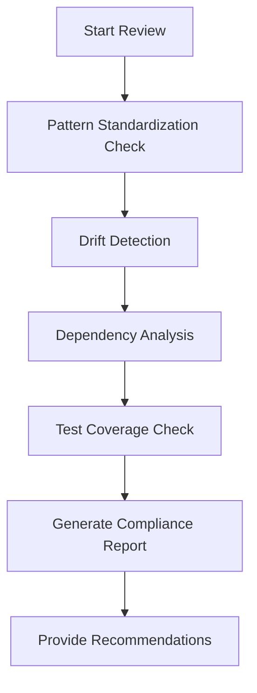

# Claude Code Workflow Examples

This guide demonstrates powerful workflows combining multiple MCP tools for common development
scenarios.

## 🚀 Automated Workflows

### 1. Complete Code Review Workflow

**Trigger:** "Review my code thoroughly before I create a PR"

**Claude's Automated Steps:**



**Example Output:**

```
✅ Code Review Complete

Pattern Compliance: 96% (3 auto-fixed)
Drift Status: Low (2 minor issues)
Dependencies: Healthy (no circular)
Test Coverage: 84.3% (above threshold)

Recommendations:
1. Address 2 complexity warnings in UserService
2. Add tests for new error handlers
3. Consider extracting validation logic

Ready for PR: YES ✅
```

### 2. Smart Refactoring Assistant

**Trigger:** "Help me refactor the authentication module safely"

**Claude's Process:**

1. **Baseline Creation**

   ```
   Creating safety baselines...
   ✓ Drift baseline created
   ✓ Test coverage baseline: 78.5%
   ✓ Dependency graph saved
   ```

2. **Impact Analysis**

   ```
   Analyzing authentication module...
   - 12 files directly affected
   - 23 files with dependencies
   - 3 potential circular dependency risks
   ```

3. **Guided Refactoring**

   ```
   Step 1: Extract interfaces (I'll help)
   Step 2: Apply dependency injection
   Step 3: Standardize error handling
   Step 4: Update tests
   ```

4. **Validation**
   ```
   Post-refactoring check:
   ✓ No new circular dependencies
   ✓ Test coverage increased to 85.2%
   ✓ All patterns compliant
   ```

### 3. Monorepo Migration Assistant

**Trigger:** "Convert my project to a monorepo structure"

**Intelligent Migration Flow:**

```typescript
// Phase 1: Analysis
Claude: "Analyzing your codebase structure..."
- Found 5 logical modules
- Identified 3 shared libraries
- Detected 2 applications

// Phase 2: Planning
Claude: "Here's your migration plan:"
1. Core types → @company/core-types
2. Error handling → @company/errors
3. Utilities → @company/utils
4. API service → apps/api
5. Worker service → apps/worker

// Phase 3: Execution
Claude: "I'll guide you through each step..."
[Interactive migration with validation at each step]

// Phase 4: Verification
Claude: "Migration complete! Running checks..."
✓ No circular dependencies
✓ All imports updated
✓ Build successful
✓ Tests passing
```

## 🤖 AI-Powered Automation

### Predictive Quality Gates

**Setup:** Claude monitors your development patterns and predicts issues

```javascript
// Claude learns from your patterns
"Based on your recent changes, I predict:
- 78% chance of import ordering issues
- Possible circular dependency if you import from models/
- Test coverage might drop below threshold

Shall I run preventive standardization?"
```

### Smart Commit Assistant

**Natural Flow:**

```
You: "I'm done with my changes"

Claude: "Let me check your changes..."
[Runs multiple tools in parallel]

Claude: "I found and fixed:
- 5 import ordering issues
- 2 error handling patterns
- 1 naming convention

Your code now passes all quality gates.
Suggested commit message:
'feat: Add user authentication with OAuth2 support

- Implemented OAuth2 flow
- Added token refresh logic
- Standardized error handling
- Test coverage: 86%'

Ready to commit? (y/n)"
```

### Continuous Improvement Loop

**Weekly Automation:**

```
Every Friday, Claude automatically:

1. Generates weekly governance report
2. Compares metrics with last week
3. Identifies improvement areas
4. Creates tasks for next sprint
5. Updates team dashboard

"Weekly Summary:
📈 Code quality improved by 12%
🎯 3 high-priority issues resolved
⚠️ 2 new areas need attention
📊 Test coverage trend: ↗️ +3.2%"
```

## 🎯 Context-Aware Assistance

### 1. File-Specific Recommendations

```typescript
// When you open UserService.ts
Claude: "I notice this service doesn't extend BaseService.
Would you like me to:
1. Refactor to follow the service pattern?
2. Add lifecycle methods?
3. Update error handling?
```

### 2. PR-Triggered Workflows

```yaml
# When creating a PR
Claude automatically:
  - Validates against quality gates
  - Generates PR description
  - Adds checklist items
  - Suggests reviewers
  - Labels based on changes
```

### 3. Learning from Feedback

```
You: "The standardization was too aggressive"

Claude: "I'll adjust the rules. Which patterns should I be more careful with?"
[Updates configuration based on your preferences]

Next time:
"I'll apply standardization more conservatively based on your feedback"
```

## 🔄 Integrated Development Cycles

### Morning Standup Helper

```
Claude: "Good morning! Here's your code status:

Yesterday's Progress:
- 12 commits across 3 features
- Code quality: Stable ✅
- No drift detected
- Coverage increased by 1.2%

Today's Recommendations:
1. Address 2 medium-priority lint warnings
2. Review PR #45 dependencies
3. Update test baseline (coverage improved)

Shall I run the morning cleanup routine?"
```

### Sprint Planning Assistant

```
Claude analyzes your backlog and suggests:

"Based on code analysis:
- Feature A: Low risk, 2 days
- Feature B: High complexity, needs refactoring first
- Feature C: Circular dependency risk with module X

Recommended sprint order: A → C (with refactor) → B"
```

### Release Preparation

```
Claude: "Preparing for v2.0 release...

Pre-release Checklist:
✓ All tests passing
✓ No critical drift
✓ Dependencies updated
✓ Coverage above threshold
⚠️ 3 TODO comments found
⚠️ 1 deprecated API usage

Generating release notes...
Creating deployment report...
Ready for release: YES (with warnings)"
```

## 💡 Advanced Integration Patterns

### 1. Cross-Tool Intelligence

```typescript
// Claude connects insights across tools
"I noticed:
- Your new error handling (from standardization)
- Increased complexity (from drift detection)
- Missing tests (from coverage analysis)

Suggestion: Add error handling tests to maintain quality"
```

### 2. Predictive Maintenance

```typescript
// Claude predicts future issues
"Based on current trends:
- Test coverage will drop below 80% in ~3 commits
- Circular dependency risk in auth → user flow
- Package size increasing rapidly

Preventive actions available. Run now?"
```

### 3. Team Coordination

```typescript
// Claude helps coordinate team efforts
"Team Overview:
- Alice: Working on auth module (might conflict with your changes)
- Bob: Refactoring utils (you depend on these)
- Carol: Adding tests (coverage will improve)

Recommendation: Sync with Alice before proceeding"
```

## 🎮 Interactive Workflows

### Guided Problem Solving

```
You: "My build is failing"

Claude: "Let me diagnose the issue..."
[Runs multiple analyses]

"Found it! Circular dependency introduced in commit abc123
UserService → AuthService → UserService

I can:
1. Show the exact cycle
2. Suggest refactoring approach
3. Apply automatic fix
4. Rollback the change

What would you prefer?"
```

### Learning Mode

```
You: "Teach me about our code standards"

Claude: "Let's explore interactively! I'll show you:

1. Current violations in your code
2. Why each standard exists
3. How to fix them
4. Best practices examples

Starting with error handling patterns..."
[Interactive tutorial begins]
```

## 🚦 Status Indicators

Claude uses visual indicators for quick status:

```
Code Health: 🟢 Excellent (92/100)
├─ Patterns: 🟢 Compliant
├─ Coverage: 🟡 Good (82%)
├─ Drift: 🟢 None
├─ Dependencies: 🟢 Healthy
└─ Build: 🟢 Passing

Quick Actions: [Fix Coverage] [View Report] [Create Baseline]
```

## 🎯 Goal-Oriented Workflows

### "Make It Production-Ready"

```
Claude creates a plan:

📋 Production Readiness Checklist
├─ □ Increase test coverage to 90%
├─ □ Fix all high-priority drift issues
├─ □ Remove unused dependencies
├─ □ Standardize all patterns
├─ □ Document API endpoints
├─ □ Add error monitoring
├─ □ Performance profiling
└─ □ Security scan

"I'll guide you through each step. Ready to start?"
```

## 🔮 Future-Proof Development

Claude helps you stay ahead:

```
"Trend Analysis:
- Your code complexity is gradually increasing
- Test coverage trending down
- New patterns emerging in industry

Recommendations:
1. Schedule refactoring sprint
2. Adopt new testing patterns
3. Update coding standards

Would you like me to create a modernization plan?"
```
