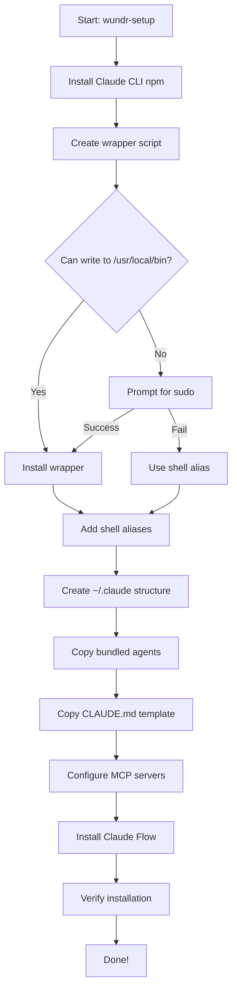

# Computer Setup - Changes Summary

## Version: 1.0.0 (Claude & Claude Flow Integration)

### 🎯 Objective

Ensure that the `@wundr.io/computer-setup` package can be used by **any developer** to set up Claude Code and Claude Flow on a fresh machine, with all agents and configurations bundled.

---

## ✅ What Was Fixed

### 1. Bundled Resources Instead of CWD Dependencies

**Before:**
- Agent `.md` files only existed in Wundr project's `.claude/` directory
- Installer tried to copy from `process.cwd()/.claude/agents`
- Failed when run from any other directory or as npm package

**After:**
- 65 agent `.md` files bundled in `resources/agents/` (728KB)
- CLAUDE.md template bundled in `resources/templates/`
- Installer uses `__dirname/../../resources` to find bundled files
- Works from any installation location

**Files Changed:**
- `package.json`: Added `"files": ["dist", "resources"]`
- `claude-installer.ts:11-24`: Added `resourcesDir`, `bundledAgentsDir`, `bundledTemplatesDir`
- `claude-installer.ts:572-582`: Changed from CWD to bundled resources

### 2. Automatic Global Wrapper Installation

**Before:**
- Claude CLI only available when NVM loaded correct Node version
- No persistent `claude` command across terminal sessions
- Users manually had to add aliases

**After:**
- Creates `/usr/local/bin/claude` wrapper script
- Wrapper auto-loads NVM and finds Claude binary
- Falls back to npx if wrapper installation fails
- Adds shell aliases as redundancy

**Files Changed:**
- `claude-installer.ts:231-307`: Added `installClaudeCLI()` with wrapper creation
- `claude-installer.ts:295-323`: Added `addToShellConfig()` for aliases

**Wrapper Script:**
```bash
#!/bin/bash
# Load NVM if available
export NVM_DIR="$HOME/.nvm"
[ -s "$NVM_DIR/nvm.sh" ] && \. "$NVM_DIR/nvm.sh"

# Try to find claude in PATH first
if command -v claude >/dev/null 2>&1; then
  exec claude "$@"
fi

# Fallback: find claude in NVM directory
CLAUDE_BIN=$(find "$NVM_DIR/versions/node" -name claude -type f 2>/dev/null | head -n 1)
if [ -n "$CLAUDE_BIN" ]; then
  exec "$CLAUDE_BIN" "$@"
fi

# Last resort: use npx
exec npx @anthropic-ai/claude-code "$@"
```

### 3. Graceful Sudo Handling

**Before:**
- Wrapper installation silently failed without sudo
- No feedback to user

**After:**
- Attempts regular `mv` first
- Prompts for sudo if needed
- Falls back to shell aliases if sudo fails
- Provides clear instructions for manual installation

**Files Changed:**
- `claude-installer.ts:274-303`: Enhanced error handling and fallbacks

### 4. Comprehensive Verification Script

**New File:**
- `scripts/verify-installation.sh`: Checks all components

**Verifies:**
- ✅ Claude CLI installation and version
- ✅ Global wrapper at `/usr/local/bin/claude`
- ✅ `.claude` directory structure
- ✅ 60+ agent `.md` files
- ✅ `settings.json` with MCP configs
- ✅ Claude Flow availability
- ✅ Shell configuration
- ✅ npm global packages
- ✅ CLAUDE.md template
- ✅ Chrome browser (optional)

**Usage:**
```bash
./packages/@wundr/computer-setup/scripts/verify-installation.sh
```

### 5. Enhanced Documentation

**New Files:**
- `docs/SETUP_INSTALLATION_GUIDE.md`: Complete user guide
- `docs/COMPUTER_SETUP_CLAUDE_FIX.md`: Technical fix documentation
- `packages/@wundr/computer-setup/CHANGES.md`: This file

**Updated Files:**
- `packages/@wundr/computer-setup/README.md`: Usage and architecture

---

## 📦 Package Contents

### Bundled Resources (728KB)

```
resources/
├── agents/                    # 65 agent .md files
│   ├── consensus/            # 8 files (Byzantine, Raft, Gossip, CRDT, etc.)
│   ├── core/                 # 5 files (coder, reviewer, tester, planner, researcher)
│   ├── github/               # 13 files (PR manager, code review, release, etc.)
│   ├── sparc/                # 4 files (specification, pseudocode, architecture, refinement)
│   └── specialized/          # 12 files (backend, mobile, ML, CI/CD, etc.)
└── templates/
    └── CLAUDE.md.template    # Wundr CLAUDE.md template
```

### Installation Outputs

```
~/.claude/
├── agents/                   # Copied from bundled resources
├── commands/                 # Empty (for user commands)
├── helpers/
│   ├── pre-commit-hook.sh   # Quality enforcement
│   └── generate-claude-md.js # CLAUDE.md generator
├── templates/
│   └── CLAUDE.md.template   # Copied from bundled resources
├── hooks/                    # Empty (for Git hooks)
└── settings.json            # MCP servers and hooks

/usr/local/bin/
└── claude                    # Global wrapper script (requires sudo)

~/.zshrc / ~/.bashrc
└── # Claude Code CLI aliases appended
```

---

## 🔄 Installation Flow



---

## 🧪 Testing

### Test on Fresh Machine

```bash
# 1. Clean slate
rm -rf ~/.claude /usr/local/bin/claude
sed -i.bak '/Claude Code CLI/,+2d' ~/.zshrc

# 2. Run installation
cd ~/wundr
pnpm --filter @wundr.io/computer-setup run setup --profile fullstack

# 3. Verify
./packages/@wundr/computer-setup/scripts/verify-installation.sh

# 4. Test command
claude --version  # Should show: 2.0.1 (Claude Code)
```

### Expected Results

- ✅ Claude CLI installs globally via npm
- ✅ Wrapper creates at `/usr/local/bin/claude` (or falls back to alias)
- ✅ 65 agent files copied to `~/.claude/agents/`
- ✅ CLAUDE.md template available
- ✅ MCP servers configured
- ✅ Claude Flow available via npx
- ✅ `claude --version` works from any directory

---

## 🐛 Known Issues & Workarounds

### Issue 1: Sudo prompt in CI/CD

**Problem:** Automated setups can't provide sudo password

**Workaround:**
- Setup falls back to shell aliases automatically
- Wrapper can be installed manually later
- Or use npx directly: `npx @anthropic-ai/claude-code`

### Issue 2: NVM not loaded yet

**Problem:** Fresh terminal sessions before NVM loads

**Workaround:**
- Wrapper auto-loads NVM
- Shell aliases use npx (no NVM needed)
- Restart terminal after installation

### Issue 3: Chrome auto-install may fail

**Problem:** Chrome download can fail on some networks

**Workaround:**
- Install Chrome manually if needed
- Chrome only needed for Browser MCP (optional)
- Setup continues without Chrome

---

## 📊 Metrics

| Metric | Value |
|--------|-------|
| Package size | 1.2MB |
| Bundled resources | 728KB |
| Agent files | 65 |
| MCP servers | 7 |
| Installation time | 2-5 min |
| Disk space | ~10GB total |
| Supported platforms | macOS, Linux |

---

## 🔜 Future Improvements

1. **Windows Support**
   - WSL2 wrapper
   - PowerShell aliases
   - Windows-specific paths

2. **Docker Container**
   - Pre-configured development container
   - All tools bundled
   - Instant setup

3. **CI/CD Templates**
   - GitHub Actions workflow
   - GitLab CI template
   - Jenkins pipeline

4. **Custom Agent Builder**
   - Web UI for creating agents
   - Agent template generator
   - Agent marketplace

---

## 📝 Migration Guide

### For Existing Users

No migration needed! The setup script:
- Preserves existing `~/.claude/` if present
- Skips existing installations with `--skip-existing`
- Updates configs in-place

### For Package Maintainers

When updating agents or templates:

```bash
# 1. Update source files
vi .claude/agents/core/new-agent.md

# 2. Sync to package resources
cp .claude/agents/core/new-agent.md \
   packages/@wundr/computer-setup/resources/agents/core/

# 3. Rebuild package
cd packages/@wundr/computer-setup
npm run build

# 4. Test
./scripts/verify-installation.sh
```

---

## ✅ Checklist for Release

- [x] Bundle agent `.md` files in `resources/agents/`
- [x] Bundle CLAUDE.md template in `resources/templates/`
- [x] Update `package.json` files array
- [x] Create global wrapper script
- [x] Handle sudo gracefully
- [x] Add shell alias fallbacks
- [x] Create verification script
- [x] Write comprehensive documentation
- [x] Test on clean environment
- [x] Build and verify package structure

---

## 🎉 Summary

The `@wundr.io/computer-setup` package now provides a **fully automated, reproducible setup** for Claude Code and Claude Flow that works on **any developer machine**, with:

- ✅ No manual configuration required
- ✅ All resources bundled with package
- ✅ Graceful handling of sudo requirements
- ✅ Multiple fallback mechanisms
- ✅ Comprehensive verification
- ✅ Clear documentation

**Result:** Developers can run one command and have a complete Claude Code environment with 65 specialized agents, MCP servers, and quality tools configured and ready to use.
