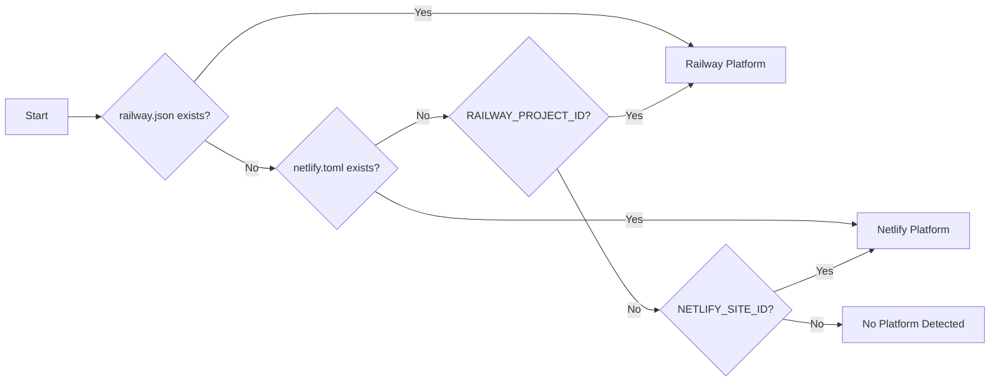

# Deployment Monitor Workflow

## Overview

This workflow provides end-to-end monitoring of deployments to Railway and Netlify, with automatic
issue detection and resolution.

## Trigger Conditions

### Automatic Triggers

1. Git push to `main` branch detected
2. Git push to `master` branch detected
3. Deployment webhook received (if configured)

### Manual Triggers

```bash
# Via slash command
/deploy-monitor

# Via Claude prompt
"Monitor my deployment to Railway/Netlify"
"Check deployment status and fix any issues"
```

## Workflow Phases

### Phase 1: Platform Detection



**Actions:**

1. Check for platform configuration files
2. Verify environment variables
3. Test API connectivity
4. Select appropriate MCP tools

### Phase 2: Monitor Deployment

**For Railway:**

```javascript
// Poll deployment status
let status = 'building';
while (['building', 'deploying'].includes(status)) {
  const deployment = await mcp__railway__deploy_status({
    projectId: process.env.RAILWAY_PROJECT_ID,
  });
  status = deployment.status;
  console.log(`Deployment status: ${status}`);

  if (status === 'failed') {
    const logs = await mcp__railway__get_logs({
      deploymentId: deployment.id,
      type: 'build',
    });
    return { status: 'failed', logs };
  }
  await sleep(5000);
}
```

**For Netlify:**

```javascript
// Poll build status
let deploy = await mcp__netlify__get_deploys({ limit: 1 })[0];
while (['building', 'processing'].includes(deploy.state)) {
  deploy = await mcp__netlify__deploy_status({
    deployId: deploy.id,
  });
  console.log(`Build status: ${deploy.state}`);

  if (deploy.state === 'error') {
    const logs = await mcp__netlify__get_build_logs({
      deployId: deploy.id,
    });
    return { status: 'failed', logs };
  }
  await sleep(10000);
}
```

### Phase 3: Log Analysis

After deployment completes (success or failure):

1. **Fetch Recent Logs**
   - Railway: Runtime logs from deployed service
   - Netlify: Build logs + Function logs (if applicable)

2. **Pattern Matching**
   - Scan for error patterns
   - Identify stack traces
   - Detect warning accumulation

3. **Classification**
   - Categorize by severity
   - Identify root cause category
   - Determine if auto-fixable

### Phase 4: Issue Resolution

If issues detected:

```
┌─────────────────────────────────────────────────────────────┐
│                    ISSUE RESOLUTION FLOW                     │
│                                                              │
│   Issue Category          Resolution Action                  │
│   ─────────────────       ──────────────────                │
│   Build Failure     →     Analyze build logs, fix deps      │
│   Type Error        →     Fix TypeScript issues             │
│   Runtime Error     →     Add error handling/retry          │
│   Memory Issue      →     Optimize code/add pagination      │
│   Env Var Missing   →     Alert user (manual action)        │
│   External Service  →     Add circuit breaker/retry         │
│   Database Error    →     Add connection pooling/retry      │
└─────────────────────────────────────────────────────────────┘
```

### Phase 5: Verification

After applying fixes:

1. **Local Verification**
   - Run tests
   - Run build
   - Run type check

2. **Deploy Changes**
   - Commit with descriptive message
   - Push to main/master

3. **Monitor New Deployment**
   - Repeat Phase 2-3

4. **Confirm Resolution**
   - Check logs for original error
   - Verify service health
   - Report success/failure

## Cycle Continuation

The workflow continues in a loop until:

- All identified errors are resolved
- Maximum iteration count reached (default: 5)
- User intervention requested
- Non-auto-fixable issue encountered

## Configuration Options

```yaml
# .claude/workflows/deployment-monitor.config.yaml
deployment_monitor:
  platforms:
    railway:
      enabled: true
      project_id: ${RAILWAY_PROJECT_ID}
      poll_interval: 5000
      timeout: 300000
    netlify:
      enabled: true
      site_id: ${NETLIFY_SITE_ID}
      poll_interval: 10000
      timeout: 600000

  auto_fix:
    enabled: true
    max_iterations: 5
    categories:
      - type_errors
      - missing_imports
      - null_checks
      - retry_logic

  notifications:
    on_deploy_start: true
    on_deploy_complete: true
    on_error_detected: true
    on_fix_applied: true

  escalation:
    after_iterations: 3
    on_repeated_failure: true
```
